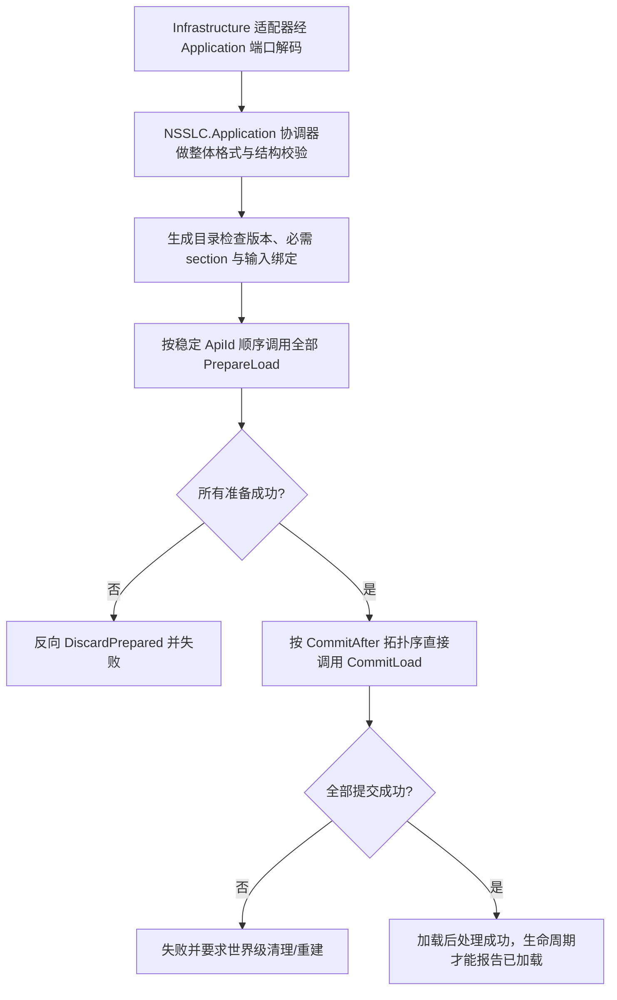

# 世界存档 System 标准加载 API 设计

文档 ID：DOC-2026-10-02-world-load-standard-api-design  
逻辑域：architecture  
产物类型：design  
状态：draft  
范围：持久化 System 的强类型加载契约、构建期发现与目录生成、加载期自动分派和失败语义。  
证据入口：[总体协调器设计](2026-10-02-world-storage-load-coordinator-design.md)、[PRD](../plans/tasks/2026-10-02-world-storage-load-coordinator-prd.md)、[CR-2026-10-02](../cr/CR-2026-10-02-world-load-standard-api.md)。  
canonical 路径：docs/architecture/2026-10-02-world-load-standard-api-design.md

本文细化 System 自声明加载 API 的标准和自动调度边界。当前已实现契约基础、构建期收集器与生成目录原型；Application 也已接入通用强类型载荷、解码/整体校验端口和生成目录调用路径。Infrastructure 已增加不依赖 `Main`/`WorldGen` 的 WorldFile decoder、validator 和 encoder，覆盖 header、环境/进度前缀、压缩 Tile payload、实体/容器区段及 Footer；生产 owner 映射和世界生命周期接线仍未实现。生产 ECS System 尚未声明该 API。协调器、文件格式、保存快照和世界生命周期的总体职责以[总体协调器设计](2026-10-02-world-storage-load-coordinator-design.md)为准。

## 1. 设计决定

每个需要从世界存档恢复权威状态的 System（或其专属加载端点）实现同一加载协议，并声明唯一身份、所属 owner、自己消费的强类型 section、格式版本范围、必需性和提交依赖。构建阶段收集所有可达声明并生成可编译的直接调用目录；协调器在加载时调用该目录。

自动化边界如下：

- 自动发现、契约检查、section 映射、依赖排序和调用代码生成属于构建阶段。
- `NSSLC.Application` 承载协调器、应用端口和生成目录消费端；API 实例与 owner context 由宿主组合根提供，文件 codec 的具体实现由 Infrastructure 提供。发现 API 不等于构建期创建运行时服务。
- 运行时不扫描程序集、不反射查找 API，也不维护逐 API 的手写调用或注册清单。
- 各 API 只能接收本 owner 的强类型输入和窄上下文，不接收完整存档根或通用 `WorldStorageRoot`。
- 所有 owner 完成准备/预检后才进入提交；提交失败时不得报告世界加载成功。

不增加外部库，不另建第二个 Application 项目或 feature-local `/WorldStorage` 用例层。现有 `NSSLC.Application` 负责协调加载/保存用例并定义所需应用端口；它依赖 NSSLC 公开领域 API，不依赖 `NSSLC.Infrastructure` 具体实现。Infrastructure 实现应用端口，实际宿主组合根引用两边并绑定实例。生成器运行在能引用全部 API 声明及所选文档 schema 的消费编译中；优先由 `NSSLC.Application` 消费编译生成目录。若只有具体组合入口同时引用 API 与 codec/schema，则由该组合入口编译目录并通过 Application 的 `IWorldLoadApiCatalog` 端口交给协调器。生成源码位于 `Build/generated/`。

## 2. 术语与身份

| 项目 | 含义 | 约束 |
| --- | --- | --- |
| API | 一个由构建阶段发现并由生成目录调用的 owner 加载端点 | 每个声明有全局稳定且唯一的 `ApiId` |
| Owner | 对恢复后的运行时状态拥有唯一写入权的领域边界 | API 只提交到自己的权威 Store |
| Section | 文件解码后交给某个 API 的强类型持久化输入 | `TSection` 类型由 NSSLC 领域公开 API 契约定义；有稳定 `SectionId`，不携带文件句柄、Store 或服务 |
| Owner context | 组合入口提供给 API 的强类型运行时依赖 | 不暴露其他 owner 的可变 Store 或整份存档 |
| Prepared data | API 在准备阶段校验或规范化所得的临时结果 | 只在一次加载尝试中有效，由对应 API 释放或消费 |
| Generated catalog | 构建阶段生成的强类型直接分派目录 | 输入相同的 API 声明必须生成稳定、可复现的顺序和内容 |
| Application coordinator | 持有一次尝试的完整载荷，调用端口和生成目录，汇总用例结果 | 依赖具体 Infrastructure 实现或写领域 Store |
| Composition root | 创建 Application 协调器与 Infrastructure 实现并绑定端口 | 取代 Application 的加载业务编排 |
| Codec port | Application 对文件读写/编解码能力的应用内契约 | 不暴露 Infrastructure 具体类型；由 Infrastructure 实现 |

`ApiId` 用于诊断和结果关联，`OwnerId` 标识状态所有者，`SectionId` 对应解码文档中的 section。身份与 section key 不依赖 C# 类型名、源码路径或文件枚举顺序。具体编码形式由契约实现阶段确定。

第一版采用一项 API 声明消费一个 section，且一个 section 只映射给一个 API。若一个文件结构确需多个 owner 消费，应先在格式 DTO 中拆成具有明确身份的强类型 section；不得让构建器猜测一个 section 如何被多方解释。共享信息的领域校验放在明确的整体校验边界，不借由多个 API 写同一 owner 状态。

## 3. 概念契约

下列伪代码表达协议要求，不规定最终 C# 类型名、接口/属性写法或是否以实例方法实现：

```text
WorldLoadApi<TContext, TSection, TPrepared>
  Descriptor:
    ApiId
    OwnerId
    SectionId
    SupportedFormatVersions
    Requirement: Required | Optional
    CommitAfter: [ApiId...]

  PrepareLoad(context, sectionPresence, attempt) -> Prepared<TPrepared> | Rejected(error)
  CommitLoad(context, prepared, attempt) -> Committed | Failed(error)
  DiscardPrepared(context, prepared, attempt) -> cleanup result
```

### 3.1 声明元数据

- **`ApiId`：**跨所有参与组合的程序集唯一、稳定、可读；重复值为构建错误。
- **`OwnerId`：**标明唯一 Store 写入 owner。相同 owner 可有多个 API，但每个 API 仍须拥有不同身份和 section。
- **`SectionId` / `TSection`：**Section key 必须唯一映射到编译时可验证的强类型输入。ID 与类型不相符、无映射或有多个消费者时为构建错误。
- **格式版本：**声明 API 接受的格式版本范围。当前文件版本及缺省值映射先由 codec/协调器解释，API 只收到已归一化 section 和版本信息。
- **必需性：**缺少 `Required` section 必须在任何 owner 准备或写入前整体拒绝；缺少 `Optional` section 以显式 `Absent` 传入，不能靠空数组、null 或静默构造默认值混淆。
- **`CommitAfter`：**只表达 owner 提交的先后要求。引用不存在的 API、依赖环或跨 owner 依赖不可访问均为构建错误。准备阶段不依赖其他 API 的 prepared data。

### 3.2 准备、提交和清理

1. `PrepareLoad` 是只读输入、无权威写入阶段。它可以校验 section、转换表示或建立暂存数据，但不能修改 section/其嵌套值、owner context、owner Store、发网络消息或发布世界已加载通知；需要规范化时写入自己的 prepared data。
2. `PrepareLoad` 返回明确的接受或拒绝结果；异常由分派边界转为带 `ApiId`、`OwnerId` 和阶段的加载失败，不能吞掉或伪装为成功。生成目录执行结果的失败对象必须包含有效错误码和消息；Application 在归一化非法执行阶段时保留原始异常和清理异常，以免丢失取消或结果未知信息。
3. 全部准备成功后，生成目录才允许 `CommitLoad`。每个 API 只写自己的 owner Store。
4. `CommitLoad` 接收 prepared data 后负责在返回或抛出前消费/释放该值，并返回明确的提交成功或失败结果。一个 owner 失败后停止后续提交，整个尝试不得完成；此前成功的 owner 可能已写入，不能假定自动回滚。
5. 若准备失败，已准备的结果按反向准备顺序交给对应 API 清理。当前返回拒绝或抛异常的 API 必须自行释放未作为 prepared data 返回的暂存资源；分派器拿不到该调用的清理句柄。若提交失败，目录清理尚未提交的 prepared data；已进入 Commit 的 API 自行消费/释放其输入。`DiscardPrepared` 应可重复调用；清理失败作为附加诊断保留，不覆盖原始失败原因。
6. 提交失败时，协调器要求世界级清理/重建，或使用已被实现证据证明的事务方案；清理前不得在同一运行时状态上重试并重放载荷。

准备只读不代表两个 owner 可以并行准备。第一版先按稳定 `ApiId` 顺序同步执行，只有存在明确线程安全、上下文隔离和顺序语义证据后，才能讨论并行化。

## 4. 构建期发现与生成

构建收集器以 API 消费编译的输入和引用程序集为范围，发现实现标准协议的 API 声明。它必须覆盖该消费编译引用的全部 System/API 程序集，而不能只扫描项目源码。生成目录编译进负责组合调用的消费程序集；实际宿主仍负责将 API/owner context 与 Infrastructure 端口实现实例化并提供给协调器。若目录生成在组合根，组合根用 Application 的 `IWorldLoadApiCatalog` 实现封装该目录，Infrastructure 工厂不得固定选择一个可能为空的 Application catalog。

生成目录至少提供以下能力：

1. 产生 API 声明清单，包含身份、owner、section、版本范围、必需性和依赖。
2. 将已解码的 section 与组合入口提供的强类型 owner context 绑定到各 API；每个必需输入在运行前可验证。
3. 生成稳定的准备调用序列、准备结果持有类型、提交调用序列和准备数据丢弃逻辑。
4. 以直接静态调用分派到各 API，不通过 `object` 反射调用或运行时程序集扫描。
5. 在无效声明时产生可定位的构建诊断，并阻止输出可运行但缺少 API 的目录。

API 消费编译通过 assembly-level `WorldPersistenceSectionSchemaAttribute` 声明其选定 document codec 的规范化 section schema。每个属性声明 `SectionId`、强类型 DTO 和 Required/Optional 要求；将元数据放在消费编译的源码中，使诊断能定位到 schema 声明处，也避免生成器依赖 Infrastructure 反向引用。构建收集器据此检查重复 schema、API 缺失 schema、DTO 类型不匹配、必需 section 无消费者及 requirement 不一致。运行时 API 实例和 owner context 仍由组合根提供，生成目录会在任何 Prepare 前预检缺失绑定。

构建检查至少覆盖：重复 `ApiId`/`SectionId`、接口形状无效、section schema 类型不匹配、API section 无 schema、必需 section 无消费者、schema 提供者重复、owner context 运行时无法绑定、不可访问的 API、未声明的依赖和依赖环。每个构建失败应指向声明位置并给出修复对象。

构建收集器不替代宿主的运行时依赖组合。宿主继续提供 API 实例或 owner context，并将 Infrastructure codec adapter 绑定到 Application port；生成目录消除的是逐个 API 手写发现和调用清单，而不是 API 的真实依赖构造。Application 提供 `WorldLoadApiRuntimeBindingsBuilder` 作为可选的显式组合工具，按 API 类型和 owner id 生成一次性绑定快照；它不持有完整文档，也不参与 API 发现。如何在不手工维护 API 清单的前提下访问现存 System 实例，必须在生成器原型中验证。

当前原型位于 `Build/Tools/WorldLoadApiGenerator/`，直接引用 SDK `10.0.400` 的 `Roslyn/bincore` 程序集，不添加 NuGet 包。生成器扫描消费程序集及其编译引用中的类型符号，收集实现标准接口并带有声明属性的类型；在 fixture 中已验证可发现被宿主引用的 API 程序集，并生成 `Build/generated/` 下的静态 catalog。生成 catalog 命名空间以消费程序集名区分，避免 Application 和上层 fixture/Host 同时启用生成器时产生跨程序集同名冲突。生成器按 `ApiId` 排序准备阶段，按 `CommitAfter` 依赖做稳定拓扑排序提交阶段。

当前原型实现重复 `ApiId`/`SectionId`、无效接口/属性组合、版本范围、依赖缺失和依赖环诊断；消费编译上的 `WorldPersistenceSectionSchemaAttribute` 还为必需 section 无消费者、API section 无 schema、DTO 类型不匹配、schema 重复和必需性不一致提供 WLA007-WLA012 构建诊断。WLA001 也拒绝 `object`、`dynamic`、可空、`Nullable<T>`、pointer、function pointer、ref-like、`void` 等非有效强类型参数，并拒绝把 `WorldLoadApiBindings` 或其子类作为 API 类型参数，以避免 owner 直接取得任意 section。Application 的运行时目录预检还会在任何 API 调用前拒绝 null descriptor、重复身份、未知依赖和依赖环。fixture 的唯一正向构建已验证匹配 schema 可生成，schema 诊断位置来自该消费编译的源码。上述负向诊断尚未运行验证，保持在 10% 行为测试预算之外。宿主 API 实例和 owner context 是否可取仍由生成目录运行前预检，不声称它们已被构建期验证。

## 5. 加载期自动分派



分派规则：

- 版本支持、必需 section 存在、section 类型映射和 owner context 绑定须整体预检完毕后，才调用任一 API。
- 目录描述符的读取、计数和预检都属于 Binding 边界；预检枚举异常不得逃出协调器，也不得在任何 API 调用后才报告。
- `Optional + Absent` 仍调用相应 API，让 owner 明确处理 absence；除非契约版本另行决定，否则不得省略回调。
- 准备顺序按稳定 `ApiId` 排列，仅为可复现执行；准备阶段不共享其他 API 的临时结果。
- 提交顺序按 `CommitAfter` 构造拓扑序；同一拓扑层按稳定 `ApiId` 排列。
- 提交全成功也不自动表示世界可运行。现有加载生命周期要求的初始化、load 后处理和加载门关闭都成功后，宿主才能发布完成通知。
- 完整载荷 DTO、准备数据和生成目录的本次调用状态都限定于单次加载尝试，不放入 ECS Component、`WorldStorageRoot` 或生命周期组件。
- 协调器默认将成功尝试标记为 `WorldRecoveryStatus.Loaded`；备份替换由生命周期完成后，宿主必须通过同一 `Load` 入口显式传入 `WorldRecoveryStatus.RecoveredFromBackup`。协调器不自行判断路径是否来自备份，也不执行备份恢复。

## 6. 诊断与失败结果

结果至少携带 `ApiId`、`OwnerId`、阶段、错误类别和原始原因引用；用户可见日志不应序列化完整载荷。实现可以用结果类型或异常边界编码，但必须保留可区分的构建错误、格式错误、owner 拒绝、owner 提交失败和清理失败。

| 失败点 | 可观察结果 | Owner 状态 | 后续动作 |
| --- | --- | --- | --- |
| 构建声明无效 | 构建失败并定位声明 | 未触碰 | 修正 API 声明；不运行目录 |
| 格式/整体校验失败 | 载荷失败及字段/关系原因 | 未触碰 | 交由既有主文件/备份恢复生命周期 |
| 必需 section、版本或上下文缺失 | 分派前拒绝并指出 `ApiId`/section | 未触碰 | 不开始准备或提交 |
| 准备拒绝/异常 | owner 预检失败 | 权威状态未写入 | 逆序丢弃先前准备结果 |
| 提交失败/异常 | 提交阶段失败 | 可能部分写入 | 清理/重建整个失败世界；不得报告成功 |
| 取消 | 结果标记为 `Canceled`，不伪装成格式错误 | 提交前未写权威状态；Commit 阶段可能部分写入 | 不再重试；若取消发生在备份替换、读回、解码或 API 绑定/Prepare 阶段且主文件已被替换，先恢复原主文件并附加恢复失败；Commit 取消保留已校验的备份主文件并要求世界级清理/重建 |
| 丢弃暂存结果失败 | 原始失败加清理诊断 | 权威状态未写入，但暂存资源可能残留 | 终止尝试并保留诊断 |

## 7. 非目标与限制

- 不设计世界文件的二进制布局、压缩、备份或保存快照 API；这些由 PRD 与总体协调器设计规定。
- 不读取、生成或提交探索地图 `.map` 数据。
- 不包含 Steam 云存档字段、参数、函数或平台调用。
- 不将完整载荷放入 ECS；不创建第二个 Application 项目或 feature-local 应用子系统。
- Application 不依赖 Infrastructure 具体实现；Infrastructure 通过实现 Application 端口接入，宿主组合根负责绑定。
- 不把 `Batch` 作为 API 生命周期概念。只有领域输入确实表示一组记录时才在类型名中使用该词；它不暗示事务或跨 owner 原子性。
- 不把当前 source generator 原型的有限验证视为生产 owner 和真实加载宿主已接入；不新增外部库。

## 8. 原型状态与待实施确认

### 2026-10-03 WorldFile 后续区段加载边界

本次实现补充了完整 pointer table 中的 `TownManager` 和 `Bestiary` 解码，并对 `TileEntity`、`CreativePowers` 保留有界原始 section payload。前两者只输出 DTO 和应用级边界校验，不创建旧运行时对象；后两者的类型注册和扩展字段由未来 owner 在 Prepare 阶段解码。Tile payload 仍只保留压缩传输数据。随后 encoder 已与完整 pointer table 对齐：保留 Tile 原始压缩数据、各实体/容器 section framing、opaque section payload 和 Footer；未知 section、缺少 Tile 或不匹配的 Footer 会拒绝保存。本次没有新增行为测试。

Application 已定义 `WorldPersistenceDocument` 作为一次加载的强类型分段载荷。`WorldLoadCoordinator` 在一次 `Load` 调用内解码并整体校验该文档，再把它交给生成目录；文档及 section 只在该次调用中暂存，不放入恢复结果或 ECS Store。协调器会先复制 catalog descriptor 快照，再执行身份、依赖和当前文档版本范围校验，避免可变目录或自定义 catalog 绕过声明。Infrastructure 的 `WorldFileDocumentDecoder` 与 validator 接受 pointer-based `.wld` 版本 `88..326`；`WorldFileDocumentEncoder` 仍只写版本 `319`。解码器读取版本、元数据、完整 section 指针以及 header/environment/progression/quest/banner/boss-progression/party/sandstorm/defender-event/background/event/tree-tops/seasonal/npc-unlocks/time-policy/spawn；在 section pointers 足够时还读取压缩 Tile payload 及其 frame-importance 表、Tile 后的 Chest/Sign/NPC、WeightedPressurePlates、TownManager、Bestiary 和 Footer DTO，并保留 TileEntity/CreativePowers 的有界原始载荷。spawn section 读取额外出生点、dual-dungeons 标志、版本 323 起的 `moreLightningSeed` / `noLightningSeed` 标志和原始 manifest 文本，不依赖旧 JSON serializer，也不读取探索地图 `.map`。Tile payload 只做有界传输和尺寸校验，不展开为全局 Tile；后续 DTO/原始载荷只做加载和应用级边界校验。Application 生成目录 wrapper 调用消费程序集编译期生成的静态目录。唯一运行验证是 Test 下的非生产跨项目 fixture：验证宿主经传递项目引用发现两个 API 程序集，使用 Infrastructure factory 和本地文件适配器读取临时 fixture 文件，解码并整体校验，再完成绑定预检及两个 API 的 Prepare/Commit；optional section 的 Absent 状态在提交时也有断言，提交顺序符合 `CommitAfter`。这只证明通用载荷与生成分派路径，不证明生产世界数据已经能被完整解码或恢复。当前没有生产 System 实现/声明该 API；真实 owner 和 lifecycle/Host 接线尚未验收。

正式 WorldFile decoder 按参考 `WorldFile.LoadWorld_Version2` 要求当前 pointer-based `WorldFile` 的
pointer table 恰好包含 11 项；少于或多于 11 项的文件在读取 section 前拒绝。完整 11 项表由
Footer section 消费到文件末尾，header 起始指针还必须精确等于重要性表后的读取位置。该边界
防止未识别的尾部 section 或中间字节被静默跳过；它不扩大支持的文件版本或声称完成旧格式
往返兼容。

`WorldStorageCoordinatorFactory.CreateSaveValidationQuery()` 为保存协调器提供统一的 read-back 校验入口：保存后的字节必须先由正式 decoder 解码，再通过正式 validator，才能被保存流程视为有效。完整 encoder 会写出 11 项 pointer table，并由该入口检查 section 边界和 Footer。该入口不负责备份选择、重试、恢复或 ECS 状态提交；宿主仍显式组合保存协调器、encoder 和 query。

WorldFile 版本 `>=135` 的本地 metadata 由 `WorldFileMetadataSection` 保留 `Revision` 与
`IsFavorite`。它是文件格式元数据，不属于 ECS owner 输入，也不表示 Steam 或其他云存档能力；
缺少 metadata 的新建前缀文件使用明确的本地默认值。

`WorldLoadApiBindings.FormatVersion` 从本次文档提供格式版本，`CancellationToken` 表示本次协调调用的协作式取消请求；Application 将文档 section 与宿主提供的 API 实例、强类型 owner context 合并成生成目录绑定。Application 在进入生成目录前先复制 descriptor 快照，并校验身份、提交依赖和当前文档版本范围；生成目录随后在 Prepare 前完整检查 API 实例、owner context、section、必需性和版本，并在绑定、Prepare、Commit 阶段边界观察取消。主机仍负责提供运行时 API/context 实例，可使用 `WorldLoadApiRuntimeBindingsBuilder` 固化注册结果。Application 的 catalog 若为空会在任何 API 调用前明确失败，避免没有生产声明时把纯解码误报为世界加载完成。Infrastructure coordinator factory 接收组合入口提供的 `IWorldLoadApiCatalog`，不会再固定绑定 Application 当前生成的空目录。

生成器目前对重复 API/section 身份、无效 API 声明、无效版本范围、未知依赖和依赖环输出构建诊断；Application 运行时目录预检对组合入口提供的 descriptor 列表执行相同的身份、版本和依赖拒绝。生成目录按 `ApiId` 顺序准备、按 `CommitAfter` 稳定拓扑序提交；Prepare 失败会逆序丢弃已准备值，Commit 失败会清理仍未提交的值。进入 Commit 的 owner 负责消费或释放自己的 prepared data。除正向 fixture 外，这些失败分支尚未运行验证。

1. 核对 `NSSLC.Application` 对 NSSLC 公开 API 的项目引用、Infrastructure 对应用端口的实现引用，以及实际 Host 对 Application/Infrastructure 的组合引用；防止 Domain -> Application/Infrastructure 反向依赖。
2. 确认 Application 消费程序集能观察各 System API 声明、持久化 DTO 和生成目录；Application 已有 `.csproj` 并编译生成器，当前其目录为空，因为没有生产 System API 声明。fixture 单独验证对 fixture API 程序集的发现与直接调用；生产 Host 的组合引用仍待确认。
3. 已确定消费编译上的 section schema 输入形式并实现对应构建诊断；仍需在生产 codec 与组合宿主接入后验证无效 schema 诊断及 API/context 绑定。
4. 验证生产目标中的 `Build/generated/` 路径、清理策略、多目标构建与重复构建确定性。
5. 从 WorldFile 字段清单确认真实 section 与 owner 映射；本设计不预设每个运行时 Store 都持久化。
6. 先以一个 owner 验证 Prepare/Commit/Discard 生命周期，再按 owner 迁移其余持久化数据。
7. 将主文件重试、备份、加载门和部分提交清理接入 `WorldLoadLifecycleSystem` 的实际 Host 路径。

各阶段和验收门槛见[标准加载 API 执行计划](execution/2026-10-02-world-load-standard-api-execution.md)。
`WorldRecoveryOutcome` 将取消表达为独立的 `WorldRecoveryStatus.Canceled`；`Failure.Kind=Canceled` 仍保留底层原因分类。若取消发生在 Commit 阶段，`RequiresWorldReset` 继续为真，宿主不得在部分提交状态上直接重试；可将该标志传给生命周期的 `CompleteLoadAttempt(..., requiresWorldReset: true)` 或 `CancelRecovery(..., requiresWorldReset: true)`，让恢复状态直接终止并等待世界级清理。

`WorldLoadCoordinator` 保留两参数 `Load(path, runtimeBindings)` 的主文件默认语义，并新增带 `WorldRecoveryStatus successStatus` 的重载；宿主还可通过四参数重载传入 `CancellationToken`，在文件读取、解码、整体校验和目录分派边界取消本次调用。成功状态只允许 `Loaded` 或 `RecoveredFromBackup`；生命周期在备份替换成功后再次加载时显式传入 `RecoveredFromBackup`，避免协调器根据路径或文件名猜测恢复来源。非法状态在读取文件前返回 `InvalidData`，不会触碰文件或 owner API。
