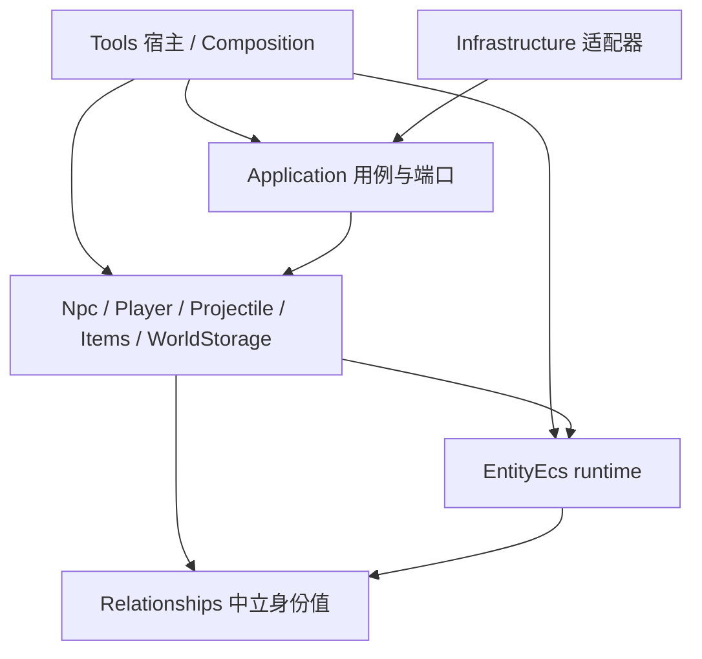

# Entity 组织迁移代码设计

日期：2026-10-06。状态：实施中；源码事实、已接入切片与目标方案分开记录。配套文件：
[执行文档](execution/2026-10-06-entity-organization-execution.md)。

本文把 [Entity 组织设计约束](../../Context/架构设计/ECSEntity组织设计约束.md) 落到
Version4 原实现和 NLTX 当前调用路径。交付范围是架构、代码边界、迁移映射和验收方案，
当前进度和可复核的构建、行为证据记录在执行文档及其
[执行 ledger](../migration/ledgers/2026-10-06-entity-organization-execution-ledger.md)。

## 1. 依据、范围与结论

采用已接受的 [EntityUuid 身份决策](decisions/0001-entity-identity-root-and-typed-projections.md)、
[身份术语](entity-identity-context.md)、[文件组织约束](../../Context/架构设计/ECS文件组织设计约束.md)
和 [领域/基础设施边界](../../Context/架构设计/ECS领域与基础设施架构边界.md)。
SS14 的身份与组件关联、能力查询、类型化视图和生命周期机制见
[固定版本源码研究](../research/2026-10-06-ss14-entity-organization.md)。

SS14 引擎参考提交为 `b2c22005744e8da8e74f69a8c8165f3839452ea6`；本地内容快照与该提交
的配套版本未确认。Version4 参考根为 `D:/TRbackup/Version4`，NLTX 根为
`D:/TRbackup/NLTX`。后两者是读取时的工作树；实施前须保存文件指纹并复核变化，不能将
本设计的行号视为固定提交。Version4 的 `net40/x86` 项目在本轮只读。

当前主要问题是：主模拟宿主长期使用固定实体聚合，缺少覆盖主入口的统一身份/组件关联；
身份和位置还存在不同领域的独立表示。迁移应建立一份实例身份和能力存储，再逐入口切换。
已有槽位代际、领域 owner、兼容索引、加载发布和调度协议具有复用价值。

范围包括 Player、NPC、Projectile、Item/世界掉落、实际具有独立生命周期的 TileEntity、
Leashed，以及它们在加载、保存、网络、世界切换和两个宿主中的真实入口。瓦片、背包槽位、
采样和不可变 Definition 保留值/批量存储。`WorldStorageRoot` 的名称不构成错误。
本设计不规定全 Terraria 未支持内容已经迁完；全入口清单和内容缺口由执行批次维护。

证据标记：`confirmed` 仅表示所引方法体或接线已读；`partial` 表示协作者或内容分支未闭合；
`unknown` 表示存根或缺失；`proposed` 表示本文目标。它们均不等于行为验证通过。

## 2. Version4 → NLTX → 目标行为映射

### 2.1 原实现不能按类名机械翻译

| 入口/事实 | Version4 直接证据 | NLTX 当前实现 | 目标及必须保留的行为 |
| --- | --- | --- | --- |
| 公共空间状态 | [Entity.cs:6](D:/TRbackup/Version4/Terraria/Entity.cs:6)：位置、速度、几何、液体；Center getter/setter:50 | Location/Velocity/Collider 已定义；主宿主实际推进 Movement/Kinematics | 共享能力关联同一实体；Center 是派生计算与显式写命令，保留中心到左上角换算 |
| 分类数组与顺序 | [Main.cs:11411](D:/TRbackup/Version4/Terraria/Main.cs:11411)：Player → NPC → Projectile → WorldItem → Leashed；Projectile 扫描 0..999 | [Phase 枚举](../../src/NSSLC.Application/Simulation/WorldSimulationPhase.cs)、[宿主装配](../../src/NSSLC.Tools.Simulation/Program.cs) | 保留当前阶段和领域内部顺序，先建立 B0 行为基线；Entity 查询不能任意重排。两者全部前后处理尚未证明相同 |
| NPC 创建 | [NPC.NewNPC:67051](D:/TRbackup/Version4/Terraria/NPC.cs:67051)：选槽、新对象、Defaults、Bottom、wet、AI、同步意图 | [RuntimeNpcStore](../../src/NSSLC.Tools.Simulation/RuntimeNpcStore.cs) Hydrate/TrySpawn；[NpcSpawnSystem](../../src/NSSLC/Component/Npc/NpcSpawnSystem.cs) 已拆分生成规则 | 复用生成规则；新实例 Commit 分配新 UUID；类型决定的正反扫描、slot0 禁用、保护和替换不能丢失 |
| NPC 更新/死亡 | [UpdateNPC:76711](D:/TRbackup/Version4/Terraria/NPC.cs:76711)：inactive 返回，buff/gravity 后检查 life；life≤0 时失活、网络更新再返回 | RuntimeNpcStore.ApplyProjectileHit、NpcCombatSystem、NpcDeathLifecycleSystem | 命中/生命/掉落/失活由领域 owner 提交，组件关联和关系清理由生命周期协议收尾；不是所有失活都调用同一 Kill |
| Player 复活 | [Spawn:21798](D:/TRbackup/Version4/Terraria/Player.cs:21798)：原对象就地改变状态，区分加入世界 | [RuntimePlayerEntity](../../src/NSSLC.Tools.Simulation/RuntimePlayerEntity.cs) AdvanceLifecycle、PlayerLifecycleSystem | 同实例玩法复活保留 UUID；真正销毁并重建才新分配。位置、生命、物品使用计时的重置仍按现有领域契约执行 |
| Projectile 创建 | [NewProjectile:10244](D:/TRbackup/Version4/Terraria/Projectile.cs:10244)：Owner=-1→255，空槽/oldest、Defaults、位置、source、wet、限速 | [Hydration](../../src/NSSLC/Component/Projectile/ProjectileDefinitionHydrationSystem.cs)、[Lifecycle](../../src/NSSLC/Component/Projectile/ProjectileLifecycleSystem.cs) | 保留默认值/能力/source 输入、协议 sentinel 和失败清理；对象池复用不等于同一实体实例 |
| Projectile 协议身份 | NewProjectile:10279/10332：identity 为协议投影，projUUID 按定义条件设置 | owner-scoped ProjectileIdentityIndex、packet-27/29 owner | protocol UUID 与 EntityUuid 分离；同类型 Active 更新保留实例，类型替换/重新 hydrate 分配新根及新 generation |
| Projectile 子步 | [Update:14693](D:/TRbackup/Version4/Terraria/Projectile.cs:14693)：可变 numUpdates，continue/return；15232 寿命及穿透终止 | [TickCoordinator](../../src/NSSLC/Component/Projectile/ProjectileTickCoordinator.cs) | 保留实时槽位扫描、可变子步和提前返回；回调后重新解析。不能替换为无序、整帧冻结的能力集合 |
| Projectile 终止 | [Kill:46425](D:/TRbackup/Version4/Terraria/Projectile.cs:46425)：清协议索引、timeLeft=0、取消 channel 与内容效果；Update:14711 越界直接失活 | Lifecycle.TryTerminate、ProjectileEndReason.WorldBoundary | 区分普通 Kill、越界失活、网络终止和替换；越界保留剩余寿命的现有行为不能被统一 Kill 覆盖 |
| 物品内容/世界存在 | [Item.NewItem:48693](D:/TRbackup/Version4/Terraria/Item.cs:48693)、[WorldItem:15](D:/TRbackup/Version4/Terraria/WorldItem.cs:15)：Item 不继承 Entity；WorldItem 继承并持有 inner | RuntimeItemRegistry 保存 payload，RuntimeWorldItemStore 保存世界状态 | Item 实例为内容/堆叠实体；世界掉落是可附着能力和分类投影，世界消失不必删除仍在背包的物品 |
| 拾取与合并 | [Player.GetItem:23018](D:/TRbackup/Version4/Terraria/Player.cs:23018) 返回剩余；其 Fill 协作者为存根。WorldItem.TryCombining:227 有减源/增目标及清空逻辑 | [InventoryOwner](../../src/NSSLC.Tools.Simulation/RuntimePlayerInventoryOwner.cs) 区分空槽转移、合并、部分剩余；PickupSystem 有效果提交 | 按完整转移、部分转移、合并耗尽、消费建模身份变化；保存数量守恒和提交后效果顺序。Version4 完整拾取等价仍为 partial |
| TileEntity | [TileEntity:48](D:/TRbackup/Version4/Terraria.DataStructures/TileEntity.cs:48)：更新列表；Add:80 登记 ID/位置，Remove:110 清索引后 OnRemoved；Place:97 存根 | [TileEntityStore](../../src/NSSLC/Component/WorldStorage/TileEntityStore.cs)、[UpdateSchedule](../../src/NSSLC/Component/WorldStorage/TileEntityUpdateSchedule.cs) | 保留 ID/anchor 双索引及当前按 ID 排序的 tick 捕获；不能声称排序等同 Version4 列表。独立实例关联能力，持久化 DTO 单独捕获 |
| Leashed | [LeashedEntity:234](D:/TRbackup/Version4/Terraria.GameContent/LeashedEntity.cs:234)：检查 active sections 后更新；Remove/StreamNetUpdates 存根 | [RegistrationSystem](../../src/NSSLC/Component/LeashedEntity/LeashedEntityRegistrationSystem.cs) 已有 EntityId、slot/generation、section 清理 | 接入单一根并保留领域 registration/section；原 Remove 网络效果 unknown，不能以函数体空推断无效果 |
| 加载/保存 | 原数组/对象与序列化器耦合，本文未追完全部 WorldFile 方法 | [LoadedWorldSession](../../src/NSSLC.Application/WorldStorage/Loading/LoadedWorldSession.cs)、WorldNpcLoadApi、RuntimeNpcStore.CreatePersistenceSnapshot | 在未发布会话中 hydrate；所有 owner 完成才发布；保存从当前组件捕获 DTO，原 SavedState 保留为基底，不是第二实时写源 |

表中方法的直接片段为 confirmed；NewProjectile 后续全部内容效果、NPC/Player 全量更新和
存档完整闭包为 partial。TileEntity.Place、GetItem_FillIntoOccupiedSlot/FillEmptyInventorySlot、
Leashed.Remove/StreamNetUpdates 为 unknown。补全时应读取完整参考实现并记录版本，不能以
SS14 行为填补 Terraria 的未知分支。

Main 的 Player[256]、Projectile[1001]、WorldItem[401] 包含边界/保留位置，而上述更新循环
分别扫描 255/1000/400 个槽。Owner=255、创建失败返回 1000/400 等 sentinel 必须按协议
解释，不能因为数组中存在对象就把保留槽登记为普通实体。NPC 的 maxNPCs 失败返回同样
保留领域语义。

### 2.2 当前代码的结构性风险

| 当前位置 | 已确认状态 | 设计处置 |
| --- | --- | --- |
| [EntityRuntime](../../src/NSSLC/Component/Share/Entity/EntityRuntime.cs)、[EntityIdentityComponent](../../src/NSSLC/Component/Share/Entity/Components/EntityIdentityComponent.cs)、旧 EntityId/EntityIdentityState | 主宿主使用 EntityUuid 根、runtime token 和身份组件；共享旧 `EntityId.cs`、`EntityIdentityState.cs` 已删除，`WorldSession.Calendar.EntityId` 是独立领域类型。`src/NSSLC.Infrastructure/分类参考/` 中另有同名参考类型，不属于生产源码范围 | 保持 EntityUuid 为根；共享旧声明的删除由 B9 编译与生产入口检查覆盖，不据此改写不同领域的 `EntityId`，也不把只读分类参考类型计为生产声明 |
| [RuntimeNpcEntity.Hydrate](../../src/NSSLC.Tools.Simulation/RuntimeNpcEntity.cs) | NPC 根由 EntityRuntime 创建；NpcInstanceId 是进程内递增的兼容投影，slot 是独立容量投影 | 保持投影与根分离；生命周期重建发新根，旧投影不得成为引用解析根 |
| [EntitySlotStore](../../src/NSSLC/Component/WorldStorage/EntitySlotStore.cs) | 已处理 generation、匹配 replace/release、耗尽退休；句柄无 runtime token | 复用算法，加入解析作用域；容量表最终保存实体引用/投影 |
| RuntimeItemRegistry.CreateEntityId | 固定前缀+局部计数，重建 registry 会重复 | 根 UUID 由 runtime 创建；ItemEntityRef/RuntimeEntityId 成为强类型投影 |
| B0 快照中的旧 ProjectileEntityState、RuntimeNpcEntity、RuntimePlayerEntity | 快照中的旧 ProjectileEntityState 是长期聚合；Player 聚合还推进行为。当前源码已删除 ProjectileEntityState，`src/`、`Test/` 的 C# 与 csproj 静态搜索无引用 | B5 已将 Projectile 状态改为组件访问与 typed 输入；旧调用者/签名退出由源码审阅确认，typed API build 是补充证据。NPC/Player 聚合行为继续交回领域 owner |
| Location 与 Movement/Kinematics/嵌套 WorldItem | 当前 NPC/Player root 已附加 Location、Velocity、Collider 与 grounded 状态；MovementStateComponent 是临时值适配器。历史 5BDE…014D 0/1/2 Player、600 tick 空间 probe 未包含 NetId 4；后续 38 场景 full-host matrix 的当前支持集 probe 已覆盖 NetId 1,2,3,4,16,22,37,488，同 fresh Simulation DLL 621C…E2FDE | 当前支持集的空间/几何 host 场景已通过。0B052D…981E56 PDB/CodeView map 只证明该 artifact-time DLL/PDB 与 17 项 source Documents 在捕获时对应（4 DLL/PDB）；主验收 receipt 记录 9 项后续 current-tree source hash drift 来自独立 NPC AI 写入，属于该运行验收范围之外，不声称当前源码仍等于编译输入，也不使 0B052D… 的运行证据失效。Eye profile 仍只覆盖开场计数、失去目标退出和首次 dash，不宣称完整 AI parity；窄 probe 也不证明所有 NPC 行为等价或 B3/B4 所有纵向功能。当前 WorldItem 支持路径已纳入 world-presence slot owner，38 场景 host 覆盖 expiry、physics、pickup 与 cleanup；没有待切换的 host gate，其余领域禁止双写 |
| RuntimeProjectileStore.TryHitNpc 与 NPC 消费者 | Projectile 命中写入前由 NPC owner 重新解析根、runtime handle 和 slot generation；Player contact 使用逐 tick 根/值快照，TrainingDummy 使用根/slot-generation 绑定，自然生成读取使用最小能力快照 | Housing 与当前支持 AI 由 NPC 组件 owner 提供；当前 Simulation NPC 准入集合为 NetId `1,2,3,4,16,22,37,488`。38 场景 full-host matrix 已覆盖该集合；0B052D…981E56 source-map 在 artifact time 已通过；receipt 另记录 9 项独立 NPC AI 后续 source hash drift，属该运行验收范围之外，不改变绑定 0B052D… 的运行证据或声明当前源码与编译输入相同。Eye profile 只覆盖开场计数、失去目标退出和首次 dash，不代表完整 AI parity。NPC `aiStyle 28` 仍拒绝。Version4 的 `NPC.realLife` 赋值位于 Wall of Flesh 分段 `aiStyle 28`，`WorldNpcState` 也不持久化瞬时父关系，因此 Hydrate 不合成 ParentRelation。NPC owner 对显式附加的 runtime ParentRelation 按 EntityReference、NpcInstanceId、旧 slot 和 generation 重新解析父根，在父/子 Health、Lifecycle 的短期双实体借用内调用 combat；父死亡时释放关联组并返回父 NPC 的掉落投影。合成的 Zombie/Blue Slime 关系仅用于验证该通用能力，未来加入 `aiStyle 28` 来源仍须接入其真实 spawn/AI 生命周期。当前 `ActivePressurePlateTickPhase` 只读取玩家位置，压力板不形成 NPC 引用入口 |
| [EntityReference](../../src/NSSLC/Component/Relationships/EntityReference.cs) 的 Scope | 作用域标签与 EntityRuntimeId 已加入；NPC 运行时引用解析会校验所属 runtime | 保留类别判别和 runtime 校验；补齐其他领域投影及跨宿主场景 |

现有 EntityGeometryQuery/EntitySpatialQuery 接受已经传入的组件值，属于领域计算；它们
不能证明主宿主已具有组件组合查询。保留计算 API，新增的 runtime Match 与按实体访问另行验收。

### 2.3 当前内容支持与真实调用边界（2026-10-07）

`SimulationContentSupportManifest` 的当前 NPC 准入集合是 NetId `1, 2, 3, 4, 16, 22, 37, 488`
（含 Training Dummy）；其中 NetId 4 / style 4 的外部扩展状态单独跟踪，不追溯扩大先前空间 artifact 的范围。
Items
`23, 39, 40`，Projectile type `1`（普通箭矢支持配置）。该 catalog 刻意要求与准入集合完全
相等；NPC `aiStyle 28` 与其他未列内容会被拒绝。Simulation TileEntity tick 当前仅处理
type `0` 与 `2`（Water/Honey）。

历史 5BDE…014D 0/1/2 Player、600 tick spatial artifact 的输入序列为 NPC
1, 1, 2, 3, 16, 22, 37, 488，不含 NetId 4；该历史范围不向后扩大。随后 B8/full-host-current-20261007-r1
以 fresh Simulation DLL 621C35731250C8790A12CD55B312F5B74145B9FF1444A55A31C6F918BB8E2FDE
通过 38 个场景，当前支持集 NetId 1,2,3,4,16,22,37,488 的 0/1/2 Player spatial probes 包含 NetId 4。
0B052D…981E56 PDB/CodeView source map 在 artifact time 关闭了该构建的 source-to-PDB 对应核验；主验收 receipt 记录 9 项独立 NPC AI 后续 current-tree source hash drift，均在该运行验收范围之外。运行证据仍绑定该 DLL，但不据此声称当前源码等于编译输入。Eye profile 只覆盖开场计数、失去目标退出和首次 dash，不宣称完整 AI parity。

| 领域/入口 | 当前可支持证据 | 具名范围限制 |
| --- | --- | --- |
| NPC / Player spatial 与 B0 对照 | Location、Velocity、Collider、grounded 状态附着于 NPC/Player root；38 场景 fresh Simulation host matrix 通过，当前支持集 1/2/3/4/16/22/37/488 的 0/1/2 Player spatial 与 cleanup probe、save/reload/switch 均有覆盖。相同 DLL 621C35731250C8790A12CD55B312F5B74145B9FF1444A55A31C6F918BB8E2FDE 按 B0 exact arguments 完成 3600 tick | 237 项比较仍有 11 项 Mother Slime / NetId 16 行为差异。source-backed route attribution：旧 generic _aiSystem.Evaluate 与当前 NpcMotherSlimeProfile 路线不同，未发现直接 spatial copy mismatch；DirectionY 当前 writer 为 RuntimeNpcMotherSlimeEffectPort.RequestTargetReacquire → SelectFinitePlayerTarget → NpcTargetSelectionSystem.Select → RuntimeNpcEntity.CommitTargetSelection → CommitDirection。Hydration 初始 direction 为 (1,1)，generic NpcAiDecision 不含 DirectionY；没有逐 tick 完整因果或旧算法等价证明。保留该行为限制，组织门禁按已通过范围处理 |
| Projectile | 旧 identity 删除后的 fresh build 5C631F60797CD86E7B23A88CD8B04CF706B3DA2D993EDB75C2ADA65D7CD487B3 上 default、identity-index、lifecycle、hydration、network、tick-coordinator、damage-candidates 七 mode 全通过；ProjectileEntityState 已删除，src/Test C# 与 csproj 无引用。38 场景 Simulation matrix 与 exact 3600 run 也覆盖当前 type 1 ordinary arrow host path | 七个 domain mode 不直接实例化私有 RuntimeProjectileTickAdapter；Simulation 仅支持 Projectile type 1，NetworkServer packet-27/29 仍 disabled。不得外推为未列 Projectile 类型或权威网络 gameplay |
| NetworkServer | 实际 NetworkServer 进程以固定 WorldFile 启动；Terraria319 TCP Hello 进入 Packet 3 admission 并分配 slot 0，断连后进程 clean exit。当前无 packet-27/29 ingress | Projectile registration 仍 disabled；该 smoke 证明有限 admission/host boundary，不证明权威 Projectile/gameplay。Steam 路径独立 |
| Item / TileEntity / Leashed | B6 17 场景 owner matrix 与 38 场景 Simulation Item 子场景通过；B7 disposed-store/reuse、captured SessionDisposal 与真实 TileEntity save/reload/switch host 场景通过 | Simulation catalog 无 coin definitions，Version4 GetItem_Fill* 为 stub；Version4 TileEntity Place/NetPlaceEntityAttempt 为 stub。未发现 Leashed production registration/remove/section caller，按未接线限制记录 |

Version4 直接审阅的缺口要按方法体区分：`Player.GetItem_FillIntoOccupiedSlot`、
`Player.FillEmptyInventorySlot`、`TileEntity.Place` 和 `TileEntity.NetPlaceEntityAttempt`
是存根；`TileEntity.Remove` 方法体实现索引及 update-list 清理，不能笼统记成空方法；
`LeashedEntity.Remove`、`StreamNetUpdates` 与基类 `NetSend`/`NetReceive` 是空实现，空方法的
外部效果仍标 unknown。缺失 caller 或 stub 只能缩窄迁移支持声明，不能由邻近已通过的域 fixture
补成已验证行为。

## 3. 目标 runtime、身份和程序集依赖

身份与组件表的基础机制已经落入 EntityEcs；仍未实现的纵向领域接线和 API 继续按下文标为
proposed。已实现基础包括 EntityUuid、EntityRuntimeId、RuntimeEntityHandle、
EntityIdentityRegistry、EntityRuntime、ComponentStore<T>、短期 struct Edit、快照捕获和
组合查询；它们的批次状态以执行 ledger 为准。

### 3.1 类型与存储归属

| 类型/模块 | 所在项目及职责 | 不变量 |
| --- | --- | --- |
| EntityUuid | `Terraria.Relationships`：Guid 包装的单一实例根 | 非零；由 Commit 生成；不接受客户端指定；存档不直接恢复旧根 |
| EntityRuntimeId | 同上：一次 runtime 会话的标识 | 不是 world 文件中的 worldId；重新加载、世界切换/重建取得新值 |
| RuntimeEntityHandle | 同上：RuntimeId + local index + generation | 局部索引是解析加速；generation 耗尽退休；跨 runtime 立即失败 |
| EntityReference | 改造现有 Relationships 类型：Uuid + RuntimeId + 原 Scope 类别 | None 允许零值，其余必须完整；核心入口不接受只含 Guid/类别的引用 |
| EntityIdentityRegistry | `Terraria.EntityEcs`：Uuid ↔ 当前 handle 登记及冲突/失效历史 | 不存生命、位置、背包；在宿主可观测历史内旧根不能再次登记。结束 runtime 后其当前映射全部失效 |
| EntityRuntime | EntityEcs：实体记录、组件表、关联生命周期和 owner-thread 检查 | 一次 runtime 一组表；引用与组合查询访问同一份状态；不依赖 Npc/Player/Projectile/文件/网络 |
| ComponentStore<T> | EntityEcs 内部类型表；实体反向类型集合只保存键/关联 | 每实体/注册身份一个 cell；两种查询索引指向同一 cell；class 实例/嵌套可变集合禁止跨实体共享 |
| 各领域投影索引 | 原 owner：分类槽位、NpcInstanceId、ItemEntityRef、owner+protocol identity、TileEntity ID/anchor、Leashed section | 显式 runtime/连接/协议作用域；索引查到候选后仍验证根、代际及操作阶段 |

身份中立值放在 Relationships，因为当前 EntityEcs 已依赖 Relationships，而后者不依赖
EntityEcs。不能把 EntityUuid 放 EntityEcs 后让 Relationships 反向引用。本轮复用现有项目，
不默认引入 Arch 或另建全局 Contracts 项目。旧 PRD 提及 Arch 的方案不能当成现有实现。

组件表属于 runtime；根登记及已分配根历史由同一宿主的 Registry 保持，世界切换不重置
可观测历史中的重复检测。当前单 owner 装配串行调用；若以后并发创建多个 runtime，须另外
定义根登记同步协议。根生成器不可接受外部 UUID 作为分配结果，碰撞候选不发布；历史
保留范围与诊断保留范围一起记录，不凭空宣称跨所有宿主拥有无限全局历史。

箭头表示目标编译依赖，不能解释为玩法调用图必须无环。已有领域间依赖保留并逐批核查。
`NSSLC.Infrastructure.Network` 当前引用 Application；Application 不得反向引用其包类型。
新增网络翻译器放在 Infrastructure，owner 接口继续放在 Application 或领域公开边界。

### 3.2 身份投影与兼容迁移

`EntityIdentityComponent` 改成根记录的只读投影；不保留可覆盖的 UUID 字段及公共 Create()
作为第二创建入口。Registry 的根记录是唯一权威来源。EntityId 逐调用转换为 EntityUuid，
EntityIdentityState 中兼容、网络和持久化字段分别交给投影 owner。

现有 NpcInstanceId、Player/Projectile handle、Items.RuntimeEntityId、Player.ItemEntityRef
保持各自边界类型。NpcInstanceId 若仍需数值，采用 runtime 内不复用的分配和显式映射，
溢出报失败；禁止 world+slot 或 UUID 截断生成。Item 投影同样不能自行创建第二实例根。

过渡期旧 Guid/slot API 只允许在声明了所属 runtime 的 Adapter 中解析，不能自动补一个
默认世界。改造 EntityReference 时先更新构造及消费入口，再移除旧构造；仅保留只读旧
EntityId 值投影时必须标明退出批次。相同 UUID 的格式、登记存在、可更新、可删除分别判断。

## 4. 组件关联、struct 写入与视图有效期

### 4.1 第一版最小存储协议

第一版使用类型表与稳定组件 cell，不承诺 archetype/chunk 布局或性能优势。运行时注册
确切组件类型，定义工厂由宿主/领域注册；不根据继承自动产生基类别名。将来需要别名时，
必须映射同一 cell 并验证唯一注册，不再复制组件。

cell 记录实体 handle、组件注册键、attachment revision、值和借用状态。实体反向索引
支持 RemoveEntity 清理。Attach/Replace/Detach 同步维护两侧索引；每次替换或移除重加
递增 attachment revision，借用 token 不能只检查实体 generation。

当前运行时按 `RuntimeEntityHandle.LocalIndex` 使用稠密 cell 数组，并在 cell 中核对 generation；
runtime 入口先验证 `RuntimeId`。类型表和实体反向成员保持同步。高频查询可以把结果写入调用方
复用的 `List<RuntimeEntityHandle>`，候选仍须在使用时重新解析；返回数组的查询保持独立快照。

上述稳定 cell、精确组件表、版本化提交和受控借用已由 B2 实现并按记录范围验证，不再只是目标设计。
容量 microbenchmark 覆盖 1000 Projectile、200 NPC、255 Player；逐实体读取/写入和完整扫描耗时、
复用 Match 的零分配结果见执行 ledger 的 B2 基准表。测量显示组件表访问慢于直接数组访问，不能据此
声称性能提升；它记录当前访问成本，为后续真实领域 tick 决定是否引入批量访问提供数据。

| 概念 API | 可见效果和返回 | 使用条件 |
| --- | --- | --- |
| TryResolve(reference, requirement) | 返回当前 handle 或明确失败 | 校验 RuntimeId、UUID、generation 与允许阶段 |
| Has<T>(handle) / Match<T1,T2>() | 返回存在性/候选 handle；不创建组件、不 lazy 初始化 | owner thread；Match 不隐含排序/快照承诺 |
| TryBorrow<T…>(handle, access) | 返回当前关联的短期类型化访问；缺能力失败 | 记录实体、attachment revision 和访问模式；结束必须释放 |
| Edit<T…>(handle, domainOperation) | 在短期写借用中提交原 cell；可调用既有 ref 系统 | 只在 owner thread；同实体写入顺序由领域 owner 决定 |
| CaptureSnapshot(handle) | 返回领域声明的值/防御复制 DTO | class 对象和数组不能直接泄漏；只读包装不等于深不可变 |
| Attach/Detach/Replace | 同步改变组合，完成生命周期及索引维护 | 必须先释放受影响实体的借用；不允许在未声明阶段偷偷延迟 |

上表是职责契约，不要求每项都新建接口/Command 类型。写入仍可直接是 System 方法；
只因外部线程、明确延迟语义或有版本验证的计划才排队。网络/后台线程提交意图，经现有
Kernel.CommandDrain 进入 owner；它们不能借用组件。

### 4.2 值类型与引用类型的实际提交

Location、Velocity、Movement、Projectile 多个状态为 struct。`TryGet(out T copy)` 的修改
不会写回；正式写入口应在 `Edit` 内对 cell 的 `ref T` 调用既有系统。若旧算法需要输入/输出
值，允许在一次 owner 操作内复制、计算，再校验 attachment/data revision 并提交，期间
不允许回调/reentry；失败返回冲突且不覆盖新状态。此局部值不是并列权威状态。

class 组件在借用中访问同一实例；`ref readonly` 包着 class 仍能修改对象，因此公共读取
应返回领域值快照/只读能力接口，不能把内部可变对象当作只读 DTO。原型数组/集合按实例
独立构造。基础设施只能接收捕获快照，不能接收 cell 或借用对象。

当前 `TryCapture<TComponent,TProjection>` 在返回前递归检查投影字段：仅接受值类型字段及
不可变 `string`，拒绝数组、集合和其他引用字段。`TryCaptureVersioned` 另返回绑定当前
handle、组件精确类型、attachment revision 和 data revision 的 `EntityComponentSnapshot`；
`TryReplace(handle, snapshot, value)` 只在四者仍匹配时提交。`TryEdit` 每次调用都会推进
data revision，包括回调抛出异常的情况，因为回调可能已部分写入。异常原样传播且编辑并非
事务，owner 必须按实际部分状态处理或终止该实例；旧快照不能覆盖这些写入。Replace 推进
attachment/data revision，Detach 后重加取得更新的 attachment revision。

C# 委托仍允许受信任的组件 owner 在 `TryCapture` 回调中误写或保存传入的 class 实例；投影
形状检查只保证返回值不带可变引用，并不能沙箱回调。调用点必须由领域 owner 使用，并经代码
审查确认只读取标量/值字段或不可变字符串、不保留组件引用；这属于实现能力限制，不是安全边界。

稳定 cell 解决表扩容移动问题，但不自动解决引用泄漏。写借用采用 ref struct/受控回调等
限制堆存储；运行时在所有配置中检查线程、阶段、借用冲突与修订，结构变更遇到受影响实体
仍被借用时拒绝，不能只依赖 Debug.Assert。C# 无法阻止所有 class alias 或不安全 ref 逃逸：
公开域 API 不返回裸可变组件，内部能力访问禁止缓存/跨帧/await，并纳入审查与失效场景测试。

调用可能创建、删除、替换或重入领域时，先提交并释放借用，仅携带身份和值输入去调用；
返回后重新 TryResolve/TryBorrow。命中回调若删除 NPC/Projectile，后续步骤不得再写旧组件。

### 4.3 查询与迭代

普通组合查询先取得候选 handle，再在使用时验证所需能力。候选捕获只冻结身份集合，不冻结
组件值，也不保证完整深快照；本轮未证明读快照可任意跨线程使用。字段修改不改变组合，
组合变化须遵循迭代协议，不能直接枚举内部 Dictionary 时增删。

Projectile 保留原实时 0..999 槽位游标：每个槽位临用时解析，可见该扫描时点已提交的实例，
已过槽位不会重扫，尚未扫描槽位可包含新实例。子步/回调后按当前 handle 重新验证。
TileEntity 则保留当前 CaptureTickSnapshot 的 ID 排序和逐 ID 解析。Leashed 按 section 活跃
协议参与，不与暂停、移除混用。三种遍历不会统一成一个全局查询遍历模板。

## 5. 创建、销毁、关系与世界生命周期

### 5.1 创建提交

领域创建 owner 解析 Definition/输入，构建独立组件实例，预留分类槽位和新 runtime 记录，
生成根并登记，建立必要关系及投影，完成初始化/启动后发布为正常查询可见的 Running。
Constructing/Initialized/Running/Terminating/Removed 属于运行时关联阶段；Alive/Dead、暂停或
域 Active 属于玩法状态，不共享同一枚举。

准备期间只有明确允许的初始化 API 可以访问实体。失败撤销本次组件、关系、映射和槽位，
不通知正常模拟“已创建”。异常清理失败要报告失败/不确定并隔离候选，不能返回成功。
替换先完整准备候选，原实例在提交前保留；局部提交无外部 reentry。Projectile 必须沿用
其协议索引/槽位回滚语义并扩展根及组件的清理。网络、音效等不可撤销效果在提交后执行；
其失败单独报告，不能宣称已提交状态回滚。整 tick 没有数据库式原子回滚。

动态 Attach 要经过运行时关联入口，补齐该阶段应有的初始化、领域索引和订阅。域工厂
提供初始组合，不长期持有所有组件；生命周期钩子仅为已有实际需求注册，不建立通用总线。

### 5.2 实例和能力退出

| 变化 | 根身份 | 权威状态与清理 |
| --- | --- | --- |
| Player 普通死亡/同实例复活 | 保留 | 提交生命周期/生命/位置；清理应结束的动作，保留应存在的背包关系 |
| 同类型 Active packet-27 更新 | 保留 | 只更新协议允许字段，保留 hydrated defaults 和本地句柄 |
| NPC 重建、Projectile 重新发射/类型替换、Player 真正重建 | 原根失效，新根生成 | 旧关系按领域断开；旧 handle/视图失败；投影切换和代际增加 |
| 移除世界掉落能力 | Item 根可保留 | 取消世界槽位、空间/掉落组件，按完整转移建立容纳关系 |
| 删除实例 | 失效 | 先标 Terminating 禁止普通访问；域清关系/索引/订阅；组件退出；Registry 注销/退休 handle |
| 暂停或 section 失活 | 保留 | 按领域停止指定更新，不等于删除，查询必须明确是否包括暂停实体 |
| 世界卸载/切换 | 该 runtime 全部失效 | 停止旧入口、清空 pending commands/投影/订阅，释放组件；新 runtime token 防陈旧输入 |

同步删除仍在原调用可见时点完成逻辑失效；如果物理回收需要延后，只能延后资源回收，
不能让后续命中继续解析已删除实例。关系清理只能通过约定的清理访问读取 Terminating。
反复删除/迟到终止按各领域既有 no-op/拒绝结果返回。

控制、Projectile owner、战斗 target、容纳、空间父子、牵引、Tile anchor 分别表达关系。
关系持有作用域引用/handle，不嵌入完整实体。领域 owner 协调双向索引；目标删除分别执行
断开、重定向或联动删除规则。牵引清双方与活跃标记，不能只清一侧。只有具有无环不变量
的空间关系检查环；不要求所有 gameplay 关系构成树。

### 5.3 加载和发布

复用 LoadedWorldSession，新增 runtime 关联及 entity readiness 门禁。不能直接给已完成
session 随意附加未完成的运行时实体。加载顺序为：DTO Prepare → 各 owner Commit →
创建/关联必要实例及关系修复 → entity readiness 校验 → 与既有完整提交门禁一起发布。
当前 [WorldNpcLoadApi](../../src/NSSLC.Application/WorldStorage/Loading/WorldNpcLoadApi.cs) 先恢复
WorldNpcState；[当前 NPC Hydrate 接线](../../src/NSSLC.Tools.Simulation/Program.cs:623) 已注入加载回调。新关联沿此协议接入，而
Player/Projectile 等后续宿主装配也必须在对外 readiness 前完成；不能把旧 IsPublished
误称为已经具有全部目标 Entity 能力。

NPC/TileEntity 等恢复取得新 UUID；持久化 ID（确有需要时）映射到新根。NPC SavedState
和 SourceDocument 可保留为不可变保存基底；运行字段从当前组件捕获。旧 runtime 的排队
命令在新会话中按 RuntimeId/epoch 拒绝。Codec 仅产生/消费 DTO，不能直接 spawn。

## 6. 各领域的代码边界与单写切换

| 切片 | 组件权威及写 owner | 保留的投影/组织 | 必须切换的消费入口 |
| --- | --- | --- | --- |
| NPC | NpcHealth/Lifecycle/Behavior/GivenName/DefinitionReference/NaturalDespawnState；Npc combat/spawn/AI owner；公共空间能力 | slot、NpcInstanceId、住房 relation 和静态免疫索引 | RuntimeNpcStore 的 load/spawn/update/hit/save、自然生成、Player contact、Projectile target、TrainingDummy |
| Player | Lifecycle/Vitals/Rest/Inventory/ItemUse/Physics 等领域状态；PlayerLifecycle/Combat/Inventory owners | PlayerSlot/会话关联、输入路由、账户边界 | RuntimePlayerStore、ActivePlayerTickPhase、owner 解析、NPC contact、世界拾取、复活重置 |
| Projectile | 已有运动、寿命、免疫、伤害、网络/表现及可选能力；Lifecycle/Coordinator 与各规则系统 | 1000 槽容量、owner-scoped 协议索引、NeedsUUID 投影 | Hydration、Lifecycle、全部 TickAdapter API、NPC/PVP 命中、packet-27/29、保存/诊断读取 |
| Item | 复用 Items/Instances 的实例/堆叠状态；Item/Inventory transfer owner | inventory slots、ItemEntityRef、世界槽位、容器关系 | RuntimeItemRegistry、RuntimePlayerInventoryOwner、WorldItem update/spawn/pickup/expire、武器/弹药消费 |
| TileEntity | 类型能力、anchor、runtime 更新状态；对应领域 owner | ID/anchor 索引、UpdateSchedule | load、ActiveTileEntityTickPhase、锚点移除、保存捕获、关联 NPC |
| Leashed | 现有牵引/锚点/运动等能力；Registration 与各行为 owner | legacy slot/generation、section | 创建/更新/失活/取消登记/卸载；原网络 unknown 单独补证 |

现有独立纯值 Query 与 ref System 算法保留，不为了实体关联重写算法，也不机械一组件
一系统。宿主中的自然生成范围计时、Player 接触免疫/复活参数等持续事实需明确归属组件；
诊断计数、脚本输入和报告仍在宿主普通对象中。

### 6.1 位置和几何

公共 Location 是世界像素左上角 X/Y；Velocity 是对应速度，Collider 提供碰撞形状及 offset。
历史位置/速度属于采样/运动历史，不能再当实时位置写源；液体接触属于 Liquid 能力。
TileEntity anchor 保持 tile 坐标语义，不凭空增加像素位置；实体几何和特殊攻击 hitbox 分开。

NPC 与 Player 源码已将 MovementStateComponent 降为一次调用输入/输出适配值：getter 捕获
Location/Velocity/grounded，setter 编辑同一实体 root 上的公共组件；当前根还关联 Collider。
同一 fresh Simulation DLL 上的 0/1/2 Player、600 tick live spatial probe 已验证共享组件在
这些场景中的运动/geometry 接线。该窄矩阵不覆盖全部 NPC/Player lifecycle、content 与 owner 情形。
剩余切片仍须将 Movement/Kinematics 作为临时适配值，从公共
组件读取、运行既有算法，再由唯一 owner 写回；其余非重复状态仍在领域组件。Items.WorldItemComponent 与
WorldItemStateComponent 现有 Position/WorldPosition/Velocity 必须一并收敛，不能只迁移
嵌套 RuntimeWorldItem 后留下领域第二写源。

### 6.2 Item 身份决策

目标以一份 Item 实例承载内容/堆叠，世界存在是该实例的掉落能力；不创建另一个长期世界
对象来重新拥有 payload。复用 ItemInstanceComponent/ItemStackComponent，核对现有
ItemState/StackableItemComponent 的使用，逐路径指定同一权威状态；不把 Snapshot 当组件。
ItemInstanceComponent 的 PersistentInstanceId 保留持久化语义，不改名后当运行时根。

- 完整转移到空背包槽：保留 incoming 根，移除世界能力，建立容纳关系及槽位索引。
- 合并到既有堆叠：保留 destination 根；减少 incoming；耗尽才删除 incoming；部分剩余仍在世界。
- 部分分拆到新槽：创建独立 item 根，双方数量提交；必要字段按实例独立复制。
- 消费耗尽/世界过期：确认没有其他拥有关系后终止实例；未耗尽仅改数量。
- 现有特殊拾取/货币升级以领域契约决定“原实例变更”或“新实例”，不能按 type 值变化统一重建。

提交前检查来源/目的引用和 stack revision，量变化、容纳关系及世界投影由同一 transfer
owner 在一次同步提交中协调。效果 port 保持“状态先提交、效果可能失败”的现有语义，
重复命令不能重复转移/播放效果。原 GetItem 协作者存根缺口须单列，不能声称 Terraria 全量等价。

### 6.3 具体 API 改造契约

下表为 proposed 的调用契约；沿用既有领域 API 名称时，修改参数/内部访问而保留规则。
跨 slot/load/save 编排使用现有 Application 普通协调器或本批新增的具名协调器，领域方法
不接受 Application 存档 DTO。创建输入是经边界映射的领域值，不能带客户端指定的根。

| 旧具体入口 | 目标入口与输入/输出 | 所需能力、写入与错误/顺序 |
| --- | --- | --- |
| RuntimeNpcEntity.Hydrate / RuntimeNpcStore.Hydrate、TrySpawn | Npc 创建组合接收 definition、初始像素位置/AI/住房输入；创建 owner 返回 EntityReference 与 typed slot 投影 | 关联 Identity/Health/Lifecycle/Behavior/Location 等后再发布；定义或容量失败无半成品；source/选槽/住房与加载编排仍由对应 owner 协作 |
| RuntimeProjectileStore.TryHitNpc / RuntimeNpcStore.ApplyProjectileHit(RuntimeNpcEntity, …) | 碰撞遍历捕获 EntityReference、slot generation 和最小碰撞值；命中 owner 重新解析引用后，NpcCombatSystem 对所需组件/ref 值计算并返回 NpcStrikeResult | projectile target 已核对根、runtime handle 与 slot generation；Health/Lifecycle/Behavior 已进入 runtime 组件表，命中通过 paired edit 访问；Player contact 与 TrainingDummy 已使用根关系快照。ParentRelation 在命中时从子实体捕获为值快照，按父 EntityReference、NpcInstanceId、旧 slot 和当前 generation 重新解析；成功时短期借用父/子 Health 与 Lifecycle，未解析或 slot 复用时交给 combat 规则拒绝且不写生命/追踪；父死亡释放关联子组并把父 NetId/位置交给掉落 adapter。当前支持清单没有真实 `NPC.realLife` 分段来源，合成关系 probe 验证 owner 组合，Hydrate 不伪造关系 |
| RuntimePlayerEntity.AdvanceLifecycle / TryTakeNpcContactDamage | 外层以玩家引用解析所需能力，复用 PlayerLifecycleSystem / eligibility / mitigation / death APIs | 位置重置走公共 Location；同实例复活不调用创建 owner；死亡/接触免疫/效果结果分别提交 |
| ProjectileLifecycleSystem.TrySpawn / TryApplyNetwork / TryTerminateNetwork | 保留命令与 typed handle 返回；注入 runtime；从必要能力读取而非持有 ProjectileEntityState | 根/组件/slot/index 一致提交；同类型更新保根，替换换根；false/no-op 和协议 owner scope 保留 |
| 旧版 IProjectileTickAdapter 接收 ProjectileEntityState 的方法 | 已迁移为 typed 引用/能力访问或值输入/结果；Coordinator 重新解析后调用 | 纯计算接收值；可写方法只借所需能力；回调/外部效果释放借用后执行；不复制完整聚合充当视图 |
| RuntimeItemRegistry.TryGet / TryUpdate | 库存 query 捕获 PlayerInventoryItemSnapshot；transfer owner 根据引用/revision 提交 ItemStack 与关系 | Snapshot 只读；数量与关系协调提交，返回实际 accepted/remaining；无额外独立 payload 字典 |
| RuntimeWorldItemStore.Release / Update | 世界掉落 owner 按引用更新空间/计时；transfer 结果决定 DetachWorldPresence 或 DeleteItem | 满拾取保在背包的根，合并耗尽/expiry 才删；失败量不变，效果失败与状态提交分开 |
| TileEntityStore 的 runtime 更新与快照读取 | ID/anchor 先解析 EntityReference，类型 owner 更新其能力；capture 方法输出 TileEntitySnapshot | tick 捕获后临用验证；不通过替换 PersistentState 推进运行状态；anchor 删除清 schedule/index |

具备跨实体不变量的调用接收多个作用域引用，并在提交前解析所需组合；不得由一个 System
绕过另一领域的 transfer/death/registration 协议直接改表。边界 Adapter 的唯一责任是映射、
信任/作用域校验和调用编排，不通过嵌入原大对象继续拥有第二套实体状态。

## 7. 文件与 API 改造清单

新增路径只在对应批次开始且有实际类型时创建；保留已有 namespace，类型名调整单独记 API 影响。

| 当前文件/项目 | 目标文件或操作 | 批次 |
| --- | --- | --- |
| Relationships/EntityReference.cs、EntityReferenceScope.cs | 新增同目录 EntityUuid.cs、EntityRuntimeId.cs、RuntimeEntityHandle.cs；修改引用契约及 adapters | B1 |
| Share/Entity/Components/EntityIdentityComponent.cs、EntityId.cs、EntityIdentityState.cs | 根只读投影、单向旧类型兼容；调用零引用后删除过渡状态 | B1/B9 |
| Share/Entity/Terraria.EntityEcs.csproj | 同领域新增 EntityRuntime.cs、EntityIdentityRegistry.cs、ComponentStore.cs、ComponentAccess.cs（分别同名核心类型）；无平台依赖 | B1/B2 |
| WorldStorage/EntitySlotStore.cs、EntityHandle.cs、ProjectileHandle.cs、WorldStorageRoot.cs | 保留代际算法；逐域换为 runtime 引用/投影；避免改所有值存储 | B1/B3–B7 |
| Tools.Simulation/RuntimeNpcEntity.cs、RuntimeNpcStore.cs | 创建组合进入 Npc；宿主变适配/装配；必要跨槽位 owner 放现有 Application/Simulation 或领域端口 | B3 |
| Tools.Simulation/RuntimePlayerEntity.cs、RuntimePlayerStore.cs | 创建及生命/伤害行为归 Player；宿主仅输入/装配/诊断 | B4 |
| B0 快照中的 ProjectileEntityState、IProjectileTickAdapter.cs、Hydration/Lifecycle/Coordinator | 长期聚合 → 初始构造值或短期所需组件访问/typed 输入；当前旧类型文件已删除，生产与 verifier caller 静态审阅无残余引用 | B5 |
| Tools.Simulation/RuntimeItemRegistry.cs、RuntimeWorldItemStore.cs、RuntimePlayerInventoryOwner.cs | Item/transfer owners 使用实例组件；宿主 adapter 实现既有库存端口；消除可写 snapshot 字典 | B6 |
| Items/WorldItemComponent.cs、WorldDrops/WorldItemStateComponent.cs | 取消重复空间权威，保留掉落计时/归属/投影语义 | B6 |
| WorldStorage/TileEntityRecord.cs、TileEntityStore.cs、TileEntityUpdateSchedule.cs；LeashedEntity/Registration | runtime 记录与捕获 DTO 分离；实体能力及双索引清理接入；不改成万能 Registry | B7 |
| Application/WorldStorage/Loading/LoadedWorldSession.cs；Tools 两个 Program.cs | readiness/runtime 注入、世界切换；Application 网络 owner 接线保留 | B3/B8 |
| Test/ 下相关领域 verifier | 扩展真实生命周期/访问/边界场景；新增 Terraria.EntityOrganization.Verification 项目 | B2–B8 |

领域名称和入口实际路径在批次 ledger 中补全；此表不是授权批量搬目录。共享组件按能力
归属，路径调整遵守文件约束；不为了本设计重建全局 Components/Systems/Queries 三棵树。
`src/NSSLC.Infrastructure/分类参考/` 保持只读，正式项目不能编译其中源码。

## 8. 实际宿主与完成边界

当前 [ActivePlayerTickPhase 初始装配](../../src/NSSLC.Tools.Simulation/Program.cs:1321) 与 [switch 装配](../../src/NSSLC.Tools.Simulation/Program.cs:3862) 是已验证的
端到端入口。Kernel 继续负责 owner thread、CommandDrain 和 phase 顺序；EntityRuntime 不另建全局 tick。
2026-10-07 的 38 场景 Simulation FixtureHost matrix 以 DLL
`621C35731250C8790A12CD55B312F5B74145B9FF1444A55A31C6F918BB8E2FDE` 通过，三个串行 build 均为 0 warning /
0 error。矩阵覆盖当前支持 NPC NetId `1,2,3,4,16,22,37,488` 的 0/1/2 Player spatial/cleanup、Item、
TileEntity save/reload/switch、combat/drop/pickup、save/reload/cancel/failure 和两次正常 world switch。
NetId 4 空间/几何 host 已按运行证据通过。0B052D…981E56 PDB/CodeView source map 只证明 artifact-time DLL/PDB 与 17 项 source Documents 的对应；主验收 receipt 记录 9 项独立 NPC AI 后续 current-tree source hash drift，属于该运行验收范围之外。该 drift 不使 0B052D… 的运行证据失效，也不证明当前源码与编译输入相同。Eye profile 只实现开场计数、失去目标退出和首次 dash，不证明完整 AI parity；aiStyle 28 不支持。历史 621C…E2FDE 没有完整 source map，不扩大其 artifact-time 范围。

同一 `621C…E2FDE` fresh build 按 B0 exact arguments 完成 3600 tick run，核心 combat/drop/pickup/save
计数通过。无过滤比较为 237 项中 11 项不同，全部位于 Mother Slime / NetId 16。source-backed route attribution
确认旧 generic `_aiSystem.Evaluate` 与当前 `NpcMotherSlimeProfile` 路线不同，未发现直接 spatial copy mismatch。
`DirectionY` 当前 writer 链为 `RuntimeNpcMotherSlimeEffectPort.RequestTargetReacquire` →
`SelectFinitePlayerTarget` → `NpcTargetSelectionSystem.Select` → `RuntimeNpcEntity.CommitTargetSelection` →
`CommitDirection`；Hydration 初值为 `(1,1)`，generic `NpcAiDecision` 不含 `DirectionY`。逐 tick 完整因果和旧算法
等价尚未证明；11/237 作为具名行为限制保留，不写成 parity pass，也不阻断已覆盖的组织门禁。
Full-host raw 比较的 15/237 包含相同 11 项和 4 个只在开启 liquid diagnostics 的输入字段差异。
较早 `030965…E060` 是无匹配 fresh build 的历史运行观察；当前结论绑定 621C 同 hash build/run 证据。

真实 WorldFile small `4200×1200` → medium `6400×1800` late-finalize failure rollback 以 DLL
`5BA221555986145102FCB9274805C82355EE39BF159EED08BAA48B792E7E15B4` 通过。候选提前 dispose 后访问
`candidate.Lifecycle` 的历史故障已修复；当前断言覆盖失败 candidate 清理、旧 TileEntity roots/references/handles、
legacy tile bytes 与 snapshot 保持、`CleanupFailure Kind=0`、`Gate=false`、`previousReprojectCount=1` 及成功 retry。
证据见 `Build/diagnostics/EntityOrganization/B9/final-current-20261007/real-world-late-finalize-rollback-candidate-disposal-repair-current-run.evidence.json`
和 `real-world-rollback/rollback-diagnostics-639269418579060808`。

Simulation actual-owner/static-immunity late-failure → rollback → retry，以及 zero-tick 和 2-player small → medium →
small 两次 switch narrow regressions，均以 fresh DLL `0B052D8CB8E6D47A0DF4555B44249F26D1A0BE1A787BF7819CB53D71D9981E56`
通过，0 warnings/errors、run exit 0。独立断言确认旧 static cooldown 保留、失败 candidate registry 清理、retry 使用第三个
registry、旧引用拒绝；Portable PDB/CodeView source-map evidence 只对应此 DLL，覆盖 4 assemblies / 17 sources。
见 `Build/diagnostics/EntityOrganization/B9/final-current-20261007/simulation-owner-static-immunity-late-rollback-current-run.evidence.json`、
`simulation-owner-static-immunity-rollback-independent-assertions.evidence.json`、
`simulation-final-disposal-zero-tick-current-run.evidence.json`、
`simulation-final-spatial-required-input-two-switches-current-run.evidence.json` 和
`current-rollback-profile-pdb-source-map.evidence.json`。当前没有 B8 runtime gate 待验。

NetworkServer 以固定 WorldFile 完成 Terraria319 TCP Hello Packet 3 admission/slot 0 与 clean disconnect；该有限
network boundary 不启用 Projectile packet-27/29，也不证明 authoritative Projectile/gameplay。Simulation 当前仅支持
Projectile type 1 ordinary arrow，TileEntity type 0/2；Item catalog 无 coin definitions。Leashed 没有 production
registration/remove/section caller。Version4 `GetItem_Fill*`、`TileEntity.Place` 和 `NetPlaceEntityAttempt` 仍为存根；
`TileEntity.Remove` 有 index 与 update-list 清理实现。以上都是具名支持边界，不能外推成全量内容或权威服务器行为。

完成状态依据已记录的支持场景、实际 owner 与退出点、身份/引用失效及回滚证据判断。构建通过、改类名、文件存在或
局部 verifier 通过都不能单独证明整体符合约束；执行 ledger 保存各批次范围和 evidence，最终文档 checker 由主验收执行。
## 9. 需要跟踪的冲突与证据缺口

| 项目 | 当前边界 | 实施要求 |
| --- | --- | --- |
| 旧 [统一身份 PRD](../plans/tasks/prd-unified-entity-identity-migration.md) | 早期需求曾要求普通 Player respawn 新 UUID，并把 Arch 类型/路径当作目标 | PRD 已按 accepted ADR 校准：普通复活保根，只有实例销毁重建才换根；Arch 仅留在历史草案说明，不是依赖或验收要求 |
| Component borrow 实现 | B2 已实现稳定 cell、owner-thread/阶段/借用冲突/attachment 与 data revision 检查、版本化快照提交和复用 Match；1000 Projectile、200 NPC、255 Player 容量 microbenchmark 已记录 | Benchmark 显示直接数组访问更快，组件表当前有明确成本；class capture callback 仍是受信任 owner 代码。C# 不能阻止所有 class alias 或不安全 ref 逃逸；公开 API 不返回裸可变组件，调用点靠领域约定与审查遵守，不宣称对恶意 class alias 有类型系统保证。数据及限制见执行 ledger B2 基准表 |
| 全入口 inventory / B0 输入归属 | 原始 523 项 input-copy 与历史 hash 保留；2026-10-07 10:37:52.7216357+08:00 只读 checkpoint 显示 73 changed / 3 missing | checkpoint 本身只保存路径与 before/current hash，不代表 owner attribution。Integration 专有 `.agent-workplace/entity-organization-2026-10-07/final-source-owner-attribution.json` 由主验收审阅；在该 artifact 被接受前不据此关闭 B0 正式状态。不得按 Git dirty count 推作者或改写历史快照 |
| Version4 部分存根与 caller | GetItem Fill、TileEntity Place/NetPlace、Leashed Remove/StreamNetUpdates/基类网络方法为存根或空实现；TileEntity.Remove 有索引和 update-list 清理；生产 Leashed caller 未找到 | 按方法体与真实 caller 分项补证；不把 TileEntity.Remove 说成空方法，也不从空体推断无外部副作用 |
| B3/B4 空间与正常生命周期 host | NPC/Player 公共空间组件与 38 场景 fresh Simulation host matrix；当前支持集含 NetId 4，0/1/2 Player spatial/cleanup 与两次正常 WorldFile switch 均通过 | 0B052D…981E56 PDB/CodeView source map 只证明 artifact-time DLL/PDB/source 对应；receipt 记录 9 项独立 NPC AI 后续 source hash drift，属该运行验收范围之外，不改变该 DLL 的运行证据，也不声称当前源码等于编译输入。Eye profile 的开场计数/失去目标退出/首次 dash 覆盖限制和未实现内容范围继续保留 |
| 3600 tick finite-host behavior comparison | 同 fresh Simulation DLL `621C35731250C8790A12CD55B312F5B74145B9FF1444A55A31C6F918BB8E2FDE` 按 B0 exact args run 成功；237 项中 11 项 Mother Slime / NetId 16 不同 | 11 项的路线差异已 source-backed 归因并保留为具名行为限制；没有逐 tick 完整因果或旧算法等价证明。组织/host 门禁按其实际覆盖分别验收，不能写成 behavior parity |
| 新增 NPC NetId 4 / 外部 style 4 | 当前 38 场景矩阵的 0/1/2 Player spatial probe 包含 NetId 4 | 空间/几何 host 运行证据通过；0B052D…981E56 PDB/CodeView source map 仅为 artifact-time 对应，receipt 记录 9 项独立 NPC AI 后续 current-tree source hash drift，属于该运行验收范围之外。该 DLL 的运行证据保持有效，不表示当前源码仍等于编译输入。Eye profile 仅覆盖开场计数/失去目标退出/首次 dash，不代表完整 AI parity；历史 621C/5BDE artifact-time 范围不扩大 |
| B8 late-failure rollback | 真实 WorldFile late-finalize rollback 与 Simulation actual-owner/static-immunity failure/retry、zero-tick 和两次 switch narrow regression 均通过；0B052D…981E56 的 PDB/CodeView source map 绑定该 artifact-time DLL，覆盖 4 assemblies / 17 sources | 当前没有 B8 runtime gate 待验；receipt 记录 9 项独立 NPC AI 后续 source hash drift 位于该运行验收范围之外，不使绑定该 DLL 的 rollback/run evidence 失效。两组真实 rollback 的 DLL 与断言范围分列于 §8 和执行 ledger。未覆盖玩法仍按具名范围限制记录 |
| B8 NetworkServer 有限 host | 实际 TCP Terraria319 Packet 3 admission、slot 0 和 clean shutdown 已通过；Projectile disabled | 仅接受有限 network boundary；不外推到 packet-27/29 或 authoritative gameplay |
| SS14 内容/引擎版本配套 | 未确认 | 只借鉴已读机制，不使用其版本拼接作为运行或性能证据 |
| 当前非权威宿主 | finite content 与协议探针 | 分别验收实际入口；未接入权威玩法不得写“服务器全量完成” |

原算法缺口与 Entity 组织缺口分开跟踪。可以先完成已支持路径的组织切换，但最终报告必须
限定范围；需删除兼容层或宣布旧行为等价时，必须补齐相应路径的行为证据。

## 10. 本轮核心输入指纹

以下 SHA256 在 2026-10-06 文档编写期间采集，标识当时所读关键源文件；不表示读取了文件中
每个方法，也不构成整体仓库提交快照或运行证据。2026-10-07 将表内 9 个 Version4 文件与当前
只读文件复核，全部匹配；表内 NLTX hash 保留 2026-10-06 的历史指纹，不替换成后续工作树 hash。
2026-10-07 的 B0 输入快照是独立的 523 文件内容边界，二者有 3 个已知时间差，见下方 B0
基线清单。快照文件变化后应新增对应输入快照，不能替换旧 hash 冒充相同输入。

| 文件 | SHA256 |
| --- | --- |
| `D:/TRbackup/Version4/Terraria/Entity.cs` | `EDA89950B21692E6859F993D405AF53BBEC675A55E2FE4E64F748A9CE24ECEC6` |
| `D:/TRbackup/Version4/Terraria/Main.cs` | `66DBE1D1E6FB89A24A512309BB039DFEC7C06D4678D2A22D7ADECBAD3AFD6520` |
| `D:/TRbackup/Version4/Terraria/NPC.cs` | `29869B0390D85CB0E627552ECBED929D90508C8EF0DA55D9660133F91DA42D17` |
| `D:/TRbackup/Version4/Terraria/Player.cs` | `E5B301E3401F61E37BF3291754670BCC123D6593EDD94597C4E9109C4030FE86` |
| `D:/TRbackup/Version4/Terraria/Projectile.cs` | `97C3D68586AEF862411699E428F5C4B18CEE1F8051B684BE9F86FA7B60FAE83B` |
| `D:/TRbackup/Version4/Terraria/Item.cs` | `932AA78145344BF9D825FB42ECD71A732BDDCE36474442D9CCB7B06A6F385E55` |
| `D:/TRbackup/Version4/Terraria/WorldItem.cs` | `A220C1C7AFDA67DDAFD296DA3E8EE14B8B8E1CC37492B01BF089080195D752CD` |
| `D:/TRbackup/Version4/Terraria.DataStructures/TileEntity.cs` | `8E164326E4876888D111A0CDD125CD846F222D28BA3C65940B5269FFB51B8E1B` |
| `D:/TRbackup/Version4/Terraria.GameContent/LeashedEntity.cs` | `DD8A2B1DCC4C3E73ADB65F5D14A39B4C6AD1D5389D972C2C1DDAB7CFA1E0775E` |
| `D:/TRbackup/NLTX/src/NSSLC.Tools.Simulation/RuntimeNpcEntity.cs` | `E585B3C056BF2C9B7EEFAD4E08D739D907153AB4C4A5535BDDC2A44625C83D85` |
| `D:/TRbackup/NLTX/src/NSSLC.Tools.Simulation/RuntimePlayerEntity.cs` | `6E154636C039DB739C5F94EFD8C92916A96A490900DC207B59E99FCDD7DDB803` |
| `D:/TRbackup/NLTX/src/NSSLC.Tools.Simulation/RuntimeItemRegistry.cs` | `37E9D416FB3A57CA7666601385FD62482E79AB4F450B9CAD25ED5AC863B0860E` |
| `D:/TRbackup/NLTX/src/NSSLC.Tools.Simulation/RuntimeWorldItemStore.cs` | `642C9CA1ABD3345139901E1EC1541821CFE1A94CCB17AEF414DE586E9C5AD76D` |
| `D:/TRbackup/NLTX/src/NSSLC/Component/Projectile/ProjectileLifecycleSystem.cs` | `8765B83DA109790A08A5B19AC2DD9E7D9D9DDC5BB1086A6FED66D87058A6D55E` |
| `D:/TRbackup/NLTX/src/NSSLC/Component/WorldStorage/EntitySlotStore.cs` | `0C7E3585D4C4EC8744D6D297155C19E3A7B7A770D721DFAAC6A2499737FC1A37` |

### 10.1 B0 工作树输入与差异边界

- `.agent-workplace/entity-organization-2026-10-07/source-input-sha256.json` 列有 523 个初始
  文件；对应 `input-copy/` 的 523 份文件均存在且 SHA-256 匹配（0 mismatch）。
- 2026-10-07 10:37:52.7216357+08:00 的只读 source-review checkpoint 记录相对该内容快照
  73 个 changed、3 个 missing path，并保留各自 before/current hash。它只给出路径和内容指纹，
  不是 owner attribution，也不应按 Git dirty 数量推断来源。三项 missing 包括 B5 的旧
  ProjectileEntityState 与 B9 的旧 EntityIdentityState、EntityId 声明。
- Integration 的专有 path/hunk owner attribution 参考文件为
  .agent-workplace/entity-organization-2026-10-07/final-source-owner-attribution.json；B0
  已由主验收 receipt 记录为 `ACCEPTED_WITH_NAMED_LIMITS`。source-owner review 的最终 13:50
  双扫描记录 `FINAL_RECHECK_STABLE; PROVIDER_DRIFT_RECORDED`；provider 历史值仍保留，不从 hash
  推断个人作者。原始 523 项 input-copy 和 hash 不变。

- 设计表内 6 个 NLTX 指纹来自 2026-10-06，`source-input-sha256.json` 与 `input-copy/` 来自
  2026-10-07。三份文件在两次采集间已变化；保留原始历史指纹，并分别记录 B0 快照的 SHA，不能
  将后一天的 hash 写回历史表：

  | 文件 | 2026-10-06 设计指纹（保留） | 2026-10-07 B0 manifest / input-copy |
  | --- | --- | --- |
  | `src/NSSLC.Tools.Simulation/RuntimeNpcEntity.cs` | `E585B3C056BF2C9B7EEFAD4E08D739D907153AB4C4A5535BDDC2A44625C83D85` | `019356ABD07A0A39B89D47C7F94D4C3F72A59BEA10CBDDCD0204CEA315438AA5` |
  | `src/NSSLC.Tools.Simulation/RuntimePlayerEntity.cs` | `6E154636C039DB739C5F94EFD8C92916A96A490900DC207B59E99FCDD7DDB803` | `3AD9AE79B77C3160C6E64EA1F6CD5F99C4ED7E5223429D223CDC8A2AD0BA98C2` |
  | `src/NSSLC/Component/Projectile/ProjectileLifecycleSystem.cs` | `8765B83DA109790A08A5B19AC2DD9E7D9D9DDC5BB1086A6FED66D87058A6D55E` | `365E14E0FEA017842C3DE75B3C54E5CBB8AE70561A9990158AE01F92BE440F09` |

  B0 snapshot files cannot independently reproduce the earlier bytes. The document verifier retains
  the three original 2026-10-06 values, recognizes only these recorded capture-time gaps, and separately
  verifies each `input-copy/` file against the 2026-10-07 manifest. Current call/reference semantics are
  anchored against current source, not inferred from either historical hash.
- git-status-before.txt 的 381 条是初始历史状态快照，仅用于说明当时工作树背景。后续
  状态包含 NPC AI、Social/network 等并行工作；dirty 状态不用于本迁移的当前文件计数、
  owner attribution 或作者归因。

- 设计内 9 个 Version4 指纹已对照当前文件重算，均匹配。重点 `Terraria/Entity.cs` 为
  `EDA89950B21692E6859F993D405AF53BBEC675A55E2FE4E64F748A9CE24ECEC6`。Version4 保持只读。

这组数据界定输入快照与来源审计，不是提交归因、行为通过或 B0 完成声明；分项文件清单、
caller/write owner 与兼容退出状态以执行 ledger 为准。
