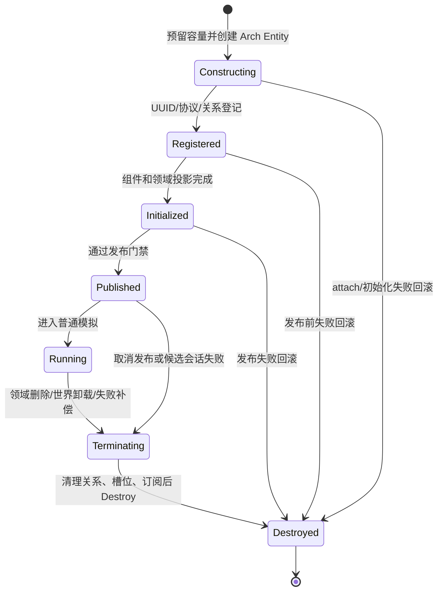

# Arch 迁移长线 T3：实体生命周期与关系静态交接

文档 ID：DOC-2026-10-08-ARCH-TRACK-T3-EXECUTION

状态：**partial / blocked-by-prerequisite**

日期：2026-10-08（Asia/Shanghai）

对应批次：A3

合同：[T3 生命周期与关系](../../plans/2026-10-08-arch-migration-track-t3-lifecycle-relationships.md)
关系前置：[T3-B3 官方关系扩展兼容性与清理探针合同](../../plans/2026-10-08-arch-migration-track-t3-relationship-extension-probe-execution.md)

本交接记录只包含当前主工作树的静态 caller 盘点、生命周期/关系合同和编译-only 输入。按照
`CR-2026-10-08`，本轮没有运行测试、探针、宿主、WorldFile、simulation、benchmark 或其他
运行时验证；编译结果不能推导行为、关系清理、槽位复用或 Arch 兼容性已经通过。

## 1. 本轮结论

当前主工作树包含一个未提交的 T2 partial prerequisite slice：`NSSLC.Application` 直接引用
`Arch 2.1.0`，`LoadedWorldSession` 创建并拥有 Arch `World`、世界单例和独立
`EntityRuntimeId` session token，`EntityRuntime` 接收该 token，`EntityUuidIssuer` 被抽出为
UUID 签发端口。这个切片只作为 T3 的前置证据，不代表 T2 或 T3 已完成。

实体生产路径仍由 `EntityRuntime`、`ComponentStore`、`RuntimeEntityHandle` 和
`EntityComponentSnapshot` 承载。`EntityIdentityRegistry` 仍映射 `EntityUuid` 到
`RuntimeEntityHandle`，尚未切换到 `(session token, Arch.Entity)`；`WorldStorageRoot` 仍接受
`EntityRuntime`，并暴露 `ProjectileRuntime` 与 `TileEntityRuntime` compatibility alias。五类
真实 caller 也尚未使用 Arch Entity registry 合同。

因此，本线完成了不依赖 T2 完整切换的 B0 支持矩阵、生命周期状态机、关系来源/目标清理矩阵和
T2 精确阻塞输入；真实 Arch caller 接线、官方关系扩展接线及完整编译闭包迁移保持 blocked。
没有添加新的通用关系图、反向字典、实体 facade 或第二套身份协议。

### 状态摘要

| 条目 | 状态 | 证据或缺口 |
| --- | --- | --- |
| B0 五类实体真实 caller 盘点 | done（静态） | 已定位 NPC、Player、Projectile、Item/world-drop、TileEntity 的创建/发布/释放入口。 |
| T2 World/token bootstrap | partial | `LoadedWorldSession` 已创建 Arch `World`、世界单例和 session token；registry、slot、caller 闭包仍未切换。 |
| 生命周期状态机与失败回滚合同 | partial | 旧 caller 已有局部回滚；Arch World owner 已出现，但统一 Arch identity/关系回滚尚未提供。 |
| NPC 父子关系唯一权威 | blocked | 当前同时写入 `NpcParentRelationComponent` 与 `EntityRelationState`；需要 T2 Entity/token 入口后移除冗余写入。 |
| 官方关系扩展采用 | partial / blocked 生产接线 | Relationships 只有部分编译面；Events 最终 API probe Debug/Release 已为 0 warning/0 error，但关系/事件清理、重入和 Release 行为仍未运行。 |
| Player 普通复活/真实重建语义 | partial | `PlayerLifecycleComponent` 支持同实例死亡阶段；实际 Arch UUID/Entity 语义未接线。 |
| 槽位 generation 与 Arch Version 分离 | partial | 现有 `EntitySlotStore` 有槽位 generation；Arch Entity 尚未存在，无法完成双 token 检查。 |
| 运行时验证 | not-run | 由 compile-only 变更控制明确禁止。 |

## 2. 前置与范围证据

### 2.1 T2 阻塞证据

以下扫描针对 `src/`，排除 `分类参考`、`obj` 和 `bin`，以 2026-10-08 当前工作树为准：

```text
生产 C# 文件：3371
包含 EntityRuntime|ComponentStore|RuntimeEntityHandle|EntityComponentSnapshot 的文件：69
包含 Arch.Core|Arch.System|Arch.Buffer 的 C# 文件：1
包含 Arch PackageReference 的生产 csproj：1
```

关键 owner 仍是：

- `src/NSSLC.Application/WorldStorage/Loading/LoadedWorldSession.cs`：先创建 Arch `World`，再生成
  `EntityRuntimeId` 并构造旧 runtime；创建世界单例并以 `_entityRuntime.EntityCount == 0` 参与
  `IsFresh`，在 `Dispose` 中先清理 `WorldStorageRoot`/runtime 再释放 Arch World。世界单例访问和
  Dispose 的 owner-thread/生命周期门禁已存在，但实体 registry 尚未使用该 Arch World。
- `src/NSSLC/Component/Share/Entity/System/EntityIdentityRegistry.cs`：
  `EntityUuid ↔ RuntimeEntityHandle` 双向映射，尚未保存 `(session token, Arch.Entity)`；当前
  `EntityUuidIssuer` 只负责签发历史，不能替代 live entity registry。
- `src/NSSLC/Component/WorldStorage/System/WorldStorageRoot.cs`：以 `EntityRuntime` 为构造参数，
  暴露 `ProjectileRuntime`/`TileEntityRuntime` 两个同义 alias。
- `src/NSSLC/Component/Relationships/System/RuntimeEntityHandle.cs`：表达
  `RuntimeId/local index/generation`，尚不是 Arch `Entity` 投影。

T2 partial slice 已提供 World/token bootstrap，但以下字段仍未完成，继续作为 T3 硬前置：

1. registry live value 仍是 `RuntimeEntityHandle`，没有 `(session token, Arch.Entity)` 的
   exact mapping、WorldId/IsAlive/Version 解析门禁和 exact unregister。
2. `WorldStorageRoot`、`EntitySlotStore`、`TileEntityStore` 和 Projectile identity 仍以旧
   runtime handle/alias 为运行时定位，未接入 Arch Entity 投影。
3. `RuntimeNpcStore`、`RuntimePlayerStore` 仍存在独立 `new EntityRuntime(...)` 构造路径；五类
   caller 尚未共享唯一 World/registry owner。
4. 候选 World 失败、World dispose、旧 token/foreign World/旧 Version 拒绝和 UUID issuer 跨
   candidate 生命周期的生产语义没有完成并且全部未运行。
5. 世界单例仍与 `WorldSessionRestoreState` 双路径可达，`IsFresh` 仍检查旧 runtime 计数；领域
   caller 尚未全面改为单例组件访问。

T3 不复制身份协议来绕过这些缺口；依赖该签名的实现统一标记 `blocked-by-prerequisite`。

### 2.2 当前源码 hash

以下 hash 锁定本报告的静态观察输入。前五个 T2 owner 文件是当前主 checkout 的未提交 partial
prerequisite slice；其余 T3 caller 文件本轮没有被修改：

```text
596D0AA01C0369F38C4C1726076982C0AE90F3530124F739A255DF1B9A33D6A0  src/NSSLC.Application/NSSLC.Application.csproj
ADF249F0BBF4DB1A5AC82EF39E672CAA33AFF6C09A947BF990277EEA661EFD0A  src/NSSLC.Application/WorldStorage/Loading/LoadedWorldSession.cs
875423517B9E462F7272DC2443AEAE2A50BF13033DA55AD0FD7FBF03994157E4  src/NSSLC/Component/Share/Entity/System/EntityIdentityRegistry.cs
A47A71EA92A0FCB2AC62B924B1DCE119C2A8D53F12FCA17340953B4243A7039D  src/NSSLC/Component/Share/Entity/System/EntityRuntime.cs
4F73B6C0E9B3913594E5A8D40D74A9C5077A9D26539D2EBC3D8AB9B9F7132A9C  src/NSSLC/Component/Relationships/System/EntityUuidIssuer.cs
659F70CB60D39D65CFF231F8014C957E1253EDC4AB7D2C0C7169117FC12CC457  src/NSSLC/Component/Share/Entity/System/EntityRelationState.cs
5B6352F6D0432B7DDC2CB90143E75AEC8B07CF0C9C43D241DF7106C3863DD7EC  src/NSSLC/Component/Npc/NpcParentRelationComponent.cs
D753DFC9A99B6C7AB301D7C4E269A902B9CC3F1679A5AE885C4332BA788FF2D6  src/NSSLC.Tools.Simulation/RuntimeNpcEntity.cs
D0D77F6259A15836AB831592ED3DB4A51645562D88932D489846D45BB6C42334  src/NSSLC.Tools.Simulation/RuntimeNpcStore.cs
1B72A67CD233ED88B2AC8ABF2F6F6C7D6231A882F61E9D79DFC89BB7881B60C1  src/NSSLC.Tools.Simulation/RuntimePlayerEntity.cs
9BFA5267233BEA40E6534200239CC0FD98D4E5BDD616CB9F8D1B3FEBCE5A0288  src/NSSLC.Tools.Simulation/RuntimePlayerStore.cs
9641C82A1E77B612BD4C9A8EFAF3A52CCB53DF4977205FB67A403D8C36EBC0AC  src/NSSLC.Tools.Simulation/RuntimeProjectileStore.cs
6D5C206E44A2B31885A89C96DEF17DAE1083C28E8B4AA58ED094B3FB86F480F1  src/NSSLC/Component/Projectile/System/ProjectileLifecycleSystem.cs
6F89148BB71437E06D71C9981049F7FB3A7666B4E93A95FE885690C3C2B3D238  src/NSSLC.Tools.Simulation/RuntimeItemRegistry.cs
8DFA244A7FD8AF550ADEE5FE76CBCC4A1F87A2533B38E7A1E3B8187C29B6D20B  src/NSSLC.Tools.Simulation/RuntimeWorldItemStore.cs
550DDBF1A0525C6A6B386950158097429A076AC9F2B8566559607B1F2A3B7856  src/NSSLC/Component/WorldStorage/System/TileEntityStore.cs
45AAEF998449D8314AE564CC4FA881C58AED931B31BBFCAA6561DF2499F06FCF  src/NSSLC/Component/WorldStorage/System/EntitySlotStore.cs
9712FCDC33CB8ECE6880578DB06512628516E979DC1F56287CAF4219E6BC6C8B  src/NSSLC/Component/WorldStorage/System/WorldStorageRoot.cs
```

### 2.3 T1 关系/Events 兼容性证据

当前工作树中出现了未跟踪的 T1 隔离项目和诊断文件；本线只读取证据，没有执行这些项目。
证据将关系扩展从“完全未知”收窄为“部分编译面已观察、生产采用仍阻塞”：

- `Build/diagnostics/ArchMigration/T1/relationships-core-build-attempt-4.json` 记录
  `Terraria.Arch.Relationships.PackageProbe.csproj` exit `0`、0 warning、0 error。该版本的
  probe 只保留了实际可编译的 `AddRelationship`、`SetRelationship`、`HasRelationship`、
  `GetRelationship`、`TryGetRelationship`、`GetRelationships`、`Relationship<T>.Set` 和
  `RemoveRelationship` 表面。
- 同一 probe 的前序记录确认 `Relationship<T>.Count` 不在实际 1.0.1 二进制引用面；
  `TryGetRelationships`/`TryGetRefRelationships` 也被记录为 XML/二进制漂移项，不能在生产
  合同中使用。该编译结果不能证明 source/target destroy、World dispose 或反向清理行为。
- `Arch.Relationships 1.0.1` 的 PackageReference 可 restore，但其 nuspec 声明的 Arch 依赖是
  `1.2.6.5-alpha`。这与本项目固定的 Arch 2.1.0 形成兼容性风险；不能因为局部类型能编译就
  把它写成生产兼容通过，也不能为了它降级核心 Arch。
- `Build/diagnostics/ArchMigration/T1/events-package-evidence.json` 记录 `Arch-Events 2.1.0`
  包 Debug/Release restore/build 各 exit `0`、0 warning、0 error。
- `Build/diagnostics/ArchMigration/T1/events-api-build-attempt-3.json` 记录修正事件委托 `in`
  参数后的 Debug/Release API probe 各 exit `0`、0 warning、0 error；这才是当前 Events
  compile-surface 结果。较早的 `events-api-build.json` Debug/Release 各 exit `1`、4 error
  属于 historical attempt，错误是 probe 委托参数缺少 `in`，不能覆盖最终结果。
- 最终编译结果仍不能证明事件订阅清理、source/target destroy、World dispose、重入顺序或
  Release 运行时行为；`Arch-Events` 与常规 `Arch` 同程序集名的 co-load 风险也未在生产闭包
  中解决。

T3 的采用结论：可以把 Relationships 的已观察方法和 Events 的最终编译表面作为后续 T2 完整
切换后的候选 API 输入，但不能现在接入生产，也不能把包 build 或 API compile 当作 Release 清理
证据。
在 T2 session/token/world owner 和关系扩展的 source/target/World 清理语义没有共同交接前，
NPC、Item、Projectile、TileEntity 的生产关系接线继续标记 `blocked-by-prerequisite`。

## 3. B0 实体类别支持矩阵

“支持”只表示当前旧 caller 有真实创建/销毁路径；它不表示 Arch 迁移已完成，也不表示本轮
运行时行为已验证。`worldId` 参数目前是旧 caller 的普通整数输入，不能作为 T2 session token
或 Arch `WorldId` 证据。

| 类别 | 当前真实入口与组件组合 | 身份/槽位/发布边界 | 失败与销毁路径 | T3 状态 |
| --- | --- | --- | --- | --- |
| NPC | `RuntimeNpcStore.TrySpawn`（约 633 行）按 200 个 NPC 槽扫描；`CreateRuntimeNpc`（约 572 行）调用 `RuntimeNpcEntity.Hydrate`，附加 identity、lifecycle、movement、AI、combat、target 和可选能力组件。 | `EntityRuntime.CreateEntity` 先分配 `RuntimeEntityHandle`；`EntityIdentityRegistry` 签发 UUID；`TryPublishEntity` 后写入 `EntitySlotStore<RuntimeNpcEntity,NpcRuntimeSlot>` 与 `_handlesByInstanceId`。槽位 generation 独立维护。 | 组件/发布失败调用 `RemoveRuntimeNpcIdentity`；父子创建失败反向释放；`TryRelease` 先 `DetachChildren`、终止 runtime、释放槽位、注销 instance 映射，再删除 runtime entity。容量上限为 200。 | partial；session World/token bootstrap 已存在，Arch Entity registry 和 caller 接线未完成。 |
| Player | `RuntimePlayerStore.Initialize`（约 167 行）批量 hydrate；断线/重建使用 `TryCreatePlayerAtSlot`（约 325 行）；`RuntimePlayerEntity.Hydrate` 附加 identity、death record、lifecycle、ghost、位置、运动、碰撞、输入、背包槽和能力组件。 | 玩家槽位是 `LegacyPlayerSlot`；runtime handle 由旧 EntityRuntime 分配；发布后初始化 `RuntimePlayerInventoryOwner`。`TryDestroyPlayer`（约 294 行）是实际销毁入口。 | hydrate 失败会终止并删除 handle；销毁前释放背包物品。普通死亡在 `PlayerLifecycleComponent` 内推进，不由 `AdvanceLifecycle` 重新创建实体；真实重建路径是销毁后在槽位重新 hydrate。 | partial；session token bootstrap 已存在，普通复活保 UUID 与真实重建换 UUID 尚未由 Arch registry 接线确认。 |
| Projectile | `RuntimeProjectileStore.TrySpawnArrow`（约 67 行）构造 `ProjectileSpawnCommand`；`ProjectileLifecycleSystem.TrySpawn` → `CreateRuntimeEntity`（约 888 行）附加 definition、identity、lifetime、network、kinematics、collision、immunity 等组合。 | `ProjectileIdentityIndex` 保留 owner/identity ↔ `ProjectileHandle` 的双向协议投影；`TryAllocate` 写槽位 generation；`TryRegister` 成功后发布可见。Arch Entity 不能替代 projectile identity。 | 创建失败执行 `RemoveRuntimeEntity`；终止先 `TryUnregister`/释放 slot，再终止和删除 runtime entity；旧 handle/slot generation 不得命中新实例。 | partial；session token bootstrap 已存在，Arch Entity 与协议 identity 的分离接线未完成。 |
| Item / world-drop | `RuntimeItemRegistry.Create`、`CreateWorldDrop`、split item 均汇入 `CreateEntity`（约 588 行）；world-drop 由 `RuntimeWorldItemStore.SpawnWorldItem`（约 249 行）写入 400 槽位，更新/拾取/过期在 `Update`（约 117 行）。 | item UUID/runtime reference 与 `ItemEntityRef` 属于领域身份；world-drop 另有 `WorldItemSlot`、`ReplicationId` 和 `WorldItemReservationComponent`。发布前必须完成 item instance/stack 与可选位置、速度、碰撞、world state、reservation。 | 任一 attach/publish/capture 失败调用 `RemoveIncompleteEntity`；过期或完整拾取先释放 world slot/关系，再 `RuntimeItemRegistry.Remove`；部分拾取保留实体并增加 revision。 | partial；数量守恒/重复拾取/重建仅有旧代码路径，本轮不运行。 |
| TileEntity（已支持） | `TileEntityStore.Replace`/`CommitRuntimeSnapshot`（约 257/263 行）调用 `CreateRuntimeEntity`（约 426 行）；仅 type `0` TrainingDummy 与 type `2` LogicSensor 附加对应能力组件。 | `TileEntityId`、anchor 和 persistence payload 是领域/存档投影；`TileEntityRecord` 只保存运行时 handle 与快照输入；`_byId`、`_byAnchor` 为领域索引。 | Replace 先校验 ID/anchor 唯一性，创建和发布失败回滚新 handle；移除先 unschedule、终止、删除，再清理两个索引；Dispose 清空所有记录。 | partial；session World/token bootstrap 已存在，保存/重载和 anchor 仍未通过 Arch Entity 投影接线。 |
| Leashed（明确未支持） | `LeashedEntityRegistrationSystem` 有隔离注册实现，但当前生产 caller 扫描未找到真实 world host 接线。 | 当前系统另有 section/legacy slot/anchor index 和 `LeashedEntityAnchorRelationComponent`；它不能被扩大成 T3 已支持集。 | 仅作为未接线代码风险记录；不接入 Arch 关系扩展，不为其新增 caller。 | not-supported / not-run。 |

### 3.1 每类实体的目标 Arch 流程

在 T2 提供唯一 `LoadedWorldSession` owner、session token 和 `(token, Arch.Entity)` registry 后，
每类 caller 必须按同一个顺序实现：

```text
容量/槽位预留
  -> World.Create(独立组件实例)
  -> UUID/协议 identity/领域关系登记
  -> 初始化组件与领域投影
  -> 生命周期状态切换为 Published
  -> 发布到普通查询可见集
```

任何一步失败都必须逆序撤销：取消普通查询可见性、撤销关系/订阅、释放协议槽位、注销 UUID、
最后销毁 Arch Entity。Arch Entity 的 `Id/Version` 只用于当前 World 的运行时定位；不能写入
UUID、存档 identity、协议槽位或 TileEntity ID。

## 4. 生命周期合同与当前差距

### 4.1 统一状态机



当前旧代码把这些阶段分散在 `EntityRuntimeStatus`、slot occupancy、`IsActive` 和候选容器中，
尚未由单一 Arch lifecycle component/owner 原子推进。进入普通查询必须至少满足：World token 当前、
Arch Entity `WorldId` 匹配、`World.IsAlive` 为真、领域 lifecycle 为 Published/Running，且没有
termination 标记。构建中或终止中的实体即使被组件查询命中，也不能参与普通模拟。

### 4.2 Player 复活与真实重建

- 普通死亡/复活：保留同一实体实例和同一 `EntityUuid`，只推进 `PlayerLifecycleComponent` 与
  `PlayerGhostStateComponent` 等能力状态。当前 `RuntimePlayerEntity.AdvanceLifecycle` 的死亡分支
  没有销毁 runtime handle，支持这一目标，但尚未由 Arch registry 证明。
- 真实销毁/重建：`RuntimePlayerStore.TryDestroyPlayer` 释放背包、终止并删除实体；随后
  `TryCreatePlayerAtSlot` 创建新的 runtime root。迁移后必须新签 UUID，即使重用相同 player slot；
  旧 `(token, Entity.Version)`、旧协议映射和旧请求必须拒绝。

### 4.3 同 tick 可见性

当前 NPC store 以显式槽位扫描顺序更新，Projectile/Item/TileEntity 则分别由其 owner 的列表/槽位
遍历驱动。Arch chunk、archetype、`Entity.Id` 和创建顺序不能成为同 tick/next tick 合同。迁移后
需要由领域调度决定“本 tick 可见”或“下一 tick 可见”，结构变化前释放 ref，提交后重新取得组件。

## 5. 关系来源/目标与清理矩阵

关系矩阵中的“领域投影”不是允许自建通用关系图的例外；它们只保存该领域必须的槽位、协议、
持久身份或业务提交状态。通用 source/target 图能力必须消费 T1/T3-B3 的官方扩展结论。

| 关系 | source owner | target / 反向投影 | 当前写入/清理证据 | 迁移决定与缺口 |
| --- | --- | --- | --- | --- |
| NPC parent → child | `RuntimeNpcStore` + child `RuntimeNpcEntity` | `NpcInstanceId`、legacy slot、`EntityReference` 快照 | `TryAttachParentRelation` 同时 attach `NpcParentRelationComponent` 与 `EntityRelationState`；`DetachChildren`、`ReleaseParentAndChildren` 负责 parent release 前断开。 | **唯一权威建议为 Npc 领域组件**，其值需携带可解析的 `(session token, EntityUuid/Arch.Entity)` 投影；`EntityRelationState` 当前为 proposed 冗余写入，应在 T2 签名可用后移除。source/target destroy、重建和旧 token 拒绝未运行。 |
| Player ↔ inventory item | `RuntimePlayerInventoryOwner` / `RuntimeItemRegistry` | Player 的 equipment/container slot arrays 与 item `ItemInventoryRelationComponent` | `TrySetInventoryRelation`/`TryClearInventoryRelation`、`ReleaseAllItems`、item Remove/restore 路径；Player 组件保存 `ItemEntityRef` 数组。 | 这是 Items/Player 领域协议，不建立通用图。Player destroy、重复拾取、转移失败和跨会话解析必须由 item owner 清理；当前仍依赖旧 runtime reference。 |
| Projectile owner ↔ projectile | `ProjectileLifecycleSystem` | `ProjectileIdentityIndex` 的 owner identity ↔ `ProjectileHandle` 双向索引 | `TryRegister`、`TryReplace`、`TryUnregister`；终止路径先撤销 index 再删除 entity。 | 保留为协议 identity 投影，不用 Arch `Entity.Id` 替代。需将 handle 改为完整 Arch Entity + slot generation，并在 World unload/candidate failure 清空 index；未运行。 |
| World item ↔ reservation/pickup player | `RuntimeItemRegistry` / `RuntimeWorldItemStore` | `WorldItemReservationComponent.ReservedFor`、`IgnoreOwner` 与 Player `EntityReference` | 过期/完整拾取路径释放 slot 后 Remove；失败时 `RestoreWorldPresence` 回填组件；部分拾取保留 revision。 | 预留 token/revision 是物品业务冲突保护，不是通用关系图。必须证明重复拾取、过期请求、容量失败和失败补偿不会误删重建 item；未运行。 |
| TileEntity ↔ anchor/persistence | `TileEntityStore` | `_byId`、`_byAnchor`、`TileEntityRecord` 的 `TileEntityId`/anchor | Replace 预检 ID/anchor 唯一；Remove/Dispose 清两个索引并 unschedule；runtime component 只承载 type-specific state。 | 领域索引保留；Arch Entity 仅作运行时投影。anchor 失效、保存重载、候选失败和 World dispose 的完整映射撤销未运行。 |
| Leashed entity ↔ anchor | `LeashedEntityRegistrationSystem`（隔离实现） | `_membersByAnchor`、section index、`LeashedEntityAnchorRelationComponent` | `SetAnchor`/registration 内部维护反向集合和 section slot。 | 当前无真实生产 caller，明确保持 unsupported；不得因组件存在扩大支持集或接入未验证关系扩展。 |

### 5.1 NPC 冗余关系的具体证据

`RuntimeNpcEntity.TryAttachParentRelation`（当前约 747 行）首先写入 typed
`NpcParentRelationComponent`，随后从 parent runtime handle 生成 `EntityReference` 并写入
`EntityRelationState`。`TryCaptureParentRelation` 同时读取两者，并以 tick、scope 和 relation kind
做软一致性判断；`TryDetachParentRelation` 也必须分别 detach 两个组件。该模式产生第二个可写
关系事实，且 `EntityRelationState` 声明仍带有 `status: proposed`。

T3 的迁移输入是：

1. 保留 `NpcParentRelationComponent` 作为 NPC 玩法 owner 的唯一关系状态；它必须在 T2 合同下
   取得可解析的完整运行时投影，不能只靠 legacy slot。
2. 删除 parent relation 对 `EntityRelationState` 的 attach/capture/detach 写入；通用关系若确实
   需要，改由官方扩展的单一 source/target API 承载，并明确清理顺序。
3. `NpcCombatSystem`、`NpcStatusTickSystem` 和 store 的 parent 参数只消费同一 typed owner；不
   允许再次从旧 `EntityReference` 或 slot 猜测 parent。

## 6. 失败、重复释放与槽位复用矩阵

| 场景 | 当前代码证据 | 迁移后的硬门禁 | 本轮 |
| --- | --- | --- | --- |
| 组件 attach 失败 | NPC/Projectile/Item/TileEntity create helper 捕获异常并删除 incomplete runtime root。 | 必须同时撤销 Arch entity、UUID、关系、协议槽位和 reservation；任一步清理失败需保留具名错误。 | not-run |
| 发布失败 | 各 owner 在 `TryPublishEntity` 失败时调用 runtime remove；TileEntity Replace 对新 roots 逆序清理。 | Arch Entity 不得进入普通 Query；未发布实体不能拥有已发布 UUID/网络投影。 | not-run |
| 容量耗尽 | NPC 200、Projectile 1000、world item 400；slot allocation 返回 false。 | 失败不得遗留组件、UUID 或半占用 slot；容量判断与 Arch Create 顺序需由 owner 定义。 | not-run |
| 重复 release/destroy | slot generation + `ReferenceEquals`/handle status 拒绝过期对象；runtime remove 对非 running 有具名失败。 | 对旧 token/旧 Arch Version 必须幂等或返回具名 already-absent；严禁误删同 slot 新实例。 | not-run |
| 槽位复用 | `EntitySlotStore` 每次 allocate/replace 递增 generation，旧 generation 无法 `TryGet`。 | 槽位 generation 只保护业务投影；必须再检查 session token、WorldId、Arch Version/IsAlive。 | not-run |
| parent/target 先销毁 | NPC store `DetachChildren`；Projectile index `TryUnregister`；item/player cleanup 分散在 owner。 | source/target 双向索引、订阅、reservation、协议映射都必须在 Destroy 前清理。 | not-run |
| 候选 World 失败 | LoadedWorldSession/各 store 有局部 candidate rollback，但当前 World 仍是 EntityRuntime。 | 先停止发布入口，再撤销 UUID/关系/slot/buffer，最后释放 Arch World；旧 token 全部拒绝。 | blocked |
| World unload / dispose | `WorldStorageRoot.Dispose` 清各领域 store；`LoadedWorldSession.Dispose` 再释放 runtime。 | World owner 必须集中负责关系扩展清理和重复 dispose 语义；安装包或 Debug 代码不能替代 Release 证据。 | blocked |

## 7. T2 解阻所需的最小输入

T3 不实现第二套身份协议；T2 只需交付以下可消费签名，具体类型命名由 T2 owner 决定：

1. `LoadedWorldSession` 的唯一 Arch World owner、独立 session token、published/disposed 状态和
   World 访问门禁。
2. `EntityIdentityRegistry` 的唯一 live 映射：`EntityUuid ↔ (session token, Arch.Entity)`，
   以及 register/unregister/resolve 的 owner thread 与重复清理语义。
3. 外部入口固定解析顺序：session token → `entity.WorldId == world.Id` → `world.IsAlive` →
   领域 lifecycle/能力 → 组件访问；foreign World、旧 token、旧 Version 和 terminating entity
   必须是具名拒绝。
4. `WorldStorageRoot` 接受 World/identity owner，不再让 T3 继续依赖 `EntityRuntime` 或
   `ProjectileRuntime`/`TileEntityRuntime` alias。
5. 领域 UUID、协议 identity、slot generation、TileEntity ID 与 Arch Entity 的字段边界；普通
   Player 复活保 UUID，真实销毁重建新 UUID。

收到上述输入后，T3 才能逐 caller 迁移 `RuntimeNpcStore`、`RuntimePlayerStore`、
`ProjectileLifecycleSystem`、`RuntimeItemRegistry`、`TileEntityStore`，并在同一批次移除
NPC generic relation 冗余写入。T3 不会把 `World.Id`、`Entity.Id` 或 `Entity.Version` 写入 UUID、
协议或持久化 DTO。

## 8. 编译-only 交接

### 状态分类

- **done（静态）**：五类支持集 caller、容量/槽位/关系 owner、旧 runtime 依赖和 NPC 冗余关系
  写入已定位；本报告与源文件 hash 已保存。
- **partial**：T2 partial slice 已表达 Arch World owner、世界单例、session token 和 UUID issuer；
  旧 caller 仍表达局部失败回滚、槽位 generation 和 Player 死亡阶段。
- **blocked**：真实五类 Arch caller 接线、`EntityUuid ↔ (token, Arch.Entity)` registry、
  `WorldStorageRoot`/slot/TileEntity 投影、官方 Relationships/Events 清理 API、Arch Version 与
  slot 双重校验。
- **not-run**：所有创建/销毁/关系清理/复用/可见性/World dispose 行为和测试。

### 受影响项目（待 T2 签名合入后编译）

| 项目 | 直接 caller | 当前状态 |
| --- | --- | --- |
| `src/NSSLC/Component/Share/Entity/Terraria.EntityEcs.csproj` | identity/runtime/生命周期旧实现 | blocked；T2 迁移后需重编译，不能把旧 DLL 当作 Arch 证据。 |
| `src/NSSLC/Component/Relationships/Terraria.Relationships.csproj` | EntityReference、RuntimeEntityHandle、EntityUuid | blocked；关系扩展版本未接入。 |
| `src/NSSLC/Component/Npc/Terraria.Npc.csproj` | NPC relation/lifecycle 类型 | partial；等待 typed relation 与 Arch caller 签名。 |
| `src/NSSLC/Component/Projectile/Terraria.Projectile.csproj` | Projectile lifecycle/identity | partial；等待完整 Arch Entity + protocol projection。 |
| `src/NSSLC/Component/Items/Terraria.Items.csproj` | item/world-drop components | partial；等待 registry owner。 |
| `src/NSSLC/Component/WorldInteraction/Terraria.WorldInteraction.csproj` | TileEntity capability components | partial；仅 sensor/dummy 支持集。 |
| `src/NSSLC/Component/WorldStorage/Terraria.WorldStorage.csproj` | slots, TileEntityStore, WorldStorageRoot | blocked；当前构造仍接受 EntityRuntime。 |
| `src/NSSLC.Application/NSSLC.Application.csproj` | LoadedWorldSession、network caller | blocked；当前 69 个旧 runtime 引用范围未迁移。 |
| `src/NSSLC.Tools.Simulation/NSSLC.Tools.Simulation.csproj` | 五类真实 simulation caller | blocked；本轮不运行 Simulation。 |

本轮源码没有加入 Arch 类型或 PackageReference，因此没有为旧闭包伪造编译通过证据。T2 合入
后按构建约束只对实际改动项目执行增量 `dotnet build --no-restore --nologo`，记录 exit code、
warning/error 数、`Build/bin/` 输出路径与 source hash。

### 当前 compile-only 记录

本轮为确认真实 caller 闭包仍可构建，执行了一次受影响宿主项目的增量编译；没有执行任何
测试或运行命令：

```text
项目：src/NSSLC.Tools.Simulation/NSSLC.Tools.Simulation.csproj
命令：dotnet build src/NSSLC.Tools.Simulation/NSSLC.Tools.Simulation.csproj --no-restore --nologo
退出码：0
warning/error：17 / 0
输出：Build/bin/NSSLC.Tools.Simulation/Debug/net10.0/NSSLC.Tools.Simulation.dll
传递闭包中包含：NSSLC.Application、Terraria.EntityEcs、Terraria.Relationships、
Terraria.Npc、Terraria.Player、Terraria.Projectile、Terraria.Items、Terraria.WorldStorage、
Terraria.WorldInteraction、NSSLC.Infrastructure.WorldStorage 等项目
```

T2 partial prerequisite slice 在本轮主 checkout 的增量编译记录：

```text
项目：src/NSSLC.Application/NSSLC.Application.csproj
命令：dotnet restore src/NSSLC.Application/NSSLC.Application.csproj --nologo
退出码：0
warning/error：0 / 0

项目：src/NSSLC.Application/NSSLC.Application.csproj
命令：dotnet build src/NSSLC.Application/NSSLC.Application.csproj --no-restore --nologo
退出码：0
warning/error：6 / 0
输出：Build/bin/NSSLC.Application/Debug/net10.0/NSSLC.Application.dll

项目：src/NSSLC.Tools.Simulation/NSSLC.Tools.Simulation.csproj
命令：dotnet restore src/NSSLC.Tools.Simulation/NSSLC.Tools.Simulation.csproj --nologo
退出码：0
warning/error：0 / 0

项目：src/NSSLC.Tools.Simulation/NSSLC.Tools.Simulation.csproj
命令：dotnet build src/NSSLC.Tools.Simulation/NSSLC.Tools.Simulation.csproj --no-restore --nologo
退出码：0
warning/error：17 / 0
输出：Build/bin/NSSLC.Tools.Simulation/Debug/net10.0/NSSLC.Tools.Simulation.dll
```

Application 的 6 个 warning 来自未修改的 `WorldSectionState.cs`；Simulation 的 17 个 warning
来自未修改的 `NSSLC.Infrastructure.WorldGeneration`。两次 build 均只证明 partial T2 源码的
编译闭包可构建，不证明 registry、五类 caller 或生命周期/关系行为已经通过。

17 个 warning 均来自 `NSSLC.Infrastructure.WorldGeneration` 既有代码（`LegacyApi.cs`、
`WorldGen.cs`、`WorldEntities.cs`、`EnchantedSwordBiome.cs`、`NpcStaticMembers.cs` 等），本轮
没有修改这些文件；0 error 只证明当前旧 caller 闭包可构建，不能证明 Arch 接线或生命周期行为。
本次编译输入的关键 hash 为：

```text
38FF86CFA47CFC0C2C67E905D85DB4ED6B8B19AF89AC6DFD793341FA9D84DD44  src/NSSLC.Tools.Simulation/NSSLC.Tools.Simulation.csproj
63C1D4E60236AF8D5D60AD7B6C71EC22F58D0831486B881C53476F9D4EB805A1  src/NSSLC.Application/NSSLC.Application.csproj
D0D77F6259A15836AB831592ED3DB4A51645562D88932D489846D45BB6C42334  src/NSSLC.Tools.Simulation/RuntimeNpcStore.cs
9BFA5267233BEA40E6534200239CC0FD98D4E5BDD616CB9F8D1B3FEBCE5A0288  src/NSSLC.Tools.Simulation/RuntimePlayerStore.cs
9641C82A1E77B612BD4C9A8EFAF3A52CCB53DF4977205FB67A403D8C36EBC0AC  src/NSSLC.Tools.Simulation/RuntimeProjectileStore.cs
6F89148BB71437E06D71C9981049F7FB3A7666B4E93A95FE885690C3C2B3D238  src/NSSLC.Tools.Simulation/RuntimeItemRegistry.cs
8DFA244A7FD8AF550ADEE5FE76CBCC4A1F87A2533B38E7A1E3B8187C29B6D20B  src/NSSLC.Tools.Simulation/RuntimeWorldItemStore.cs
550DDBF1A0525C6A6B386950158097429A076AC9F2B8566559607B1F2A3B7856  src/NSSLC/Component/WorldStorage/System/TileEntityStore.cs
```

### 运行验证

`not-run by change control`：禁止 `dotnet test`、`dotnet run`、benchmark、fixture、simulation、
host smoke、WorldFile、关系探针和行为 API probe。历史 custom ECS 或隔离 Arch probe 不能作为
本轮生产生命周期证据。

## 9. 变更与交接

### Changed files

- `docs/architecture/execution/2026-10-08-arch-migration-track-t3-lifecycle-relationships-execution.md`
  （本交接文档；本轮只收口 T3 handoff，没有继续扩展生命周期/关系 caller）。
- `docs/document-manifest.tsv`（新增本执行文档的 canonical manifest 记录）。

当前主 checkout 还保留一组未提交的 T2 partial prerequisite source changes，仅作为本报告的
前置证据，不作为 T3 完成提交：

- `src/NSSLC.Application/NSSLC.Application.csproj`
- `src/NSSLC.Application/WorldStorage/Loading/LoadedWorldSession.cs`
- `src/NSSLC/Component/Share/Entity/System/EntityRuntime.cs`
- `src/NSSLC/Component/Share/Entity/System/EntityIdentityRegistry.cs`
- `src/NSSLC/Component/Relationships/System/EntityUuidIssuer.cs`

这些切片只建立 Arch World/世界单例/session token/UUID issuer 的 bootstrap；没有把五类真实
caller 接入 Arch registry，也没有改变关系清理责任。`codex/arch-t2-probe-handoff` 未被
cherry-pick、合并或改写。

现有工作树中的其他源码、计划和组件改动均保留，未执行 reset、clean、checkout 或批量删除。

### 下一 owner

- **T2**：完成第 7 节尚未满足的 identity/slot/WorldStorageRoot 最小输入：把 live registry 改为
  `(session token, Arch.Entity)`，迁移 slot/TileEntity 投影，定义候选失败与 dispose 清理，并关闭
  独立 runtime 构造路径；T3 不复制该协议。
- **T1/T3-B3 owner**：给出实际 `Arch.Relationships`/Events 程序集、配置与清理 API 证据；当前不
  能由 NuGet 名称或 Debug 源码声明推断 Release 行为。
- **T3 生产线**：收到 T2 后按第 3 节顺序接线五类 caller，先统一生命周期 owner，再移除 NPC
  `EntityRelationState` 冗余 parent 写入，最后补 source/target/World dispose 清理。
- **T4**：消费完整 Entity/token 解析顺序；不要保留旧 `RuntimeNpcEntity`/`RuntimePlayerEntity`
  通用 Capture/Edit facade。
- **T5**：只在所有生产 caller 接线并增量编译闭包通过后接宿主；本轮不授权删除旧 ECS。

回滚点：本文档单独删除即可回退本线交接；生产源码未被 T3 改动。
