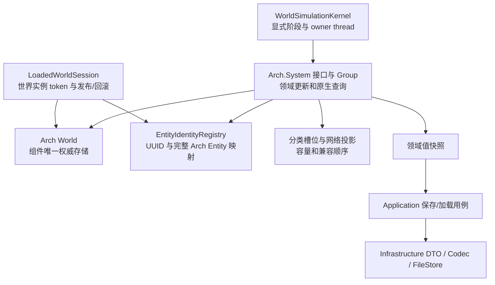

# 自定义 ECS 转向 Arch 的执行计划

文档 ID：DOC-2026-10-07-CUSTOM-ECS-TO-ARCH-PLAN  
逻辑域：plans / architecture  
产物类型：plan  
状态：draft；迁移尚未实施  
日期：2026-10-07  
范围：生产 ECS 存储、实体访问、关系解析、创建/删除、模拟宿主及相关验证程序  
证据入口：[Arch 官方 API 研究](../research/2026-10-07-arch-api-migration-research.md)、当前工作树源码及本文列出的仓库约束  
canonical 路径：`docs/plans/2026-10-07-custom-ecs-to-arch-execution-plan.md`

2026-10-08 范围增强：[Arch 原生 API 覆盖与自定义 ECS 退出审计](../reviews/audits/2026-10-08-arch-native-api-coverage-audit.md)。按用户新要求，通用系统接口/组织、世界级权威组件和关系扩展适用性也纳入完成条件；下文已同步这些增量。审计和合同更新不代表生产迁移已完成。

## 1. 目标与已确认范围

用户已明确允许采用 Arch 时破坏当前 ECS 的兼容性。因此，本计划以 **直接使用 Arch 原生存储与 API，退出自定义 ECS 框架** 为目标。旧 C# 类型、方法签名、构造参数、泛型编辑委托、查询返回形式及相关测试可以修改或删除。保留旧 `EntityRuntime` 外观、仿制全部 `TryEdit/Match` 契约或长期并存两个 ECS 后端，都不是完成条件。

目标结果：

1. 每个已加载世界会话拥有一个 Arch `World`；组件权威状态实际存放在 Arch archetype/chunk 中。
2. ECS 内部使用自带 `Version` 的 Arch `Entity`、`QueryDescription` 和原生读写 API；不采用已被 Arch 2.0 移除的框架 `EntityReference`。
3. 删除 `EntityRuntime`、`ComponentStore<T>`、`IComponentStore`、`RuntimeEntityHandle`、旧组件编辑委托与通用 `EntityComponentSnapshot<T>` 的生产用途；测试转向新行为契约。
4. 通用 System 接口与组使用 Arch.System；世界级权威组件进入 Arch World 的单例实体。实体创建组合、玩法行为和 UUID 登记由领域 owner 负责；通用关系优先采用经验证的官方扩展。
5. 已支持的实际模拟、世界切换、加载失败恢复、网络入口和存档流程通过新验收。

允许破坏 ECS API，不自动改变网络包格式、存档格式、服务器权威身份根或现有玩法结果。它们按实际行为独立验收；如果实施发现必须改变这些外部行为，应在对应批次明确新行为及受影响场景，不能把变化隐藏在框架切换内。

本次交付是研究与计划文档，没有安装依赖、修改生产 C#、构建或执行运行验收。

## 2. API 基线与采用范围

### 2.1 固定版本

执行基线固定为 NuGet **`Arch` 2.1.0**。截至本次查询，NuGet 官方版本索引中可取得的最新稳定版本为 2.1.0；`git ls-remote --tags` 与包内 `.nuspec` 的 repository commit 均确认 `v2.1.0` 对应：

```text
04d52e7268eb6f376ca4841a0c204334120c5e9d
```

本次已只读核对 `.nupkg/.nuspec`：包包含 `net8.0`、`net6.0`、`netstandard2.1` 资产，源码提交与上述 tag 相同。直接传递依赖包括 `Arch.LowLevel 1.1.5`、`Collections.Pooled 2.0.0-preview.27`、`CommunityToolkit.HighPerformance 8.2.2`、`Microsoft.Extensions.ObjectPool 7.0.0`、`System.Runtime.CompilerServices.Unsafe 6.0.0`、`ZeroAllocJobScheduler 1.1.2`；实际解析图与许可证在 A1 记录。尚未在本仓库 restore 或编译兼容性探针。仓库使用 `global.json` 选定的 .NET 10 SDK、目标 `net10.0`；不为迁移更改这项策略。

官方 README 的安装示例仍出现 `2.1.0-beta` 和 `using Arch`，稳定源码的核心命名空间为 `Arch.Core`。GitBook 还保留已被移除的独立 EntityReference 页面；稳定 `Entity` 已含 `Id/WorldId/Version`。GitBook 的 `.None<T>()`、`PlayBack(..., disposal: ...)` 示例应分别按稳定源码改为 `.WithNone<T>()`、`Playback(..., dispose: ...)`。实际重载由 A1 编译验证，不能直接复制在线示例。

### 2.2 API 与本项目的用途

| Arch 能力 | 用于本项目 | 必须额外处理的语义 |
| --- | --- | --- |
| `World.Create()`、实体 `Create/Destroy` | 世界会话及实体组件组合 | 领域身份登记、发布前不可模拟、失败清理 |
| `World.Get<T>/Set<T>/Has<T>/TryGet<T>` | 直接读写指定实体组件 | 在可信边界检查实体存活、世界作用域及必要组件；不返回跨帧可写 ref |
| `Add<T>/Remove<T>` | 能力组合变化 | 官方文档要求调用方确认存在/不存在；重复 Add、缺失 Remove 不能盲调 |
| `QueryDescription.WithAll/WithAny/WithNone/WithExclusive` | 按组件组合筛选 | `All` 不要求组件集合完全相等；只有确有必要时用 `Exclusive` |
| `World.Query`、`ref` 回调及非 lambda 查询方式 | 同步批量领域处理 | 创建、移动、删除会影响布局；查询顺序不作为游戏调度合同 |
| 自带版本的 Arch `Entity` | 本世界内同步或跨 tick 的运行时引用 | 保存完整 `Id/WorldId/Version` 并附所需世界实例 token；不是领域 UUID 或持久化身份 |
| `Arch.Buffer.CommandBuffer` | 已声明提交点的结构变化 | 来自核心 Arch 包；`Playback(World, bool dispose=true)` 非 FIFO/事务；临时实体不能直接发布 |
| 批量/非泛型 API | 动态创建组合与后续热点优化 | 先证明相同默认值、组件实例隔离及注册关系，再替换创建路径 |
| `Arch.System.ISystem<T>/BaseSystem<W,T>/Group<T>` | 周期系统接口、生命周期和注册分组 | 注册顺序显式；Kernel 仍负责会话/线程/tick 提交；不自动生成业务依赖 DAG |

按 2026-10-08 新要求，Arch 核心 API 与 `Arch.System 1.1.0` 为本轮必选。周期更新对象使用官方 `ISystem<T>`，需要默认实现时采用 `BaseSystem<W,T>`，注册分组采用 `Group<T>`；退出自定义 `IWorldSimulationTickPhase`，不新增同等通用接口或调度框架。领域阶段、线程、会话失效和 tick 提交仍由宿主明确组织。

官方关系扩展纳入 T1 适用性探针与 T3 接线范围，不能整体排除：已发布 `Arch.Relationships 1.0.1` 声明依赖旧 Arch `1.2.6.5-alpha`，当前官方源码声明 2.1.0，但 NuGet 尚未发布该关系版本；清理 API 还受 EVENTS/构建配置影响。实际采用的源码/包、核心事件变体和依赖闭包必须经探针确认。不得安装不存在的版本、降级核心或另造通用关系图。

SourceGenerator、并行查询和事件总线按真实用途采用；手写原生 World.Query 已满足原生 API 要求。PURE_ECS 不在本轮启用；Arch.Persistence 不替换现有 WorldFile 边界。具体采用与保留领域代码的界限见增强审计 N1–N5。

`Arch.Buffer` 是核心包中的命名空间，不是本轮需要额外安装的包。稳定命令缓冲 `Create(ComponentType[])` 返回负 Id 的暂存 Entity；回放按 `Create → Add → Set → Remove → Destroy` 分组，不能表达任意业务调用的 FIFO 顺序。带 UUID/关系的生产生成优先在安全创建阶段直接创建真实实体；不要依赖私有 Resolve 或猜测暂存 Entity 的最终 Id。

官方入口：

- [World](https://arch-ecs.gitbook.io/arch/documentation/world)
- [Entity](https://arch-ecs.gitbook.io/arch/documentation/entity)
- [Query](https://arch-ecs.gitbook.io/arch/documentation/query)
- [EntityReference](https://arch-ecs.gitbook.io/arch/documentation/utilities/entityreference)
- [Entities in Query](https://arch-ecs.gitbook.io/arch/examples-and-guidelines/page-2)
- [Structural changes](https://arch-ecs.gitbook.io/arch/examples-and-guidelines/structural-changes)
- [CommandBuffer](https://arch-ecs.gitbook.io/arch/documentation/utilities/commandbuffer)
- [稳定版本源码](https://github.com/genaray/Arch/tree/04d52e7268eb6f376ca4841a0c204334120c5e9d)
- [NuGet Arch 2.1.0](https://www.nuget.org/packages/Arch/2.1.0)

## 3. 当前代码基线与影响面

本表描述 2026-10-07 阅读时的工作树，不代表所有文件都等于 HEAD 或历史验收 DLL 的编译输入。开始实施时必须重新记录工作树、源文件 hash 和对应构建产物。

| 当前入口 | 已观察到的职责 | 迁移处理 |
| --- | --- | --- |
| [EntityRuntime.cs](../../src/NSSLC/Component/Share/Entity/System/EntityRuntime.cs) | 实体记录、句柄分配、组件关联、状态、借用、查询、owner thread | 退出框架；拆出实际需要的领域生命周期/身份职责，存储与遍历直接交给 Arch |
| [ComponentStore.cs](../../src/NSSLC/Component/Share/Entity/System/ComponentStore.cs) | 按索引数组、稳定 cell、class 实例检查、attachment/data revision | 删除存储实现；不在 Arch 外再保留同一组件的权威 cell |
| [ComponentAccess.cs](../../src/NSSLC/Component/Share/Entity/System/ComponentAccess.cs) | 通用版本快照与编辑/检查委托 | 迁移实际调用后删除；必要的业务冲突校验改成 owner 协议 |
| [EntityIdentityRegistry.cs](../../src/NSSLC/Component/Share/Entity/System/EntityIdentityRegistry.cs) | UUID 签发历史、UUID/运行时句柄映射、线程约束 | 保留身份职责；映射目标改为完整 Arch Entity |
| [RuntimeEntityHandle.cs](../../src/NSSLC/Component/Relationships/System/RuntimeEntityHandle.cs)、[EntityReference.cs](../../src/NSSLC/Component/Relationships/System/EntityReference.cs) | runtime/index/generation；UUID/runtime/scope 引用 | 前者退出；后者按领域关系需要保留 UUID 和世界实例作用域，不照搬 Arch 已移除的同名类型 |
| [LoadedWorldSession.cs](../../src/NSSLC.Application/WorldStorage/Loading/LoadedWorldSession.cs) | 创建运行时、存储根、发布/回滚、释放 | 改为拥有 Arch World；世界实例 token、候选会话、发布及释放顺序由会话控制 |
| [WorldStorageRoot.cs](../../src/NSSLC/Component/WorldStorage/System/WorldStorageRoot.cs) | 分类槽位、Projectile identity、TileEntity 与其他世界存储 | ECS 实体映射切到 Arch；容量、槽位与协议投影保留自身业务职责 |
| [WorldSimulationKernel.cs](../../src/NSSLC.Application/Simulation/WorldSimulationKernel.cs) | owner thread、命令排空、显式阶段、会话失效检查 | 通用系统契约使用 Arch.System；保留显式业务阶段与逐边界会话检查 |
| `src/NSSLC.Tools.Simulation/RuntimeNpc*`、`RuntimePlayer*`、`RuntimeProjectileStore`、`RuntimeItemRegistry`、`RuntimeWorldItemStore*` | 创建组合、适配视图、组件读写、更新顺序、物品冲突检查 | 改为 Arch 引用和领域 API；重型实体包装按真实职责简化或退出 |
| `src/NSSLC.Application/Network/` 与 `src/NSSLC.Tools.NetworkServer/` | 网络 owner、世界/连接 epoch、排队请求与 typed projection | 重新解析当前世界与带版本实体；不跨会话捕获 World 或 ref |
| [Terraria.EntityOrganization.Verification](../../Test/Terraria.EntityOrganization.Verification/Program.cs) | 生命周期、借用、快照冲突、句柄失效、基准 | 旧实现细节断言改为新 Arch 与领域行为断言；保留有价值的行为覆盖 |

初步文本检索在生产目录中发现 50 个 `.cs` 文件引用 `EntityRuntime`、`RuntimeEntityHandle` 或 `EntityComponentSnapshot`，已排除只读 `分类参考`。这是搜索影响面，不是完整迁移清单；间接依赖、测试和未匹配名称仍须补齐。

特别注意：`RuntimeItemRegistry` 与 `RuntimeWorldItemStore.NetworkSync` 确实使用版本快照做物品提交前检查。允许删除通用 ECS 快照类型，不等于可以删除防止过期拾取/转移覆盖的业务保护。

现有 Entity 组织迁移的历史状态为有具名限制的验收，且已有 NPC AI 并行后续改动和 source drift。旧证据只作场景线索；本计划不能用旧 DLL 通过结果证明当前源码或 Arch 已通过。

## 4. 目标结构与职责



### 4.1 世界与身份

- `LoadedWorldSession` 是 World 的唯一生命周期 owner；通过正式 `World.Create` 建立，失败候选与卸载调用 `Dispose()` 完整退出。稳定源码中 `World.Destroy(world)` 直接调用 `world.Dispose()`；两者不是要求先后调用的两级清理。owner 仍要先清理项目自己的关系、映射和缓冲。
- 会话内建立世界单例实体，Rules、TimeWeather、Progression 等权威组件通过 Arch 原生 API 读写；旧 WorldSessionRestoreState 不再在 World 外独立拥有同一份可写状态。必要单例存在后，IsFresh 按默认组件与无玩法实体/加载提交判断，不再要求 World 总实体数为零。
- `EntityUuid` 继续表示权威实例身份；普通 Player 死亡/复活仍在同一实例上，真实销毁重建生成新 UUID。
- UUID registry 映射到所属会话的完整 Arch Entity。`EntityRuntimeId` 可继续作为独立世界实例 token 使用，其意义不再绑定自定义运行时实现。
- 不能把 `Entity.Id` 当成 `whoAmI`、NPC slot、Projectile 协议 identity、存档键或 UUID。分类槽位表只做容量、顺序和投影，指向同一 Arch 实体及其组件。
- `Terraria.Relationships.EntityReference` 是本项目的 UUID/世界/scope 领域引用，可以按真实需求保留；它不等同于在线旧文档的 Arch EntityReference。运行时关系直接用完整 Arch Entity，跨边界或持久身份按领域 UUID/世界 token 解析。
- 跨 tick、排队请求、缓存和关系索引保存完整 Entity 及必要的世界 token。稳定 `World.IsAlive(entity)` 检查 Id/Version，未检查 WorldId；Get/Has/TryGet 也不替调用方检查世界和版本。外部边界依次校验当前会话 token、`entity.WorldId == world.Id`、`world.IsAlive(entity)` 和领域生命周期，再访问组件。查询回调可依赖本次查询给出的当前实体。
- `Dispose` 可回收 World.Id；`Clear` 重置索引后新实体版本从初始值开始。每个候选会话创建新 World/token，本轮不在同一个发布会话内 Clear 后继续使用旧 token。若以后引入 Clear，必须先轮换 token 并撤销所有旧映射和请求；不能只依赖三个整数永不碰撞。

### 4.2 原生组件与访问

- `LocationComponent`、`VelocityComponent`、`ColliderComponent` 等直接作为 Arch 组件，不包进 `ComponentCell<T>` 再保留自建组件表。
- Arch 支持的 class/struct 形态先按现有领域需求迁移；不同时把所有 class 改成 struct。含数组/集合的实例状态由创建工厂独立构造，Arch 不自动替项目做深复制或防止引用别名。
- 普通字段更新使用短期 `ref` 或 `Set`；调用会创建、删除、Add/Remove 的协作者前结束借用，之后重新取得组件。
- 创建、销毁、Add/Remove 和可能增长/压缩存储的操作均按实际布局风险处理。仅检查“被借用实体自身没有结构变化”不足以证明其他实体的变化不会影响 ref。
- 删除旧通用 revision 协议；物品预留/拾取/转移、跨请求提交等真实冲突场景采用领域 owner 的提交 revision、预留 token 或提交时重新校验。同步且无外部重入的普通移动，不机械增加版本表。
- `TryGet<T>(entity, out T)` 对 struct 返回值副本；原地修改用 `Get<T>` 或 `TryGetRef<T>` 的 ref，并受明确访问期控制。只读对外边界捕获值快照；禁止把可写 ref、可变 class 或集合直接交给网络/存档 DTO。原有快照安全性需求继续由明确投影和防御复制承担。

### 4.3 创建、生命周期与查询可见性

创建 owner 依次完成容量预留、组件组合、UUID 登记、领域关系初始化、发布；失败清理全部已经分配的状态。最初阶段可批量建立必要组合以减少 archetype 迁移；具体动态组合重载由 A1 验证。

运行阶段只维护一份生命周期事实。现有 `EntityRuntimeStatus` 与标记 `proposed` 的 `EntityLifecycleState` 不能各自推进一套状态；A2 选择并记录单一生命周期组件/协议，查询显式检查其运行阶段。若以后为性能增加状态 tag，由同一 owner 原子维护并明确派生关系。

查询天然按组件组合过滤，不能自动证明实体已经初始化、已发布或仍应参与玩法。构建中、正在删除或候选会话内的实体即使被 Arch 查询命中，也不得进入普通模拟。

### 4.4 结构变化与调度

1. 不持有 ref 的同步 owner 路径可直接调用 Arch 结构 API。
2. 批量查询内的跨实体创建/删除/Add/Remove，默认收集带身份的领域意图，结束查询后提交；适合原生命令缓冲的场景再使用 `CommandBuffer`。
3. 提交点要逐路径确定。例如先标记终止并使普通工作拒绝该实体，再在安全边界清理关系和物理 Destroy。
4. 不能统一改成“tick 末回放”而悄悄改变同 tick spawn、命中、掉落或死亡效果。现有 NPC 槽位扫描支持新实体在扫描到的位置决定本 tick/下一 tick 更新；有此行为要求的路径继续由显式槽位调度调用原生组件访问。
5. `World.Query` 用于无需旧槽位时序的批处理。需要确定顺序时显式按领域槽位或业务键组织，不依赖 chunk、archetype、Entity ID 或创建顺序。
6. 现有 `WorldSimulationKernel.EnqueueCommand` 是领域/网络请求队列，不用 Arch CommandBuffer 替代。领域校验先完成，存储结构命令再由其 owner 提交。
7. 周期系统生命周期和分组使用 Arch.System。Initialize、BeforeUpdate、Update、AfterUpdate、Dispose 的实际调用由宿主接线；Group.Update 不会自动调用前后钩子。分组不能丢失原有会话中途失效检查；不把官方组误认为自动排序、事务或并行调度器。

## 5. 旧 API 的退出映射

| 旧 API / 类型 | 新调用方式 | 兼容处理 |
| --- | --- | --- |
| `new EntityRuntime(...)` | `World.Create()` + 会话装配身份 registry | 改构造链；删除旧运行时实例 |
| `RuntimeEntityHandle` | 完整 Arch `Entity`；跨世界/会话附 token | 改字段、参数、返回值与测试；不维持旧 index/generation 形状 |
| `CreateEntity` + 连续 `TryAttach` | 领域 Spawn owner + Arch 原生创建组合 | 显式失败清理、独立实例和发布 |
| `TryPublishEntity/TryBeginTermination/TryRemoveEntity` | 领域生命周期提交 + 原生 Destroy | 保留必要行为，改变 API；构建中与终止中查询规则写入新合同 |
| `Has/TryAttach/TryDetach/TryReplace` | 原生 Has/Add/Remove/Set | 由有明确职责的 owner 校验前置条件，不复制一个通用 Try API 层 |
| `TryEdit` 与 pair/多组件委托 | 原生 ref 访问或查询中的多 ref 参数 | 改调用者的借用范围与异常处理；不仿制所有委托 arity |
| `TryInspect/TryCapture` | 同步原生读取 + 领域值投影 | 不再自动承诺旧借用/委托细节，继续满足外部只读边界 |
| `TryCaptureVersioned/EntityComponentSnapshot` | 领域提交校验、预留 token 或短期值快照 | 清点真实使用；删除通用快照 API，补上有业务意义的冲突断言 |
| `Match<T...>()` | Arch `QueryDescription` + `World.Query` | 查询顺序改变可接受，但实际依赖旧顺序的玩法路径要显式组织 |
| runtime owner-thread 检查 | 会话/Kernel/提交 owner 的线程检查 | 保留单写执行约束；不误认 Arch 默认自动线程安全 |
| `RuntimeNpcEntity/RuntimePlayerEntity` 长期组件聚合 | 原生实体引用 + Spawn/领域 System/值快照 | 类可删除或收窄为边界视图；禁止保留第二份可写组件 |
| `IWorldSimulationTickPhase` 及通用更新组 | Arch.System ISystem/BaseSystem/Group | 移除自定义系统接口；业务阶段、trace 与停止检查由宿主维护 |
| WorldSessionRestoreState 的长期可写状态聚合 | 世界单例实体上的领域组件 | 加载/运行/保存读取同一 Arch 状态；恢复输入只作边界数据 |

旧测试中通过反射修改 `_generations`、要求槽位从同一自建表复用、固定 attachment revision 数值等实现约束可删除。对应的“旧引用不命中新实例、过期物品提交不覆盖新状态、创建失败不泄漏”行为必须用新机制覆盖。

## 6. 执行批次与依赖

全部批次初始状态为待执行。A0–A2 为必要前置；A3–A5 按当前调用依赖推进；A6 汇合宿主；A7–A8 完成性能和退出审计。

| 批次 | 交付物 | 主要依赖 | 完成门禁 |
| --- | --- | --- | --- |
| A0 当前树基线与影响清单 | source/caller 清单、旧运行场景及已知失败 | 无 | 源码、输入、产物可对应；已支持路径均有 owner |
| A1 稳定包与原生 API 探针 | 固定包、API 矩阵、引用/结构变更/释放探针 | A0 | 实际稳定包在 net10.0 构建运行；关键 API 无猜测 |
| A2 原生 World 与接口整体切换 | 会话、身份、创建/访问的签名切换 | A1 | 已识别生产 caller 编译；一个世界只有一个权威存储 |
| A3 创建与生命周期纵向验证 | Player/NPC/Projectile/Item/TileEntity 创建清理 | A2 | 容量、失败、删除、关系、同 tick spawn 验收 |
| A4 领域访问与查询重构 | 原生查询、重型实体包装退出、ref 边界 | A2–A3 | 支持路径行为对照；无跨有效期 ref |
| A5 网络与物品冲突协议 | epoch 重解析、预留/转移提交合同、DTO 投影 | A2；相关 A3–A4 | 过期/重复/跨世界请求均正确拒绝 |
| A6 会话/保存/加载及实际宿主 | 原生默认宿主、失败恢复与世界切换 | A3–A5 | 真实宿主和 WorldFile 路径通过 |
| A7 性能与热点优化 | 旧/新测量报告、必要优化 | A6 | 满足冻结预算，热点代码仍通过行为检查 |
| A8 删除旧框架与最终验收 | 删除清单、依赖/源码审计、当前构建证据 | A6–A7 | 生产路径全 Arch；必需场景通过；限制具名 |

允许破坏签名意味着部分改动跨多个项目，不能假装每个文件都能独立编译。A2 的会话构造、句柄替换和消费者重接属于一个协调切换批次；在隔离迁移分支中一次修齐其必须共同编译的调用闭包。之后的领域优化按较小批次提交。原有未改写二进制与 Arch 二进制分开运行比较，不在一个活世界双写。

### A0：重新建立当前可复核基线

1. 记录当前 HEAD、工作树变更、关键源码 hash；保留已存在的无关变更。识别正在更新的 NPC AI、网络与 Entity 组织材料，重新解析实际 caller。
2. 搜索旧运行时、句柄、版本快照、组件 Get/Set 和聚合包装的全部消费者；区分生产、Test 和只读 `分类参考`。
3. 为每个状态记录唯一写入源、组件组合、创建/删除 owner、关系清理、查询顺序、外部请求和失败路径。
4. 固定 world 文件 hash、seed、输入脚本、NPC/物品支持 manifest、tick 数、运行选项。README 与代码支持表不一致时以装配与拒绝规则取证，记录差异。
5. 在当前源码重新构建受影响 verifier 与 Simulation/NetworkServer 支持路径；既有失败先归属。历史 Mother Slime 等具名差异不纳入“Arch 已修复”声称。
6. 建立 `Build/diagnostics/ArchMigration/A0/` 输入和证据目录，记录 source hash、DLL/PDB hash、命令、退出码和结果；不修改输入世界存档。

完成条件：每个后续批次的实际调用闭包、输入场景和可比较输出已确定；未接线能力、已知失败与不确定项具名。

### A1：固定包与最小原生探针

建议在 `Test/Terraria.Arch.Verification/` 建立一个以 Arch 真实行为为目标的验证项目；输出继续进入仓库 `Build/` 约定目录。

探针覆盖：World 注册/释放、Entity ID 回收后的旧 Entity.Version 失效、World ID 回收与世界 token、跨 World 相同 Id/Version 误判防护、class/struct 组件、Has/Get/Set/Add/Remove 前置条件、All/Any/None/Exclusive、ref 值更新、候选查询重校验、命令缓冲新实体与回放。

同时覆盖跨实体结构变化：读取 A 的 ref 时增删 B 或增长相同 archetype，证明新协议不保留失效 ref。验证的是本项目限制下的正确处理，不故意依赖 Arch 未承诺的布局稳定性。

验证 `Dispose` 的世界登记/回收与 `Clear` 的存储重置区别；`World.Destroy(world)` 等价于 Dispose。对命令缓冲验证分组回放、重复 Set/Add 的覆盖、负 Id 临时 Entity、已销毁目标、异常后的部分效果及默认清空。在线文档与稳定 API 冲突时记录实际结果和固定源码。

新增 Arch.System 1.1.0 的 Group 注册顺序、嵌套、完整生命周期、异常和零 tick 释放探针；新增官方 Relationships 的包/固定源码兼容性、EVENTS 的 Debug/Release 行为、Arch 与 Arch-Events 单程序集闭包及关系清理探针。每个缺口分别记录，不把核心探针通过视为扩展已通过。

完成条件：固定版本和传递依赖已记录，关键探针通过；本项目知道哪些检查由 Arch 提供、哪些必须由领域 owner 提供。

### A2：World、身份及生产签名协调切换

主要范围：`Terraria.EntityEcs.csproj`、Relationships 契约、`LoadedWorldSession`、`WorldStorageRoot`、各 Runtime* owner、Application 网络 owner 及其验证项目。

1. 将 Arch 依赖放到实际使用原生类型/API 的项目；不要给所有组件数据程序集机械添加包。需要新项目边界时给出实际依赖理由。
2. 会话拥有一个 World；候选会话创建独立 World；UUID registry 改为完整 Arch Entity 映射并保留签发历史。
3. 原生 Entity 的存在与领域“已发布可模拟”分开；创建 owner 构造身份/必要组件和唯一生命周期事实。
4. 整体修改字段、构造参数、返回值、槽位映射与实际消费者。只允许本批次内短期编译过渡类型，并列出删除位置；不能长期保留旧泛型运行时转发层。
5. 将普通组件访问接到 Arch。通用快照及借用 API 的消费者改成短期原生访问或具名领域协议；不再维护第二份组件值。
6. 增加会话 owner-thread 检查、访问作用域和未发布/终止拒绝规则；世界 token 校验优先于访问 Arch 存储。
7. 将世界规则、时间、进度等权威状态接到世界单例实体，改候选恢复、默认值、IsFresh 和真实消费者；分类槽位只维护有明确业务用途的实体投影，不能成为第二套运行时存储。

完成条件：受影响项目闭包可构建，最小实际加载/一 tick/退出路径通过；没有同实体的新旧权威组件并存。该门禁只允许进入领域深化验收，不代表生产迁移已完成。

### A3：创建、销毁与关系逐类验收

按 NPC、Player、Projectile、物品、已支持 TileEntity 的实际依赖推进：

- NPC：200 容量、释放/复用、自然退场、父子生命路由、关系链、创建中途失败、TrainingDummy 绑定和同 tick 新建 Servant。
- Player：控制与背包 owner、普通复活保实例、真正重建换 UUID、断线/会话重建清理。
- Projectile：创建组合、协议 identity/owner 映射、碰撞/命中/静态免疫、结束和过期目标；已支持内容范围按 A0 manifest。
- Item：物品实例、world-drop 与 inventory 转移；数量守恒、预留/释放、容量失败和重复拾取。
- TileEntity：已支持 sensor/dummy 的创建、删除、anchor 失效、保存/重载映射；Leashed 未接线范围不因本计划自动变成已支持。

每类以真实 Spawn/Release/Load caller 完成纵向验收，而非仅在手工 `world.Create` 场景证明组件能读写。发布失败、清理失败和重复清理分别记录；不得把清理不确定包装成正常拒绝。

消费 A1 的官方关系兼容性结果，通用关系机制使用已验证的扩展，不自建通用图/反向字典。NPC 父子关系已有双重描述，必须选定唯一权威来源。无需通用图的领域 Entity 字段须说明职责与清理规则；销毁 source/target、复用、失败候选和 World 释放纳入关系证据。

### A4：原生 System 访问与查询

1. 收窄/删除长期持有全部组件的 `RuntimeNpcEntity/RuntimePlayerEntity` 包装。组合工厂只创建初始状态；诊断视图只保存值；系统接受 World/实体或明确所需的值。
2. 先替换现有 `Match` 调用，缓存稳定的 `QueryDescription`；查询成员变化后重新读取组件，不缓存 ref 或 chunk 索引。
3. 对依赖时序的 owner 继续显式槽位循环；对独立批处理采用原生查询。NPC scan 的同 tick 与 next tick spawn、目标平局、物品争抢和 RNG 消费顺序分别比较。
4. 查询回调内记录结构意图，结束后校验并提交；需要同 tick 立即可见的路径在领域规定的安全边界完成，不能随意后移。
5. 周期更新实现官方 ISystem，必要时继承 BaseSystem，注册分组使用 Group；退出旧 phase 系统接口，向 A6 交接阶段与生命周期合同。SourceGenerator 用于实际重复查询样板，手写原生 Query 也可；并行优化依据已测热点和副作用边界，不另造查询/系统框架。

完成条件：已支持的领域更新走原生存储；状态与效果顺序相符；不存在框架层兼容包装承担全部领域规则。

### A5：网络请求与物品提交保护

1. 清点网络/异步/排队请求捕获的旧句柄、runtime 或 class；入队保存业务请求、连接代次/世界 token 和可解析身份。
2. owner thread 排空时重新检查当前会话、连接 epoch、UUID、Entity.WorldId/Version、能力和生命周期，然后提交；不以裸 Entity ID 重建请求目标。
3. 把 `RuntimeItemRegistry`、`RuntimeWorldItemStore.NetworkSync` 的通用组件快照校验改为领域提交校验。必须证明旧拾取计划、预留失效、数量改变、移除重建、转移失败不覆盖新状态。
4. 保持既有协议字段及 DTO 方向；Framework Entity 的三个运行时整数不进入协议包或持久化 payload。
5. 网络 admission smoke、仿真中的 packet owner 与真实权威 gameplay 分别记录；目前未支持的 gameplay 不能由 smoke 通过替代验收。

### A6：会话、保存/加载与宿主汇合

- 模拟宿主和 NetworkServer 的实际装配只使用 Arch World；世界切换创建新 World/token，旧引用不解析到新世界实体。
- 保持应用加载协调器的 Prepare/Commit/发布/失败恢复；失败候选先撤销相关映射和关系，再完整释放其 World。
- 验证 controlled late-finalize failure：原会话及其 NPC/Player/Projectile/Item 状态未被错误候选清理，失败候选被隔离/释放，再次加载成功。
- 保存通过领域值快照与现有 DTO/Codec，不安装 Arch.Persistence 替代 WorldFile 存档。
- 对真实 `.wld` 执行保存/重载/两次切换/取消及零 tick 退出；保存路径指向本批次测试副本和生成目录，输入 world 保持不变。

完成条件：所有必需实际宿主场景绑定当前源码产物通过；会话及世界注册/缓冲/关系索引没有退出泄漏。

### A7：测量后优化

使用既有 benchmark 的 Player 255、NPC 200、Projectile 1000 容量，并补充真实组件组合、Spawn/Destroy、Add/Remove、物品转移及完整 Simulation tick。

至少分开比较：旧运行时、原生 Arch 单实体 Get/Set、原生批量 Query；对照相同 class/struct 组合和同一输入，不把“改成 struct”带来的差异全部归因 Arch。测量 warm-up 后耗时、分配、GC、内存、archetype 数量和结构变化比例；完整运行可记录 tick 分位数。

验收预算在 A0/A1 冻结。首轮建议预算为：相同机器/配置/输入下，完整 tick 的 p95 不高于旧基线的 110%，每 tick 分配不高于 110%，固定实体量的稳定存活内存不高于 115%；分别运行至少 5 次并记录 warm-up 与测量区间。Spawn/Destroy 的尾部耗时另列，不用平均值掩盖尖峰。这些是拟采用的迁移门禁，不是已测结果；A0 若证明某项指标不适用于现有计量方式，应在切换前记录替代指标与具体预算。仅微基准胜出不能证明整个游戏更快。

必要优化包括缓存 QueryDescription、减少重复 Add、建立合理初始组合、减少无谓快照分配及使用原生查询技巧。多线程、PURE_ECS、事件生成器、chunk size 调整另行立项，首轮不靠同时更改多项机制掩盖回归。

### A8：删除旧框架与最终验收

1. 删除生产路径中的 `EntityRuntime`、`ComponentStore/IComponentStore`、自定义 component cell、`RuntimeEntityHandle`、旧编辑委托、`EntityComponentSnapshot` 和 `IWorldSimulationTickPhase`；连同新命名的等价存储、访问、系统、结构缓冲及通用关系实现一起审计。保留有明确消费者的领域 UUID/关系数据/投影职责。
2. 重写或删除只绑定旧实现细节的验证；旧状态基准保存为独立历史证据，不把旧后端留在 production compile 中。
3. 审计 source/project references、默认构造、所有模拟和网络装配、备选分支及测试夹具；排除只读参考与历史文档后生产旧框架声明/调用为零。
4. 验收默认宿主实际组件来自 Arch，不只检查 `PackageReference` 存在。一个实体的查询与指定实体访问指向同一状态；没有私下 cell/数组镜像接受权威写入。
5. 在最终源码修订重新构建必要项目并运行矩阵；关联源码 hash、产物 hash、输入 hash 和具名限制。

完成条件：默认运行路径为原生 Arch，旧框架生产实现退出，必需场景通过，性能达到冻结预算，未覆盖范围明确。框架包安装、编译通过或文档完成均不能单独表示迁移完成。

## 7. 验证矩阵

| 目标 | 新验收断言 | 既有可复用入口 |
| --- | --- | --- |
| 运行时引用 | Entity ID 复用后旧版本引用失效；跨世界 token 拒绝；旧会话退出后请求拒绝 | EntityOrganization + A1 Arch verifier |
| 组件实例 | 两个相同定义实例不共享可变数组/class；struct 更新被查询和直接访问共同观察 | EntityOrganization、各 Spawn caller |
| 查询与结构变化 | 查询中新增/删除/能力变更按声明提交点可见；候选失效重校验；不持有失效 ref | Arch verifier + NPC/Projectile host probes |
| 玩法顺序 | NPC 新建同 tick/next tick、命中/掉落顺序、RNG、平局选择、拾取争抢按合同 | NpcAi/HostLifecycle、Simulation Eye probes |
| 创建/删除 | 构建中不模拟；失败无半成品；关系/映射/订阅完整清理；重复释放可解释 | EntityOrganization、Npc/Projectile/TileEntity verifiers |
| 物品提交 | 过期预留、旧拾取、重建实例、重复转移不导致数量重复或覆盖 | Items、Items.NetworkOwner、PlayerItemSpace、真实 RuntimeItemRegistry |
| 网络 | 连接 epoch/世界 token/完整 Entity 重新解析；过期排队请求不写新实体 | NSSLC.Infrastructure.Network.Verification |
| 世界恢复 | 两次切换、失败候选释放、controlled late-finalize rollback/retry、取消/零 tick | EntityOrganization real-world rollback、Simulation probes |
| 存档边界 | 原生 ref 不进入 DTO；保存/重载数据保持，旧输入文件未改 | WorldStorage.GeneratedWorldLoad、真实 WorldFile |
| 性能 | 实际容量与完整 tick 对照；包括结构变更成本和分配 | EntityOrganization benchmark + Simulation |

现有验证项目的通过范围以本次当前运行结果为准。TileEntity、Leashed、NetworkServer gameplay、NPC AI parity 和全部 Projectile 类型分别声明支持集；不得用本计划把历史未支持项改成已通过。

## 8. 构建、运行与证据命令

以下为实施时使用的命令模板，**本次编写计划没有运行它们**。新包引用首次 restore 是必要的；后续没有依赖变化则使用 `--no-restore`。只构建本批次受影响项目，不执行全 solution Rebuild。

原生核心接入及其验证：

```powershell
dotnet restore src/NSSLC/Component/Share/Entity/Terraria.EntityEcs.csproj
dotnet build src/NSSLC/Component/Share/Entity/Terraria.EntityEcs.csproj --no-restore
dotnet build Test/Terraria.EntityOrganization.Verification/Terraria.EntityOrganization.Verification.csproj
dotnet run --project Test/Terraria.EntityOrganization.Verification/Terraria.EntityOrganization.Verification.csproj --no-build --no-restore
dotnet run --project Test/Terraria.EntityOrganization.Verification/Terraria.EntityOrganization.Verification.csproj --no-build --no-restore -- --benchmark Build/diagnostics/ArchMigration/A7/arch-component-benchmark.json
```

`Test/Terraria.Arch.Verification` 是 A1 拟新增项目，届时按相同约束构建运行；当前不能声称该路径已存在。旧基准命令在旧源码产物上另跑一轮，与 Arch 结果分开保存。

Simulation 使用现有 fixture 输出：

```powershell
dotnet build src/NSSLC.Tools.Simulation/NSSLC.Tools.Simulation.csproj -p:FixtureHostBuild=true

$archInputWorld = 'D:\TRbackup\NLTX\Build\diagnostics\ArchMigration\A0\input\small-world.wld'
$archCandidateWorld = 'D:\TRbackup\NLTX\Build\diagnostics\ArchMigration\A0\input\medium-world.wld'

dotnet Build/bin/FixtureHost/NSSLC.Tools.Simulation/Debug/net10.0/NSSLC.Tools.Simulation.dll $archInputWorld 600 --players 1 --seed 12345 --npc-slot-probe true --spawn-npc 1 --report Build/diagnostics/ArchMigration/A6/npc-slot.json

dotnet Build/bin/FixtureHost/NSSLC.Tools.Simulation/Debug/net10.0/NSSLC.Tools.Simulation.dll $archInputWorld 600 --players 1 --seed 12345 --spawn-npc 1 --switch-world $archInputWorld --switch-world $archCandidateWorld --report Build/diagnostics/ArchMigration/A6/two-switches.json

dotnet Build/bin/FixtureHost/NSSLC.Tools.Simulation/Debug/net10.0/NSSLC.Tools.Simulation.dll $archInputWorld 1 --players 1 --seed 12345 --runtime-world-load-rollback $archCandidateWorld --report Build/diagnostics/ArchMigration/A6/runtime-rollback.json
```

输入 world 由 A0 准备和指纹登记，以上不是当前存在文件的断言。各 probe 的条件以当前 `Program.cs` 为准；空间、Eye、TileEntity、取消、save 与 rollback 的互斥选项分开运行，不把全部选项塞进一条命令。新增 CLI 参数也要更新矩阵。

每次报告构建/运行通过前，记录命令、项目、退出码、warning/error 数、输出路径、source/DLL/PDB/input hash。普通输出应在 `Build/bin/<Project>/`，fixture 在 `Build/bin/FixtureHost/<Project>/`，诊断在 `Build/diagnostics/ArchMigration/<batch>/`。历史编译输入与当前源码不同则重新构建，不沿用旧结果。

## 9. 回退与失败处理

本计划允许破坏旧 API，回退单位是一个可对应源码/依赖/产物的切换批次。保留 A0 基线提交或文件快照及旧二进制，保留测试输入；不用兼容桥在同一活世界中反向同步状态。

- A1 失败：调整固定版本/必要依赖或新合同，原生产路径尚未切入。
- A2–A5 失败：在迁移分支修复调用闭包；跨项目签名切换不能只回退半条构造链。已产生的新 World 必须完成对应清理。
- A6 或后续失败：停止新会话，释放 World、关系、缓冲与身份登记，恢复上一可运行产物，从领域 DTO/原始测试 world 建立新会话。Arch 局部 Entity ID 不迁回旧句柄。
- 命令回放或加载部分失败：不能假定 CommandBuffer 是事务；按领域 owner 确认已提交效果，对失败候选隔离/清理，保留原会话或明确失败结果。
- 不因回退修改已生成存档的格式定义；本轮存档格式保持原合同。

## 10. 完成检查与实施记录

- [ ] Arch 版本、源码、目标框架和依赖固定并由实际探针确认。
- [ ] 当前源码、输入与产物对应，已知失败/支持范围登记。
- [ ] 一个会话一个 World；一个实体组件只有一个权威写入源。
- [ ] 旧裸 Entity ID/世界 ID 回收不导致误命中新实例。
- [ ] 领域 UUID、普通复活、真实重建和网络/存档投影满足已接受合同。
- [ ] 创建失败、发布、终止、关系断开、结构提交点、线程与 ref 生命周期已验证。
- [ ] 实际物品冲突保护有新 owner 协议，旧通用 revision API 已退出。
- [ ] 已支持 Player/NPC/Projectile/Item/TileEntity 实际路径通过。
- [ ] 世界切换、真实 late-finalize rollback/retry、取消和零 tick 释放通过。
- [ ] 生产源码及项目引用中旧自建框架退出；原生 Arch 为默认运行路径。
- [ ] 测量报告满足冻结预算；未启用的优化不冒充性能收益。
- [ ] 最终 ledger 链接当前运行证据，并清楚列出未覆盖能力。

实施开始后新增 `docs/migration/ledgers/2026-10-07-arch-migration-execution-ledger.md`，逐批记录状态、改动、输入、构建/运行证据、已知限制和回退点。该 ledger 当前尚未创建，本文的待执行批次不能改写为已完成。

## 11. 仓库约束及关联材料

- [ECS 文件组织约束](../../Context/架构设计/ECS文件组织设计约束.md)：领域优先；只读 `分类参考` 不改、不参与生产编译。
- [ECS Entity 组织约束](../../Context/架构设计/ECSEntity组织设计约束.md)：身份、组件权威状态、生命周期及关系边界；框架未被固定为自建实现。
- [ECS 与基础设施边界](../../Context/架构设计/ECS领域与基础设施架构边界.md)：DTO、Codec、文件 I/O 不成为 ECS 组件或内部 World consumer。
- [组件命名约束](../../Context/架构设计/组件命名设计约束.md)：新组件按实际能力命名，不增加泛化容器。
- [副作用隔离规范](../../Context/约束/非函数式编码副作用隔离规范.md)：随机、时间、网络、存档效果明确 owner 与顺序。
- [构建与验证约束](../../Context/约束/构建与验证约束.md)：SDK、增量构建、输出位置与通过证据。
- [已接受身份 ADR](../architecture/decisions/0001-entity-identity-root-and-typed-projections.md)：领域 UUID 与 typed projection 不由 Arch Entity ID 替代。
- [现有 Entity 组织执行文档](../architecture/execution/2026-10-06-entity-organization-execution.md)：沿用其实际场景线索和具名限制，不沿用旧自建存储选型或历史通过结果。

用户已授权破坏旧 ECS API 兼容性，本计划据此改变旧框架和测试的退出策略；它是新增框架迁移计划，不重写历史 PRD、ADR 或验收证据。
