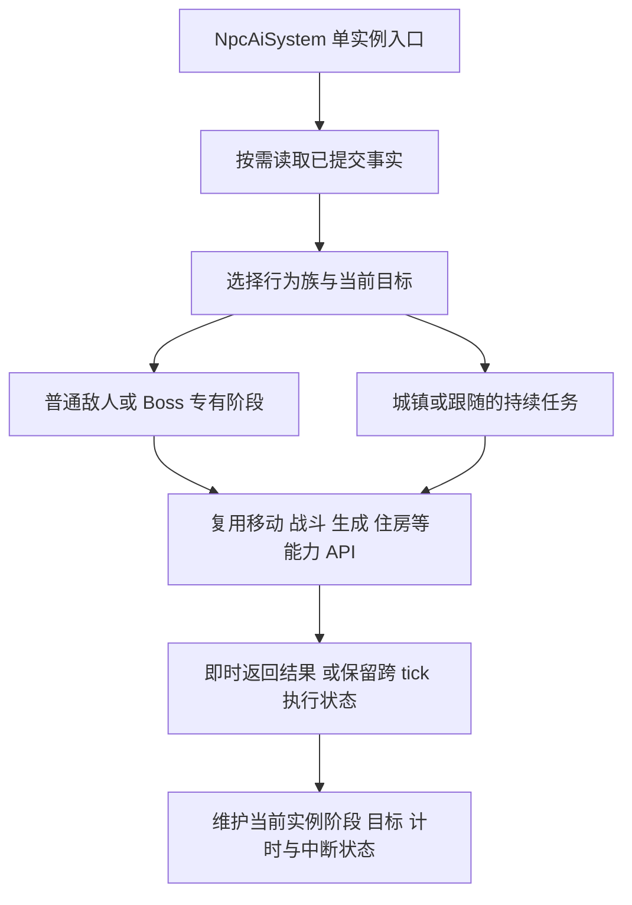

# 本地 ECS 项目的 AI 设计对照

文档 ID：DOC-2026-10-06-ECS-AI-REFERENCE-STUDY  
逻辑域：research  
产物类型：evidence  
状态：active  
复核日期：2026-10-06（Asia/Shanghai）  
范围：C:/Users/shan/Downloads/ECS 下四个项目的 AI 入口、实例状态、执行与生命周期  
关联设计：[完整 NPC AI 设计](../system-decomposition/2026-10-05-npc-ai-system-redesign.md)  
canonical 路径：docs/research/2026-10-06-ecs-ai-reference-study.md

最适合 NLTX 借鉴的是 **共享行为定义、每实例执行状态、行为选择与能力执行分工**。
SS14 提供可组合任务的具体实现，Veloren 展示即时反应、专有战斗策略与长期生活目标的组合，
Terasology 展示行为树资源与实例解释器的分离。ECS 组织数据和执行；HTN、行为树、阶段状态机
选择行为，二者可以组合。参考项目没有规定“每种 NPC 一个 System”或“所有 AI 使用同一算法”。

本文事实来自本地源码静态阅读，建议标为 `proposed`。没有运行四个参考项目，没有修改参考源码，
没有重新构建 NLTX；本文不扩大此前七种 NPC 的实现或验收范围。目录名中的 master/develop/main
不作为上游版本证明；末尾指纹只标识四个入口文件，不标识整仓库或运行环境。

## 1. 四个项目的侧重点

| 项目 | 决策机制与状态 | 执行方式 | 对完整 NPC AI 的用途 |
| --- | --- | --- | --- |
| space-station-14 | HTN 分解任务；Utility 评分目标；实例黑板与计划 | Operator 注册移动/战斗组件，由相应系统推进 | 城镇、跟随、交互、追击等可复用任务 |
| veloren | 优先级行为函数；Agent 保存目标、意识和动作状态；RTSim 管长期活动 | AI 写 Controller；角色/技能系统执行 | 即时反应、宠物、专有 Boss 策略和长期生活的分层 |
| Terasology | 行为树资产；每实体 Interpreter/Actor/runner | 解释器跨帧保留节点状态，调用节点动作 | 行为定义、实例状态与诊断的分离 |
| valence | 已检查 custom_npc 示例展示实体、位置和皮肤 | Bevy Startup/Update 系统管理表示 | NPC 组合与复制表示；该示例未提供完整决策循环 |

## 2. SS14：规划任务，交给能力系统持续执行

`NPCSystem` 管理唤醒/睡眠，并把活跃 NPC 交给 `HTNSystem`。每个 NPC 的 `HTNComponent`
保存根任务、当前计划、重规划计时及规划 job；黑板保存该实例的任务事实。YAML 定义 compound
task 的候选分支和 primitive task 的组合，Utility 对候选目标评分。

HTN 的作用是把目标分解为可执行步骤。例如近战路径包含选择目标、解除束缚/准备武器、
靠近目标和攻击。规划时沿 compound 分支展开 primitive task，不满足条件时回退规划黑板
和任务栈。`Operator.Plan` 返回可行性及预测 effects；这些 effects 用于后续规划和任务启动，
不等于已经发生的世界效果。

实际执行有明确生命周期：`Startup → Update → Finished/Failed → TaskShutdown/PlanShutdown`。
`MoveToOperator.Startup` 注册 Steering，`Update` 检查 Moving/InRange/NoPath，退出时取消路径并
注销 Steering。近战 Operator 启用 `NPCMeleeCombatComponent`，战斗系统检查目标、距离和冷却，
再调用已有武器系统的攻击入口。移动和战斗任务因此可以复用已有游戏能力。

这里的“完成”有任务和计划两个尺度。近战 YAML 将 MoveTo 的 shutdownState 设为 PlanFinished，
使任务可先完成而 Steering 继续执行；随后攻击任务运行，UtilityService 还能重新选择目标。
这不是把移动效果统一推迟到下一帧。`HTNSystem` 也能在同一帧完成当前任务并启动下一个任务。

源码入口：

- [NPC 唤醒、睡眠与调度](C:/Users/shan/Downloads/ECS/space-station-14-master/Content.Server/NPC/Systems/NPCSystem.cs:122)、[实例规划状态](C:/Users/shan/Downloads/ECS/space-station-14-master/Content.Server/NPC/HTN/HTNComponent.cs:33)。
- [计划任务队列与逐实例更新](C:/Users/shan/Downloads/ECS/space-station-14-master/Content.Server/NPC/HTN/HTNSystem.cs:178)、[规划条件与 effects](C:/Users/shan/Downloads/ECS/space-station-14-master/Content.Server/NPC/HTN/HTNPlanJob.cs:129)、[任务切换与清理](C:/Users/shan/Downloads/ECS/space-station-14-master/Content.Server/NPC/HTN/HTNSystem.cs:388)。
- [Operator 生命周期](C:/Users/shan/Downloads/ECS/space-station-14-master/Content.Server/NPC/HTN/PrimitiveTasks/HTNOperator.cs:28)、[移动任务](C:/Users/shan/Downloads/ECS/space-station-14-master/Content.Server/NPC/HTN/PrimitiveTasks/Operators/MoveToOperator.cs:141)、[战斗任务](C:/Users/shan/Downloads/ECS/space-station-14-master/Content.Server/NPC/HTN/PrimitiveTasks/Operators/Combat/Melee/MeleeOperator.cs:37)。
- [近战任务组合](C:/Users/shan/Downloads/ECS/space-station-14-master/Resources/Prototypes/NPCs/Combat/melee.yml:130)、[移动输入提交](C:/Users/shan/Downloads/ECS/space-station-14-master/Content.Server/NPC/Systems/NPCSteeringSystem.cs:291)、[调用现有武器攻击](C:/Users/shan/Downloads/ECS/space-station-14-master/Content.Server/NPC/Systems/NPCCombatSystem.Melee.cs:111)。

需要保留的适用条件：

- 更新有最大 NPC 数和跨帧游标，规划有 CPU job 预算。采用这种预算会改变 Terraria 每 tick 的推进次数，不能直接用于原版等价模式。
- 黑板的 ShallowClone 是浅复制；默认坐标可以实时读取 Transform。Utility 评分还会删除黑板目标键，不能据 Plan/Query 名称把整段代码认定为纯计算。
- Steering 虽调用 Parallel.For，本地代码的 MaxDegreeOfParallelism 是 1；近战也会注册 Steering。职责分离没有自动解决并发和多个动作竞争移动控制的问题。

这些限制分别见 [浅复制](C:/Users/shan/Downloads/ECS/space-station-14-master/Content.Server/NPC/NPCBlackboard.cs:57)、
[实时坐标默认值](C:/Users/shan/Downloads/ECS/space-station-14-master/Content.Server/NPC/NPCBlackboard.cs:247)、
[Utility 黑板写入](C:/Users/shan/Downloads/ECS/space-station-14-master/Content.Server/NPC/Systems/NPCUtilitySystem.cs:141)、
[Steering 并发限制](C:/Users/shan/Downloads/ECS/space-station-14-master/Content.Server/NPC/Systems/NPCSteeringSystem.cs:245)、
[近战注册移动](C:/Users/shan/Downloads/ECS/space-station-14-master/Content.Server/NPC/Systems/NPCCombatSystem.Melee.cs:92)。

## 3. Veloren：即时反应、战斗策略和长期活动

### 3.1 加载区域中的 Agent

`Agent` 保存目标、寻路追逐、意识、收件箱、行为能力、战斗状态和行为状态。执行代码读取世界
事实并修改每实例的 Agent/Controller。名为 BehaviorTree 的核心实现是一个按优先级排列的行为
函数列表：从滑翔、坠落、着火、被攻击等危险开始，再处理交互、目标和闲置行为；某个函数
返回 true 表示已经处理，停止后续检查。部分函数修改状态后返回 false，因此整个决策过程
不是纯谓词求值。

目标分支再区分敌对、宠物和其他活动。宠物分支明确包含远距离跟随主人、主人受伤时反击。
战斗由工具或能力配置选择 Tactic，再进入专有攻击处理器。Bloodmoon Heiress 的处理器仍用
计时器、生命阈值、冲刺和召唤分支写代码；这支持把 Boss 的专有阶段保留在处理器中，而不是
要求全部战斗都变成通用行为树节点。

AI 通常写 Controller 的移动、Primary/Secondary/Ability 等输入。Controller 系统把交互输入
转成已有领域事件，角色行为系统根据当前角色状态执行能力并应用 StateUpdate。该入口适合
让 AI 与玩家复用相同能力校验；能否表示 Terraria 的直接速度、物理门控和即时生成，仍须逐项核对。

源码入口：[Agent 实例状态](C:/Users/shan/Downloads/ECS/veloren-master/common/src/comp/agent.rs:632)、
[优先级决策入口](C:/Users/shan/Downloads/ECS/veloren-master/server/src/sys/agent/behavior_tree/mod.rs:84)、
[函数列表执行](C:/Users/shan/Downloads/ECS/veloren-master/server/src/sys/agent/behavior_tree/mod.rs:177)、
[宠物分支](C:/Users/shan/Downloads/ECS/veloren-master/server/src/sys/agent/behavior_tree/mod.rs:121)、
[Tactic 选择](C:/Users/shan/Downloads/ECS/veloren-master/server/agent/src/action_nodes.rs:1235)、
[专有 Boss 攻击](C:/Users/shan/Downloads/ECS/veloren-master/server/agent/src/attack.rs:274)、
[Controller 事件处理](C:/Users/shan/Downloads/ECS/veloren-master/common/systems/src/controller.rs:77)、
[角色状态执行](C:/Users/shan/Downloads/ECS/veloren-master/common/systems/src/character_behavior.rs:64)。

### 3.2 RTSim 的长期活动与桥接

RTSim 在另一套持久 actor 数据上组合长期活动，如工作、回家、社交、旅行和对话。
它的 Action 有 tick/reset/on_cancel 等生命周期和组合方法。Loaded 模式把活动、方向、动作
交给 ECS Agent，Agent 的 outbox 回到 RTSim inbox；Simulated 模式使用简化模拟，桥接处可以
删除对应 NPC 的 ECS 实体。长期身份与当前加载实体因此不是同一份表示。

这可作为城镇长期目标与即时危险反应分工的参考。原版兼容不能直接启用远处 NPC 跳 tick：
RTSim 的 Simulated 行为按 10 tick 分散更新；Agent 的即时更新使用并行遍历及线程随机源，
均不保证原版槽位遍历和随机消费序列。

源码入口：[Action 生命周期](C:/Users/shan/Downloads/ECS/veloren-master/rtsim/src/ai/mod.rs:150)、
[两种模拟模式和活动 Controller](C:/Users/shan/Downloads/ECS/veloren-master/rtsim/src/data/actor.rs:43)、
[RTSim 到 Agent 的实际桥接](C:/Users/shan/Downloads/ECS/veloren-master/server/src/rtsim/tick.rs:699)、
[模拟行为更新间隔](C:/Users/shan/Downloads/ECS/veloren-master/rtsim/src/rule/npc_ai/mod.rs:97)、
[Agent 并行入口](C:/Users/shan/Downloads/ECS/veloren-master/server/src/sys/agent/mod.rs:76)。
本文没有追完角色执行与物理的全局调度闭包，也不声称 RTSim 所有动作只写意图；其上下文还
暴露库存写入能力。复制整个架构仍需额外确认状态迁移、取消和存档恢复。

## 4. Terasology：行为树资产与实例解释器

`BehaviorComponent` 引用行为树资产，同时持有 transient Interpreter。组件加入/激活时建立
Actor 和解释器；权威端 BehaviorSystem 逐实体 tick。Runner 深复制树节点，保存运行状态；
节点进入时 construct，执行返回 RUNNING 时跨帧继续，终结时 destruct。Sequence/Selector
保存当前执行位置，Sequence 可以在同一个 tick 连续完成多个子节点。

Actor 的黑板保存实例任务事实，dataMap 保存节点局部数据。这展示了共享配置与实例执行状态
的分离。动作仍可通过 Actor 访问实体组件；节点深复制也不证明 Action 对象完全复制，更不能
推出每个动作都是纯函数。BehaviorSystem 还混入编辑器和树文件保存能力，NLTX 应按已有
领域/基础设施边界把资源读写放在外层。

源码入口：[组件中的资产与解释器](C:/Users/shan/Downloads/ECS/Terasology-develop/engine/src/main/java/org/terasology/engine/logic/behavior/BehaviorComponent.java:15)、
[权威端行为更新](C:/Users/shan/Downloads/ECS/Terasology-develop/engine/src/main/java/org/terasology/engine/logic/behavior/BehaviorSystem.java:46)、
[实例 Runner 的生命周期](C:/Users/shan/Downloads/ECS/Terasology-develop/engine/src/main/java/org/terasology/engine/logic/behavior/DefaultBehaviorTreeRunner.java:66)、
[Actor 黑板与节点数据](C:/Users/shan/Downloads/ECS/Terasology-develop/engine/src/main/java/org/terasology/engine/logic/behavior/core/Actor.java:32)、
[Sequence 持续执行](C:/Users/shan/Downloads/ECS/Terasology-develop/engine/src/main/java/org/terasology/engine/logic/behavior/core/SequenceNode.java:39)。

群体部分只能作为框架线索：CollectiveBehaviorSystem 建立解释器时只加入当前实体的 Actor；
Collective runner 对 Actor 集合顺序执行，并共用一份 root 和状态。在已检查的 behavior 包中，
没有找到 GroupMind.groupMembers 接入该执行集合的完整路径。这不足以证明它提供可直接复用
的群体编队，更不足以替代 Terraria 的虫链、多部位和共享生命关系。

证据：[Collective 实例建立](C:/Users/shan/Downloads/ECS/Terasology-develop/engine/src/main/java/org/terasology/engine/logic/behavior/CollectiveBehaviorSystem.java:159)、
[共用 root 的集合执行](C:/Users/shan/Downloads/ECS/Terasology-develop/engine/src/main/java/org/terasology/engine/logic/behavior/DefaultCollectiveBehaviorTreeRunner.java:68)。

## 5. Valence：本次可确认的是 NPC 表示

`examples/custom_npc.rs` 用 Bevy Startup 建立世界和 PlayerEntityBundle，并用同一 UUID 建立
PlayerListEntryBundle，使自定义玩家外观的 NPC 对客户端可见。Update 处理客户端和皮肤。
该示例中没有目标选择、追击和攻击的 AI 循环；README 把原版机制等能力交由外部库提供。
因此它可以参考实体组合和协议表示，不能从这个示例推导完整 NPC AI，也不能据此断言整个
项目及其外部生态不存在 AI。

源码入口：[示例调度](C:/Users/shan/Downloads/ECS/valence-main/examples/custom_npc.rs:8)、
[NPC 实体与客户端表示](C:/Users/shan/Downloads/ECS/valence-main/examples/custom_npc.rs:49)、
[项目能力范围](C:/Users/shan/Downloads/ECS/valence-main/README.md:26)。

## 6. 对 NLTX 完整 NPC AI 的设计补充（proposed）

保留现有设计的一个 NPC 行为状态 owner，并在内部明确以下分工。图是单个 NPC 更新中的
职责协作，不表示对所有 NPC 分阶段批处理，也不新增另一套战斗、移动或住房实现。



| 范围 | 建议 | 必须保留的语义 |
| --- | --- | --- |
| 普通敌人、Boss | 行为族处理器；专有阶段与时间线；复用已证明相同的数值能力 | 阈值、计数位置、目标重选、直接速度和物理门控、攻击及随机顺序 |
| 城镇、宠物 | 危险优先判断；按需组合回家、避险、坐下、等待、交互等任务 | 时间/天气/住房事实、即时传送及成功后效果；长期活动属于可选新增规则 |
| 召唤、跟随 | 复用目标与能力执行；每实例保存跟随/攻击状态 | 召唤者身份、死亡/消失处理、权威端生成；Projectile 随从保持原 owner |
| 群体、多部位 | 分别表达父子、相邻节、共享生命和遭遇共享目标 | 每节点独立更新，关系校验实例身份；不引入替代全部状态的全局群脑 |
| 持续任务与诊断 | 进入、推进、完成、失败、中断；记录当前任务/阶段、目标和原因 | 退出时按动作清路径、解除占用和残留控制；诊断不得改写权威状态 |

共享行为定义只放配置和算法。阶段、计时器、目标、寻路进度、任务游标都属于 NPC 实例；
不要让共享处理器持有这些可变字段。区分三个有效期：权威实体状态持续到生命周期结束，
感知/路径缓存按来源版本失效，任务局部数据在退出或变换时处理。优先复用现有组件，不为
每一栏新建组件或 System。新任务数据使用明确类型；兼容 ai/localAI 槽位则保留显式映射。

行为选择与执行可以用同步方法协作。跨帧动作才保存任务状态；即时生成、传送、变换和伤害
仍在原调用点提交并返回可读结果。Boss 跨多个系统使用能力，不意味着必须全部改成模拟
玩家按键。移动请求冲突、中断、目标失效与失败后残留效果，要由调用契约定义。

最有竞争力的备选是把全部 NPC 都放进通用 HTN/行为树。它有利于编辑任务组合，但会增加
原版 Boss 数值及时序表达的负担，且没有等价证据。当前选择是保留专有处理器，在重复的
持续行为上按需引入任务组合；也不在现有七种有限规则上先建一个尚无调用需求的通用解释器。

## 7. 调度、验证与缺口

参考架构不能覆盖原版调度契约。继续以[完整 NPC AI 设计第 6 节](../system-decomposition/2026-10-05-npc-ai-system-redesign.md#6-更新顺序与同-tick-可见性)
为基线：实时槽位串行遍历，一个 NPC 完成其更新后再读下一槽位；生成到后续槽位的实体
可能同 tick 更新，父 AI 在生成返回后立即读写子状态。不同 System 的职责拆分不强制
更改这些可见时点。SS14 的预算游标、Veloren 的并行和远处跳 tick 不纳入原版兼容路径。

本次验证只检查文档路径、源码行号、四个入口文件指纹、manifest 登记及格式。静态源码关系
支持上述设计对照；尚无四个项目的运行结果，也没有新的 NLTX 行为测试结果。完整迁移
仍须逐 profile 验证原版的阶段阈值、目标规则、随机消费、生成顺序和死亡/卸载清理。
若新增持续任务，还须用多 tick 的实际执行验证中断、目标消失和移动控制交接。

四个入口文件的 SHA-256（2026-10-06 本地快照）：

```text
SS14 HTNSystem.cs
b1220ba40dd24bca4009bf7223ef23caf1c98c38cabab46173a453608431e76f
Veloren behavior_tree/mod.rs
2a2eee6696660542d0cf8902a2ff57f73aeaaddc8062915045de26fcb35387fe
Terasology BehaviorSystem.java
7037d4d14342c6f83cbde13211eea30331cdd3550baaa04de97aa30a2a3894f7
Valence examples/custom_npc.rs
f476523c09c8c64991806eaff7646ff8756a3714ba82ee855d0ff4c8289609bd
```
