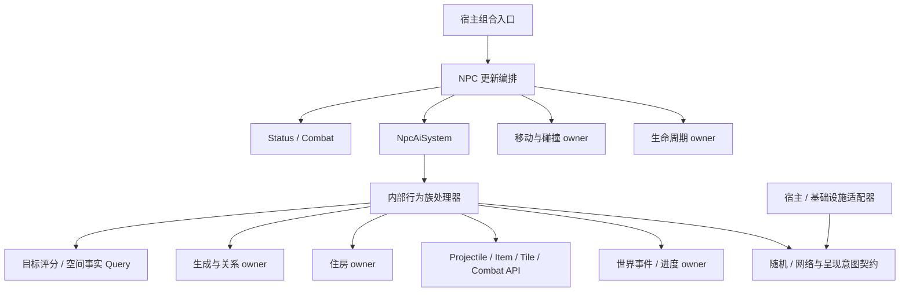

# NPC AI 系统重新设计

文档 ID：DOC-2026-10-05-NPC-AI-SYSTEM-REDESIGN  
逻辑域：system-decomposition  
产物类型：design  
状态：active  
复核日期：2026-10-06（Asia/Shanghai）  
范围：完整 NPC AI，包含普通敌人、Boss、城镇与宠物、召唤和群体行为  
配套执行文档：[NPC AI 系统执行文档](../plans/system-decomposition/2026-10-06-npc-ai-system-execution-plan.md)  
证据入口：指定完整参考源码、[128 风格索引](2026-10-05-npc-ai-reference-index.md)、当前领域源码、[本地 ECS AI 对照](../research/2026-10-06-ecs-ai-reference-study.md)  
canonical 路径：docs/system-decomposition/2026-10-05-npc-ai-system-redesign.md

## 1. 决定与交付范围

采用 **一个 NPC AI 状态 owner、按行为族组织的处理器、显式同步领域效果、保持参考顺序的
NPC 更新编排**。简单移动与目标评分可做确定性计算；生成、变换、开门、传送、伤害等需要
在执行点提交到相应 owner，然后允许 AI 继续读取结果。完整 AI 不能统一成一次巨大输入快照
到最终 decision，也不能把所有生成与写入推迟到 tick 末尾。

`NpcAiSystem` 是 NPC 行为入口。行为族处理器是该 owner 内部的模块或 partial，不因一个
aiStyle、一个方法或一个四槽字段另建 System。跨 NPC 关系、住房、世界事件、伤害和生成
使用各自的权威边界。数值公式、目标评分与空间判断只在确实只读时归为 Query。

本设计覆盖参考 `NPC.AI()` 的全部 0–127 风格入口。完整源码索引单独保留；本文规定完整
系统的职责、API、调度、不变量、迁移与验收。**完整参考 AI 的实现与行为验收尚未完成。**
当前接入的七种 NPC 是有限模拟接口切片，其规则和参考规则分别登记，不能计入原版等价覆盖。
本次实际代码与运行结果见 [接入与验证记录](2026-10-05-npc-ai-redesign-verification.md)。

## 2. 参考中必须保留的行为事实

| 源码锚点（参考 NPC.cs，另标 Main.cs） | 观察到的行为 | 对设计的要求 |
| --- | --- | --- |
| `AI:19997`；128 个分派分支 | 风格共享但按 type、难度、世界条件继续分支 | 风格索引和具体类型覆盖分开记录 |
| `Main.cs:18113` | 按 0..maxNPCs-1 实时读取槽位，逐个调用 UpdateNPC | 保持串行实时遍历；新实体所在后续槽位可同 tick 更新 |
| `UpdateNPC:91880`，重力准备 `91997`，AI `92040` | buff/DOT/变换先执行；AI 前计算重力并可能限制原速度；AI 后按当前 noGravity 应用 | 准备重力与应用重力分开；行为可修改物理门控 |
| `TargetClosest:78821`，`TryTrackingTarget:78850` | 非欧氏评分、aggro/noAggro、坦克宠物几何、混乱翻转与同步标记 | 目标评分、提交与攻击几何分别表达 |
| `TargetClosestUpgraded:78718`，`GetTargetData:6911` | 欧氏评分；NPC 548 可成为目标；玩家/NPC 索引域不同 | 目标类型和实例身份显式化，保留策略差异 |
| `NewNPC:82017`，虫类链 `51905` 起 | 生成返回槽位；随后直接写子节点、父节点和共享生命引用 | 同步生成结果及关系建立，不能返回未来对象 |
| 城镇 `53740`；回家传送 `56443` | 住房、战斗、坐下、天气、进度、名称特例和世界表读写交错 | AI 使用事实和受控调用；住房/进度仍有独立 owner |
| Fighter `56637` 中 Gnome 变石像 | 放置成功才更新图鉴、计数、消失和网络/成就效果 | 查询和 Tile 提交不能合并为虚假的纯谓词 |
| FloatingEye `53027` | 读取 collideX/Y、oldVelocity 反弹，改写 noGravity/noTileCollide、alpha | 需要碰撞历史和物理门控；alpha 的战斗用途必须保留 |
| Pal `43459`、奖励 `43563` | 初始化生成攻击者后立即读状态；奖励在权威端生成，随后消失 | 初始化、关系查询、奖励和退出有明确先后 |

上表是已阅读的关键时序证据；其余风格有完整入口索引，具体传递调用闭包和阈值仍按迁移批次
补齐。参考 `AI_127_Pal_SummonAttacker:43575` 是只返回 0 的未调用 helper，不能补造算法。

## 3. 状态归属、生命周期与写入权限

组件与具体处理器的数量不一一对应。复用已有领域状态；需要新字段时先检查已有权威来源，
避免新增并长期双写一个 `NpcBrain` 或“Boss 总状态”。以下“设计 owner”描述目标职责，
不表示当前所有 API 已实现。

| 状态/事实 | 当前可复用对象或缺口 | 设计 owner 与允许写入者 | 生命周期/不变量 |
| --- | --- | --- | --- |
| 实例、槽位、代际 | NpcEntityIdentityComponent；宿主 EntityHandle | NPC 生命周期/槽位 owner | 创建至释放；跨会话引用也必须失效 |
| aiStyle、aiAction、ai[4] | 当前宿主由定义 profile 选择风格，NpcBehaviorStateComponent 持有动作与 ai[4] | NpcAiSystem；变换/初始化经受控入口；碰撞后开关特例保留写入点 | 每实例唯一权威 ai[4]/动作；aiStyle 的运行时变更接线仍待完整宿主核实 |
| localAI[4]、一次性初始化 | NpcLocalBehaviorStateComponent，与权威 AI 状态按同一实体实例组合 | NpcAiSystem 内对应行为处理器 | localAI 不是“只供客户端”；可能控制服务端生成 |
| 目标身份、前目标、targetRect | NpcTargetComponent 可存类型/引用/旧索引；攻击几何契约待补 | AI 的目标提交入口；生命周期清理 | 身份和诱饵几何可不同；无目标保持旧语义 |
| position/velocity、方向、旧运动、碰撞、湿态 | MovementStateComponent、NpcDirectionComponent；历史/水平朝向/动态物理门控尚未齐备 | AI 提交行为运动；移动 owner 提交积分/碰撞；快照按执行点读取 | 不以定义里的初始值替代动态 noGravity/noTileCollide |
| life、damage、defense、免疫与伤害门控 | NpcHealthComponent、现有 Combat/Status 能力；风格专有战斗门控待逐项核对 | Combat/Status owner；AI 通过修改战斗状态的领域操作调用 | 战斗读取 AI 阶段已生效的门控；父生命不是复制 life |
| 父子/前后节、召唤者、共享生命根 | NpcParentRelationComponent、NpcParentHealthTarget、Relationships 身份 | NPC 关系 owner；AI 通过 attach/detach 更新 | 引用含实例身份；不同关系种类不能共用一个 parent 字段 |
| 家、坐具、住房分配、无家可归 | 现有住房关系与 TownHousingRegistrySystem | 住房 owner；城镇 AI 请求查找/变更并读取结果 | 缓存按 Tile/住房变化失效；卸载清理实例关联 |
| 已解锁城镇 NPC、Shimmer 表、Boss/事件进度 | WorldNpcHistory/WorldMilestone 等世界状态；具体字段须核对 | WorldSession/事件 owner | 持久状态由世界 owner 保存，不存于某个 NPC 的行为槽 |
| 波次、塔/水晶/门户、遭遇共同条件 | WorldSession 事件事实；真正共享的遭遇运行态按需补齐 | 世界事件/遭遇 owner | 单个 Boss 的阶段仍属其 AI；多人、多 Boss 并存隔离 |
| 生成、物品/投射物、Tile 修改 | 已有 Spawn/Item/Projectile/Tile owner | 对应领域提交入口 | 显式容量拒绝；同 tick 后续读取可见 |
| 网络脏标记、复制和呈现 | Network/NpcNetworkSyncIntent 等契约；具体投射补齐 | AI 提出语义变化；复制 owner 编码发送，呈现适配器消费效果 | 序列化字段保持来源；呈现字段先核对战斗读者 |

`NpcBehaviorStateComponent.AuthoritativeAiSlots` 是当前宿主唯一在用的 ai[4] 表示；动作和
死亡阶段 AI 决策也提交到该组件。`NpcLocalBehaviorStateComponent` 保存同一实例的 localAI[4]；
`NpcAiStateComponent` 仅作值快照。`NpcBehaviorComponent.AiSlots` 仍是未删除的旧表示，但已无
生产调用点，留待 G 阶段按删除门禁清理。当前宿主尚未接入完整 profile 变换、网络和碰撞后
特殊写入，不能把这项局部所有权收敛说成完整 NPC AI 已迁移。阶段名/攻击名是权威槽位的类型化
访问器或对外投射；若替换成专用状态，则先确定唯一转换点和网络/存档兼容规则。

`EntityReference` 当前用 GUID + Scope，`EntityHandle` 用 slot + generation；两者均不能
被文档自动视为完整会话校验。解析端必须校验当前会话、实例、代际、活动性和预期类型。
旧 ai 中的 slot、slot+1、负父槽值只能在兼容投射层编码，不用 float 作为新关系身份。

### 3.1 共享定义、实例状态与缓存

共享处理器保存行为定义、只读参数和算法；目标、阶段、计时器、寻路进度、任务游标均按
NPC 实例隔离。处理器注册表由当前世界的组合入口持有，不能把跨世界可变状态放入 static。
同一行为定义可供多个 NPC 使用，但不能共享其进行中的攻击或移动状态。

权威 ai/localAI 状态随实例初始化、变换和释放处理；类型化阶段名是这份状态的访问方式，
不另存长期双写的阶段副本。完整 profile 的网络/存档槽位映射须逐项登记，不能直接把当前
值快照 NpcAiStateComponent 当成第二份运行态。

任务局部状态只在该任务执行期间有效。进入时初始化，完成/失败/中断时按任务契约清理；
变换后的延续或重置以源分支为准，不自动从 AI 开头重新执行。路径、感知及目标解析缓存
说明来源与失效条件：实例变化、目标消失、Tile/住房变化、世界卸载可能使其失效。缓存不是
实体身份或住房合法性的权威来源，诊断也不参与行为决策。

## 4. 行为模块和完整覆盖口径

| 行为模块（AI owner 内部） | 完整范围及参考例子 | 专属规则/依赖 |
| --- | --- | --- |
| 地面与跳跃敌人 | Slime 1、Fighter 3、Unicorn 26、ImprovedWalker 107、沙鲨 103 等 | 地面/障碍、门、液体、目标、命中反应、变换、拾取/掉落特例 |
| 空中与水中敌人 | Eye 2、Eater 5、蝙蝠/鸟 14/24、鱼/水母 16/18、潜冲 108 等 | 碰撞历史、液体、LOS、穿墙门控、群体间距和昼夜退出 |
| 城镇与救援 | 0 的被绑 NPC；7 的城镇、宠物、坐下/战斗/住房；124–127 特殊救援 | 交谈、住房、坐具、世界解锁、立即变换、奖励、护卫关系 |
| 生物/环境行为 | 64–68、112、114–116、118–119 等 | 风、水面、危险规避、捕捉状态、同步初始化 |
| 单体 Boss 和特殊敌人 | 克眼 4、史莱姆王 15、双子 30/31、蜂后 43、猪鲨 69、Betsy 110、血鹦鹉螺 117、光女 120、史后 121、独眼巨鹿 123 | 每个 Boss 保留独立阶段/攻击规则；共享数值工具，不共享一份阶段表 |
| 分节、多部位与附属实体 | Worm 6、骷髅 11/12、肉墙 27–29、机械骷髅 32–36、毁灭者 37、石巨人 45–48、世纪之花 51–53、克脑 54/55、月总 77–79/81/82、教徒 84 等 | 即时生成、父子/相邻节、共享生命、独立易损部位、断链和根消失 |
| 遭遇与事件单位 | 雪人、南瓜/霜月、火星、海盗船 93、四柱 94 及附属、DD2 104–111 等 | 事件目标/波次由世界 owner 提供；NPC 执行自己的移动/攻击/保护规则 |

上表是组织边界和代表入口，不是穷尽列表；[128 风格逐行表](2026-10-05-npc-ai-reference-index.md)
是全部迁移入口。每条入口必须有显式状态：`indexed -> mapped -> implemented -> verified`，
按具体 type/netId、特殊世界、难度和权威端进一步登记。无默认类型示例的 98/124 也保留条目。

内容解析必须区分 type 与 netId，保留负 netId 的变体语义。当前有限清单把“Green Slime”
记为 16，而指定参考 NPCID 中 GreenSlime 是 -3、MotherSlime 是 16；有限 Guide/Old Man
用风格 0，参考用 7；有限 Dummy 用 0，参考用 92。这些是迁移前必须处理的明确内容差异，
不能直接沿用有限 catalog 作为完整注册表。本次维持有限夹具的已有标识以复现其回归，完整
内容版本要有显式身份映射和兼容迁移记录。

注册使用解析后的内容行为 profile；基础风格 + type 特例选择具体处理器，条件分支在处理器
内保留。不能因为 Slime 1 或 Fighter 3 的普通类型通过，就启用该风格的所有类型。未迁入的
profile 在宿主启动/内容加载时明确拒绝，或者运行已声明的有限规则；二者都不能登记为
参考等价。原本静止/特殊交互的 0 风格也必须显式绑定，不能用无动作 fallback 掩盖缺失。

Boss 阶段转换表逐条记录：入口条件、退出阈值（含 < / <=）、计数器递增位置、目标锁定/重选、
速度/易损门控、攻击生成顺序、随机调用、脏标记及中断原因。共用工具只覆盖相同公式，例如
加速/减速；不把所有 Boss 改成统一“追踪—冲刺—休息”状态机。

召唤覆盖 NPC 子节点、护卫、仆从、分身、孵化物，以及 NPC 发出的投射物/奖励/事件目标。
玩家召唤物中以 Projectile 表示的随从仍由现有 Projectile/Player owner 执行，NPC AI 要提供
和消费其生成、诱饵几何、仇恨与伤害关系契约。群体行为区分分节链、多部位、召唤关系与邻居
避让；不由全局“群脑”替代每个 NPC 的独立槽位更新。

## 5. API 边界与调用依赖

以下是目标 API 契约，不是当前已经编译的完整接口清单。保持同步普通方法，只有跨生命周期
需要独立排序/重放的外部输入才建立 Command；不强制 CQRS 或消息总线。

| 旧入口/职责 | 目标 API/位置 | 读取/写入与返回值 | 时机/拒绝 |
| --- | --- | --- | --- |
| AI() 分派和四槽演进 | NpcAiSystem.TickOne；内部行为注册表/处理器 | 读取该实例实时状态和所需事实；提交行为槽、动作和运动请求；返回更新/退出状态 | 同步一次；profile 未注册明确拒绝 |
| TargetClosest / WOF / Upgraded | 分策略 TargetCandidate Query + SelectTargetNow | Query 返回评分结果/目标几何；提交入口写目标、方向和同步意图 | 在旧调用点执行，不能统一提前一次选择 |
| GetTargetData | 有类型的 ResolveTargetData Query | 解析玩家、NPC、诱饵几何及活动门控；不写 target | 读取调用当时的已提交状态 |
| NewNPC / Transform | Spawn/生命周期 owner 的 SpawnNow / TransformNow | 返回成功实体 handle 或容量/定义拒绝；创建/水态/默认值/四槽/来源初始化由 owner 负责 | 立即可读；变换会使旧 profile/快照失效 |
| ai 槽中的前后节/realLife | 关系 owner 的 Attach/Resolve/Detach | 建立不同关系；返回校验过的实例/生命根 | attach 在 spawn 后；失效关系走该行为的退出策略 |
| Projectile.NewProjectile / Item.NewItem | 对应 owner 同步创建入口 | 返回实际创建结果；按旧分支初始化新实体属性和同步意图 | 保留生成数量、顺序和失败分支 |
| 镇民回家/坐下/寻家 | Housing API + 空间 Query + 移动提交 | 坐具占用、家标记和位置归各 owner；立即读取提交结果 | 传送失败可标记 homeless 并触发原查房路径 |
| CanPlace / PlaceTile / 开门 | 空间/Tile 事实 Query + Tile owner 修改入口 | 放置/开门返回是否成功及改变范围 | 成功才提交后续消失、解锁、图鉴等效果 |
| Encourage/DiscourageDespawn / CheckActive | 生命周期策略与提交 | AI 请求 timeLeft/退出门控；生命周期 owner 按旧位置运行检查 | 正常 CheckActive 在更新末尾；专有退出保留原点 |
| netUpdate / SendData | 网络意图 + 复制适配器 | 普通状态变更可累计 dirty；源中即时子节点同步保持调用次序 | 复制不得反向推进 AI；失败不重复执行生成 |
| 随机、音效/粒子、成就/图鉴 | 显式随机与效果端口、各事实 owner | 随机返回真实调用结果；呈现消费值；进度/图鉴改变领域状态 | 按原权威端条件与调用序列执行 |

处理器只获得所需的窄能力。数值 helper 不接收 Main、存储服务或“万能 context”；实时事实
访问与写入明确标为同步效果 API。读写交错时在调用点重新解析，不跨生成/变换持有失效快照。
已存在的 Spawn、Combat、Status、Movement、Housing 与 Spatial Query 先复用并核对其行为，
不另造一套同名算法。现有 NpcMovementSystem 主要涉及受击移动，不能直接宣称它已覆盖完整
NPC 物理积分和历史碰撞。



图中依赖指向领域能力/契约；具体文件、网络和平台实现不被 ECS 反向引用。世界 owner 不调用
某个 Boss 处理器作为更新入口，关系 owner 也不递归更新子 NPC。生成只创建实体；是否同 tick
执行由槽位遍历决定，避免 NPC AI 与世界事件/生成 owner 互相调用成环。

### 5.1 本地 ECS AI 参考补充（2026-10-06，设计建议）

已对照 Downloads/ECS 中 SS14、Veloren、Terasology 和 Valence 的实际入口及相邻调用。
[源码研究](../research/2026-10-06-ecs-ai-reference-study.md)记录了规划、实例状态、能力执行与
生命周期的分工；这些是设计依据，不是 NLTX 已接入或原版等价证明。

借鉴 SS14 的任务生命周期和移动/战斗能力复用、Veloren 的危险优先决策和专有战斗策略、
Terasology 的共享行为资产与实例执行状态分离。NpcAiSystem 仍维护实例行为状态；已有
Combat、Movement、Spawn、Housing 等 owner 负责能力校验与效果提交。共享处理器不保存
每实例的目标、计时器、路径和任务游标，也不为每个行为树节点新建 System。

普通敌人和 Boss 使用专有行为族处理器及阶段时间线。城镇、宠物与召唤跟随中的重复持续
行为可按需组合任务，定义进入、推进、完成、失败与中断的状态及清理。回家传送、生成和
变换等即时行为仍保留同步提交。群体共享目标与父子、相邻节、共享生命关系分别维护；
每个实例保持自己的执行进度。新任务局部状态使用明确类型，原 ai/localAI 槽保留兼容映射。

不直接复制 SS14 的最大更新数/规划预算，或 Veloren 的并行、线程随机和远处跳 tick，
这些机制会改变参考的槽位顺序与随机消费。能力分工不要求全局“先 AI 后物理”批处理，
也不要求把 Boss 的直接速度/物理门控全部改成玩家按键。任务中断与控制交接须按多 tick
真实执行验收；完整参考调度、数值和效果顺序仍以以下章节为准。

### 5.2 持续任务与行为处理器的执行协议

持续任务用于确实需要跨 tick 推进的跟随、寻路、等待和交互。Boss 的阶段时间线仍由专有
处理器维护；仅相同的能力调用和数值公式复用。以下是目标语义，不要求立即建立通用行为树
解释器或新增一组固定接口类型。

| 生命周期 | 执行责任 | 状态与效果约束 |
| --- | --- | --- |
| 进入 | 校验实例、目标、能力及事实；初始化本次任务 | 记录实际取得的路径/占用/控制；不重复初始化已运行的任务 |
| 推进 | 在当前 NPC 更新点读取事实并执行一步 | 返回运行中、完成或失败及原因；需要的同步效果在调用点可见 |
| 完成 | 释放本任务不再需要的资源，选择后续行为 | 源规则允许时同 tick 继续；持续后台动作的存活期必须显式定义 |
| 失败 | 区分目标失效、无路径、容量拒绝、能力拒绝和异常 | 保留已提交效果事实；按该 profile 退出或降级，不统一重跑生成 |
| 中断 | 处理危险、目标变更、受控变换、死亡、释放与卸载 | 只清理本任务拥有的控制和资源；不清掉已经交给其他动作的移动控制 |

目标选择、移动、攻击可在同一个行为路径内协作。能力 API 明确即时提交还是跨 tick 执行，
调用者必须能观察成功、拒绝、当前进度和已完成的部分效果。任务失败不撤销已经生成的
实体；网络/呈现失败也不能触发同一次攻击或奖励的再次生成。

对原版没有的危险抢占、自动重规划和后台移动，不作为默认机制引入。首个持续任务以一个
真实城镇或跟随 profile 接线验证，中断、失败和控制交接通过后，再提取可复用协议。

2026-10-06 已完成首个有限任务生命周期接线：Guide 实例在 `NpcTaskStateComponent` 中持有
任务种类、阶段、cursor 和失败原因；`NpcTaskLifecycleSystem` 提供进入、推进、完成、失败、
中断与重置的显式结果。Simulation 宿主在每个真实 tick 的 AI 前按日间、夜间有家和无可用任务
事实选择 `GuideDayPatrol`、`GuideReturnHome` 或中断运行任务，并只推进当前任务一次。
该切片用于证明状态归属和跨 tick 控制交接，住房分配、完整传送路径、坐具、交谈、危险抢占
和完整城镇 profile 仍需按来源继续接线；其运行证据记录在执行计划和验证文档中。

夜间宿主补验已通过：受控 Guide 在真实 WorldClock 首 tick 跨过日落后进入
`GuideReturnHome/Running`，任务 cursor 推进一次。关系 owner 的首个 E1 切片也已接入：
父子生成返回真实实例和稳定引用，子节点同时保存 `NpcParentRelationComponent` 与
`EntityRelationState(EntityRelationKind.Parent)`，父节点释放前解绑子关系；该切片仍不覆盖
虫链、多部位共享生命、召唤者或保存/联机关系。有限 Combat owner 已验证子命中路由到父
生命根、父槽复用隔离、父致死整组释放和掉落归属；这些是首个关系切片的已验证边界，不是
完整 Worm 或 Boss 关系规则。

E2 随后验证三节点相邻引用、尾节点伤害递归到根生命、根死亡逆序清理后代、根槽复用后的旧尾
目标拒绝、中段释放后尾节点解绑并恢复本地生命，以及容量不足时半成品链回滚。E2 的宿主关系链
verifier 已纳入完整回归；这仍不覆盖来源 Worm/多部位规则、变换、召唤者、奖励、保存加载或网络
authority。

随后 D2 接入了一个有限的 Guide 回家传送协议：在 `GuideReturnHome` cursor 60 处，住房事实
通过 owner 提供给 `NpcHomeReturnDestinationQuery`，查询按 `0、-1、+1` 候选顺序检查 home
floor 上方空间；成功提交位置、清零速度和 network update 意图后完成任务，阻塞或住房失效
记录 `NoPath` 并标记 homeless。该协议已由领域 verifier 和 success/blocked/invalid 宿主探针
验证，但不覆盖完整住房合法性、路径搜索、坐具/交谈、真实网络发送或完整 town profile。

## 6. 更新顺序与同 tick 可见性

完整宿主以参考 `Main.cs:18113` 的实时槽位遍历为基线。每个槽位进入时检查当前实例与活动性，
再完整执行该 NPC 的更新；不是先更新全部 AI，再更新全部物理。自然生成与世界全局准备
仍按宿主原阶段执行，并单独核对 AI 外围调用闭包。

每实例的参考次序为：

1. 活动/权威端/未同步 Tile 门控；网络平滑及镇民数据准备保留相应端别条件。
2. buff 标志、SoulDrain、过期、DOT 和 BloodMoon 变换；变换后重新解析定义/profile。
3. 准备重力/最大下落速度，保留对原 velocity.Y 的修改；若 life <= 0 执行参考退出/同步。
4. 保存 oldTarget/oldDirection；门户与旧入口前置效果。
5. 执行 AI；在其内部原调用点选目标、读世界、消费随机、同步提交生成/关系/战斗/Tile 效果。
6. 捕捉物临时免疫、免疫计时递减等后置处理。
7. 根据 **AI 后的** noGravity/noTileCollide 及 Tile 有效性，应用先前准备的重力和速度门控。
8. 城镇/友方溺水、生命再生、其他 NPC/蜂伤害；保留权威端和类型条件。
9. 碰撞或直接积分；更新 oldPosition/oldVelocity、collideX/Y 和液体相关状态。
10. 碰撞后的 SwitchTiles 特例可能改写 ai 槽；不能被 AI 提交末尾覆盖。
11. 对话、FindFrame、轨迹、网络同步、CheckActive；最后清理 netUpdate/justHit。

纯呈现处理可以放到呈现适配器，但其读取时点、对 gameplay 字段的写入、随机消费和活动门控
须先核对。当前有限宿主的“先自然销毁、后 AI/重力”的次序，以及 Demon Eye 直接位置移动，
只适用于有限规则，不作为完整参考调度实现。

例如，正在更新 slot 20：生成到空闲 slot 30 的子节点会在本 tick 后续遍历中执行；生成到
已遍历的 slot 5 则等到下一 tick。父 AI 在生成返回后就能写子状态并读取它的 active/位置。
不得缓存 tick 开头的活动 NPC 列表来改变这两种可见性，也不把 spawn 误变成递归 TickOne。

```mermaid
sequenceDiagram
  participant Loop as 实时槽位循环
  participant AI as 父 NPC AI
  participant Spawn as NPC 创建 owner
  participant Links as 关系 owner
  Loop->>AI: 更新当前实例
  AI->>Spawn: SpawnNow(类型、初始四槽、来源)
  Spawn-->>AI: 成功 handle / 明确拒绝
  AI->>Links: Attach(父、子、关系种类)
  Links-->>AI: 已生效关系
  AI->>AI: 继续读取子状态并演进当前阶段
  AI-->>Loop: 当前槽位更新完成
  Loop->>Loop: 读取下一槽位当时的实例
```

## 7. 专项契约

### 7.1 目标选择

普通、WOF 和 Upgraded 分开维护。普通追踪保留参考位置表达式的实际括号、整除、aggro、
noAggro 惩罚、候选遍历与严格小于的平局规则；不顺手改为“正确的中心欧氏距离”。WOF
额外要求玩家 gross。Upgraded 使用欧氏距离，允许 type 548 的 NPC 目标，仍保留自己的
坦克宠物和朝向门控。

结果表达目标身份、攻击几何及选择依据。普通 TargetClosest 的坦克宠物分支改变 targetRect，
原 target 玩家索引保留；Upgraded 的宠物分支把 target 设为宠物 owner。不能统一两者。
SelectTargetNow 在原位置处理 faceTarget、oldTarget、confused、directionY 和 netUpdate，
评分 Query 不偷偷写组件。目标死亡、诱饵消失、跨会话、槽位复用均经解析入口校验。

### 7.2 Boss、召唤与群体关系

单体攻击时间线留在该 Boss 处理器；共享遭遇事实只存于共同 owner。多部位实体仍逐槽更新，
保持部位自己的目标、易损状态与寿命；realLife/共享生命根由 Combat owner 解析，不把每节
life 镜像写进 AI。身体链与攻击者/召唤者关系分别登记，允许一个实体同时拥有不同关系。

创建操作完成槽位选择、替代类型、默认状态、水态、来源和初始四槽，返回实际 handle 后才
attach。类型替代必须以实际生成类型和 profile 为准。链创建每一步可观测，不默认采用整链
原子事务，也不在容量不足时静默回滚已经生成的节点。

来源有直接用失败 sentinel 索引 NPC 数组的路径。新 owner 返回明确拒绝，处理器停止后续
无效访问并报告已完成的子节点；各 profile 的断链/残留清理政策逐项定义。**这种容量失败保护
是待核对的行为差异**，不能和正常生成路径一起宣布原版等价。断链、父死亡、子被替换、
共享根消失、遭遇退出均有单独分支，防止槽位复用绑定到新实体。

### 7.3 城镇、宠物与环境

城镇处理器消费时间/天气/危险/交谈/住房/战斗事实；住房合法性、分配、椅子占用与查房由住房
owner 处理，空间扫描与避险使用相应 Query。读附近 NPC 的拥挤和危险条件时保持参考扫描
顺序，不改成一个无条件全局导航算法。保留雨/夜/血月/日食、归家/坐下、宠物 idle 等分支。

回家与 Shimmer 传送保持寻找落点、碰撞检验、立即移动/清速度/脏标记、尝试坐下的顺序；失败
走原 homeless/QuickFindHome 路径。解锁、ShimmeredTownNPCs 和特殊名字/进度派生属性的
写入经世界/战斗 owner 执行，不能只留下“决策”而丢掉其可观察效果。

生物避险、风/水面、捕捉免疫、Fighter 的 Gnome 石像、Slime 体内物品、特殊世界变化均有
类型专有事实；将其分别附加给相关处理器，避免所有 NPC 都持有一份包含所有字段的环境结构。

#### Blue Slime type=1 profile slice

首个普通敌人 profile 固定为来源 `type=1 / netID=1 / aiStyle=1`，由
`NpcBlueSlimeProfile.CanHandle` 显式拒绝其他 style=1 类型。`NpcBlueSlimeProfile` 的
纯计算 API 接收位置、速度、`ai[0..3]`、方向、目标槽位、昼夜/受伤/地下/SlimeRain、水态、
碰撞历史、authority 和体内物品资格，返回下一组槽位、速度、方向、`aiAction`、分支位标记和
三个窄 effect intent。纯计算保留来源的 `ai[0]` 三段阈值、夜间/受伤计数增量、湿态 `-4`
上限、`-999` 早退以及 `-6/-8` 跳跃冲量；不把来源随机或共享 Tile scratch 隐藏进 profile。

`INpcBlueSlimeProfileEffectPort` 是 owner 边界：体内物品选择、目标重选和网络同步按
来源调用点执行；初始路径为 item → network → target，湿态与跳跃路径保留各自先后。
`NpcBlueSlimeContainedItemGenerator` 已把 `AI_001_Slimes_GenerateItemInsideBody` 的随机和世界
条件映射切成显式随机端口，owner 仍负责提交 item 状态。该 profile 是 C1 可验证状态切片，尚未替代有限
`NpcSlimeAiBehavior`，也没有把特殊 item stat、
NewNPC/NewProjectile、Tile 放置和呈现效果宣称为已迁移；这些仍须在 owner 接线和来源差分中
逐项闭包。

#### Demon Eye type=2 profile slice

第二个普通敌人 profile 固定为来源 `type=2 / netID=2 / aiStyle=2`，由
`NpcFloatingEyeProfile.CanHandle` 显式拒绝 The Hungry II、Wandering Eye 和其他 style-2 类型。
`NpcFloatingEyeProfileInput` 接收碰撞前事实（`collideX/Y`、`oldVelocity`、`noTileCollide`）、
昼夜/地表/墓地、缩放、水态和显式 `DustRoll`；`Evaluate` 返回速度、方向、`noGravity`、分支位
以及 discouragement、target、dust、wet-target effect intent。

纯计算按 `AI_002_FloatingEye` 的可达顺序执行：碰撞反弹，日间地表 discouragement 或
`TargetClosest`，通用缩放水平/垂直加速，type=2 的 `Next(40)` dust 判定，最后 wet 的垂直
阻尼和再次 `TargetClosest`。`INpcFloatingEyeProfileEffectPort` 执行 `EncourageDespawn(10)`、
目标重选和 dust 呈现；`INpcFloatingEyeRandomPort` 保持随机读取显式且可重放。当前切片没有
替换有限 `NpcFloatingEyeAiBehavior`，也没有把 TargetClosest 候选、Tile scratch、网络 authority、
呈现和 `RuntimeNpcStore` 接线误报为已完成；C2 仍是可验证契约，参考逐 tick golden 保持 not-run。

### 7.4 随机、查询副作用与联机

随机端口保持每种 authority mode 下原 Main.rand 的调用顺序、参数与次数；不预先给每 NPC
批量抽样，也不未经声明改成每实体独立随机流。使用记录/重放端口可对照阶段与效果；诊断不
调用随机。呈现 sink 丢弃画面/声音时也必须核对其随机消费，避免影响后续共享流。

Collision.WetCollision 会写共享 honey/shimmer，CanPlace 也有 scratch/验证副作用，不能
仅凭名字标成可并行纯 Query。迁移优先复用已存在的显式空间事实 Query；暂用 legacy 适配器
时串行调用并立刻捕获返回值及 side channel，禁止跨调用借用静态 scratch 结果。

SinglePlayer/Server/Client 条件逐分支保留；客户端不重复进行权威生成、奖励、变换或解锁。
状态字段是否复制不能从 localAI/alpha 的名字推断。网络编码通过既有复制端口接线，按旧
dirty 与即时同步点组织；生成已经提交后的网络失败不再次生成实体。多 NPC 更新先保持串行，
只有独立只读计算且随机/写入/共享 scratch 证明可分离时再单独评估并行。

### 7.5 持久化、卸载与故障

行为、关系和遭遇属于运行态；是否写存档按已有世界保存规则核对，不默认保存所有 Boss 阶段。
世界持久化 DTO 由 owner 捕获，基础设施不持有 ECS 数组或活动处理器。卸载清理注册之外的
实例/遭遇状态、关系、目标解析缓存和待呈现效果；新世界不能接受旧会话 handle。

迁移保留参考异常可观察性，普通容量拒绝使用结果值；异常不变成“AI 已成功”。宿主故障隔离
策略单独定义，并记录当前实例/阶段及已提交效果。取消在宿主已定义的提交边界处理，不能
因为网络/呈现失败无限重试 TickOne 或重复奖励。

## 8. 实施顺序与退出条件

详细任务、依赖、改动位置、验证命令与交付要求见[配套执行文档](../plans/system-decomposition/2026-10-06-npc-ai-system-execution-plan.md)。
下表保留架构层阶段摘要；执行文档中的 planned 状态不等于这些阶段已经实施。

| 阶段 | 必须完成的内容 | 验收/退出条件 |
| --- | --- | --- |
| A：入口与覆盖登记 | 固定参考指纹，建立 128 风格 + 类型/条件状态；区分有限 profile | 无缺入口；未知内容不会误走相似风格；本次索引完成 |
| B：完整更新骨架 | 状态唯一权威、目标策略、碰撞历史/门控、生成返回/代际、随机端口、实时槽位顺序 | 同 tick 生成、变换重绑定、重力前后与 slot 复用测试通过 |
| C：普通与生物 | 1/2/3 起逐族迁移；水中/飞行/特殊敌人、捕捉与环境规则 | 每具体类型的分支、阈值、随机及效果对照；七种有限规则不算来源完成 |
| D：城镇与救援 | 完整 7/0、住房/坐具/天气/危险、宠物与特殊救援/解锁 | 日夜/天气/无家/交谈/传送成功失败/战斗/多人/卸载矩阵通过 |
| E：关系与分节 | Worm/多部位/仆从，共享生命、链生成/断链、同 tick 子节点 | 满槽/部分链/根死亡/替换/代际与父子读写顺序覆盖 |
| F：Boss 与遭遇 | 逐 Boss 攻击表、难度/世界条件；事件/塔/水晶/门户协作 | 每阶段边界、权威生成、随机和目标失效对照，无通用 Boss 占位 |
| G：全量闭包 | 其余所有风格/类型、AI 外围更新和调用者；网络/保存接线 | 全部条目 verified 或显式差异；删除旧路径前有调用闭包与行为证据 |

阶段是依赖顺序，不意味着每类都必须先拆出新项目。每个小批次至少保留源分支/辅助调用、
读写 owner、API 组合、实际接线和行为证据；通过的批次才进入完整宿主可用清单。
代码归领域目录，规模确实增大时才按 Town/Bosses/Segments 等稳定职责加子目录；本次不
预建所有空目录，不迁入只读参考目录，不重构无关网络、存档和世界生成代码。

## 9. 行为验收与覆盖差异

| 验收目标 | 必须观察的结果 | 当前证据 |
| --- | --- | --- |
| 入口库存 | 128 分派无重复/缺项，来源指纹一致 | 本次词法索引通过；传递语义闭包按批次补齐 |
| 有限 AI 接口 | 输入不变、完整中心/平局/死亡目标、周期边界、归家、未知类型拒绝 | 本次专用 verifier 通过，见验证记录 |
| 有限宿主接线 | 0/1/2 玩家、长期 tick、代际/容量、战斗/销毁/存档 | 本次既有宿主回归通过，见验证记录 |
| 完整参考调度 | 首槽/末槽/前槽/后槽生成，变换/退出，碰撞前后状态与物理 flags | 设计契约；完整接线尚未验证 |
| 目标与群体 | 各追踪策略、坦克宠物、548 目标、平局、断链、共享生命/失效引用 | 设计契约；来源差分测试待实施 |
| Boss/城镇/召唤 | 阈值前后、不同难度/世界、目标死亡、攻击计数/顺序、住房/奖励/解锁 | 设计契约；完整 profile 待迁移 |
| 确定性与联机 | 相同输入/随机流逐 tick 相同；服务器一次生成、客户端不重复；同步字段一致 | 完整来源对照与网络接线待实施 |

来源对照使用相同 tick、玩家/NPC/Tile 初态、authority mode、内容/世界条件和记录随机流，
观察 ai/localAI、目标/几何/方向、position/velocity/flags、生命/伤害/免疫、生成/关系/奖励/
Tile/进度和同步效果序列。数值差异先定位运算顺序/浮点精度，不直接扩大容差；golden 不能
用新实现自己的输出作为来源。参考历史项目未在本次重新构建；完整对照执行环境需要另行绑定
其现有可运行产物或隔离基线。编译成功、文档完备和有限场景通过都不能代替这些对照。

本次完整设计及入口索引已形成可评审产物；完整源码行为迁移仍按上述阶段开展。默认七类型
NpcAiSystem.Evaluate 是有限计算 API，未来完整 TickOne 及窄效果契约不受其当前 input 字段
限制，也不把 fallback 当作 Boss/城镇/群体实现。
