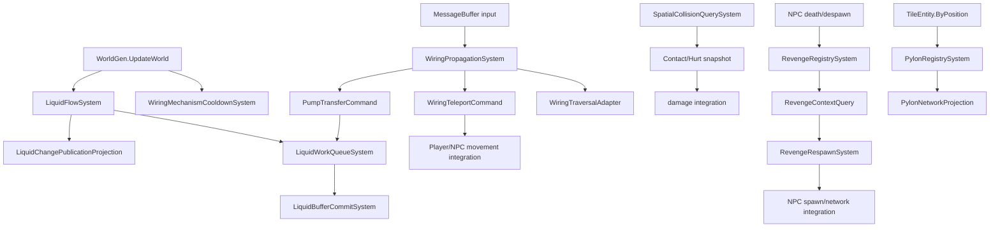

# P01 Liquid / Wiring / Spatial / Death / Teleport System 设计

## 文档状态

| 项目 | 值 |
| --- | --- |
| `designStatus` | `proposed` |
| `verificationStatus` | `not-run` |
| `coreSliceVerification` | `passed`（Spatial、Liquid、Wiring、Pylon、Revenge、Teleportation 局部 verifier） |
| 分区 | `P01` |
| 任务 | `AUTH-SYS-P01` |
| 原始 `sessionId` | `17f3d4e11f504f5e98ff62ac4e380dd9` |
| 成员覆盖 | 14 个叶子组，113 个成员 |
| 输入报告 | `docs/system-decomposition/reports/2026-09-18-system-decomposition-authoritative-P01-liquid-wiring-spatial-death-teleport.md` |
| 目标源码 | `D:\TRbackup\Version4` |
| 完整参考源码 | `D:\TRbackup\无任何删减通过编译` |
| 迁移代码范围 | `D:\TRbackup\NLTX\src\NSSLC` |

本文是 P01 的 System 边界、API 组合和跨域交接设计。它只表达静态证据支持的候选
结构，不表示目标源码已经接入这些 System，也不表示新旧行为等价、旧 API 兼容或迁移
成功。完整参考项目用于补充被删减目标源码的调用顺序和副作用形状；它不是目标项目的
行为验证替代品。

## 证据和状态词

- `confirmed`：在目标源码或只读 CPG 查询中可定位的声明或正向关系。
- `partial`：查询完成但调用闭包、动态分派、别名或副作用仍不完整。
- `unknown`：目标源码、查询范围或当前 stub 无法建立行为或唯一写者。
- `proposed`：本文提出的 System、Query、Command、Adapter 或 Projection 契约。
- `not-run`：完整迁移、集成、运行时和行为等价 verifier 尚未运行；局部 core slice 结果另列，
  不改变这个整体状态。

本次只读 CPG 数据库为 `D:\TRbackup\Version4-cpg-export\out-dop8-interproc.sqlite`，
导入状态 `complete`，967 shards、8,166,789 nodes、71,038,907 edges、1,317 diagnostics，
没有 source snapshot ID。查询结果可支持正向静态关系，但不能证明运行时闭包。补充查询中
`CheckRespawns` 的调用点仍为 `partial` 且 `gapStatus: unknown`，不能解释为无调用。

## 设计目标与非目标

设计目标：

1. 为 113 个成员建立按状态生命周期和写入边界划分的候选 owner。
2. 把读计算、状态提交、网络/表现投影和外部适配分开。
3. 保留 `WorldGen.UpdateWorld`、网络收包、世界重置和入服同步中的可观察顺序。
4. 为跨 P01 分区的 Tile、Player/NPC、网络和持久化关系留下可审查的 handoff。

非目标：

- 不把本文设计本身当作生产接线授权；本轮实现仅限已定义 owner 的局部候选切片，
  不把局部代码接入旧 facade 或全局 scheduler。
- 不用参考项目的可编译状态替代目标 Version4 的行为验证。
- 不从方法名、空结果或 stub 推断缺失语义。
- 不在当前文档中选择两个 `CollisionResultComponent` 的最终 owner。

## System 边界

### Liquid

| 候选 owner | 负责状态或动作 | 明确不负责 |
| --- | --- | --- |
| `LiquidFlowSystem` | budget、panic、cycle、work-item 处理、stuck 恢复和 tick 编排 | 直接暴露内部队列；网络模块的权威状态 |
| `LiquidWorkQueueSystem` | `AddWater`/`DelWater` 相关 work item 的入队、删除和边界复核 | 预算决策、网络发送 |
| `LiquidBufferCommitSystem` | `LiquidBuffer.AddBuffer`、`DrainNext`、压缩和 `checkingLiquid` 提交 | 纯 Query；不能隐藏 Tile 写入 |
| `LiquidChangePublicationProjection` | `_netChangeSet` 与 `_swapNetChangeSet` 的 immutable dirty snapshot，以及 `NetLiquidModule` 投影 | 反向修改 liquid authority |
| `LiquidFlowBudgetQuery`、`LiquidWorkItemReadyQuery` | 在显式 `LiquidWorldSnapshot`、`LiquidQueueSnapshot` 和 Tile snapshot 上做决定 | 时钟、随机、Tile lazy materialization 和队列提交 |

`UpdateLiquid` 的相对顺序候选为：预算/压力判断、panic 快速路径、work item 分片、
到期删除、buffer drain、stuck recovery、dirty-set swap/publication、恢复 Tile solidity。
参考源码 `Terraria/Liquid.cs:1015-1192` 显示了这一顺序；目标源码仍需 focused verifier
确认每一处 `AddWater`、`DelWater` 和 WorldGen helper 的写入闭包。
CPG 同时定位到 `Terraria.IO/WorldFile.cs` 的独立 `UpdateLiquid` 入口；它与正常 world tick
和 WorldGen load pass 必须保留为不同的 phase contract，不能只按方法名合并。

### Wiring

| 候选 owner | 负责状态或动作 | 明确不负责 |
| --- | --- | --- |
| `WiringPropagationSystem` | wire traversal、四种颜色 pass、gate/pixel queue 和传播顺序 | Player/NPC 移动、Liquid 权威存储 |
| `WiringMechanismCooldownSystem` | `_mechX/_mechY/_mechTime`、cannon cooldown 和 world tick 倒计时 | 具体炮弹、陷阱、NPC 生成效果；owner 仍需 integration review |
| `WiringTraversalAdapter` | 将旧入口和 tile/device 事实翻译成有序 traversal/commit intents | Query 不能 flush 或写 Tile |
| `WiringTeleportCommand` | 携带稳定 command identity、传送端点、主体和 one-iteration block 意图 | Player/NPC 位置、section 和 network 的最终写者 |
| `WiringTeleportTransitionAdapter` | 通过 `IWiringTeleportSnapshotProvider` 取得当前 facts，把 Wiring intent 组合成 `TeleportTransitionRequest`，并把 Teleport 结果映射回 Wiring commit result | 不直接移动 Player/NPC、不写 network/section；`Unknown` 不能映射为成功 |
| `PumpTransferCommand` | 泵输入/输出坐标和液体转移意图 | 目标 liquid queue 的权威写入，直到 pump 语义闭包完成 |

完整参考源码确认 `Wiring.TripWire` 在四个 wire color pass 中逐次收集 pump 和 teleport
端点，每一 pass 后可能 `XferWater`，随后按收集顺序执行 `Teleport`，最后执行
`PixelBoxPass` 和 `LogicGatePass`（`Terraria/Wiring.cs:551-694`）。目标源码中
`CheckMech`、`XferWater`、`CheckLogicGate`、`GeyserTrap`、`DeActive`、`ReActive` 和
`MassWireOperationInner` 的闭包状态仍按报告标为 `unknown`；参考实现不能自动升级目标
状态。

#### Wiring 关系补查

针对目标 `Version4/Terraria/Wiring.cs` 的只读 CPG 查询确认了以下正向关系：

| 符号 | 查询结果 | 解释边界 |
| --- | --- | --- |
| `TripWire` | `complete`，Wiring 内 8 个 call site | 支持传播入口和递归触发候选；不闭合被调效果 |
| `HitSwitch` | `complete`，3 个 call site（含 `MessageBuffer.cs`） | 支持网络/内部入口候选；不证明协议提交完整 |
| `UpdateMech` | `complete`，`WorldGen.cs` 1 个 call site | 支持 world tick 正向入口；其它动态入口仍 unknown |
| `CheckMech` | `complete`，Wiring 内 35 个 call site | 只证明调度点，不证明目标 stub 的行为 |
| `XferWater` | `complete`，Wiring 内 4 个 call site | 只证明四个颜色 pass 的调用位置；目标方法体仍为 stub |
| `LogicGatePass` | `complete`，Wiring 内 2 个 call site | 支持 post-pass 顺序；`CheckLogicGate` 仍为 stub |

`TripWire` 的 callable-facts 查询返回 `partial` 并带
`CalleeEffectsNotExpanded`；因此上表的 `complete` 只表示调用点索引查询完成，不能把
`HitWire`、`PixelBoxPass`、`LogicGatePass` 或实体/网络副作用闭包写成已确认。完整参考项目
`D:\TRbackup\无任何删减通过编译\Terraria\Wiring.cs` 仅用于核对四 pass、pump、teleport、
PixelBox、LogicGate 的顺序形状；目标实现仍由目标源码和后续行为 verifier 决定。

### Spatial

| 候选 owner | 负责状态或动作 | 约束 |
| --- | --- | --- |
| `SpatialCollisionQuerySystem` | 从完整 geometry/tile snapshot 计算 hit、wet、slope、tile collision facts | 不写共享 static flags，不触发 callback，不 lazy 写 Tile |
| `SpatialContactQuerySystem` | 生成 contact/hurt immutable result；调用方拥有结果容器 | 不直接扣 Player/NPC 生命 |
| `SpatialCollisionCommand` | conveyor velocity、cache invalidation 和 damage handoff | 必须在显式 commit 阶段执行 |
| `CollisionResultProjection` | 仅在 integration review 后选择结果投影 owner | 现有 Physics 与 Spatial 两个 `CollisionResultComponent` 不得再造第三个 |

`CanHitWithCheck` 的 callback/异常转 false、`GetWaterLine` 的 lazy tile、`WetCollision`/
`SlopeCollision`/`TileCollision` 的共享结果 flag 都是 mixed 或 `unknown`。Query API 必须
接受完整 snapshot，并在返回值中表达 callback、异常、cache 和 lazy materialization 结果；
无法满足时保留为 Command 或 integration handoff。

#### Spatial 证据补查（CPG + 完整参考）

只读 CPG 查询在 `Terraria/Collision.cs` 中解析了以下声明：
`CheckAABBvAABBCollision`、三个 `CanHit` overload、两个 `CanHitWithCheck` overload、
两个 `GetWaterLine` overload、`WetCollision`、`SlopeCollision` 和 `TileCollision`，
查询状态均为 `complete`。选定的 `CanHitWithCheck`、`SlopeCollision` 和 `TileCollision`
调用点中，entity overload 在 `Terraria/NPC.cs` 定位到 1 个点，value overload 在
`Terraria/Collision.cs` 定位到 1 个内部转发点；`SlopeCollision` 和 `TileCollision` 的
选定范围还覆盖 `Terraria/NPC.cs`、`Terraria/Player.cs`、`Terraria/Projectile.cs` 等调用方。
这些是正向静态关系，不是完整入站闭包。对
`CheckAABBvAABBCollision` 的 callable-facts 查询为 `partial`，并明确返回
`CalleeEffectsNotExpanded`，因此不能据此证明无隐藏写入或唯一 owner。

完整参考源码 `D:\TRbackup\无任何删减通过编译\Terraria\Collision.cs` 与目标源码的对应
实现进一步确认：

- `CheckAABBvAABBCollision` 是两个矩形的严格边界重叠判断，可以作为显式 geometry
  snapshot 上的最小纯 Query 候选。
- `CanHit` 逐 tile 走线并读取 `Main.tile`、`Main.tileSolid`、slope 和 half-brick；
  迁移前必须将这些事实预先快照化，不能在 Query 内访问全局 Tile。
- `CanHitWithCheck` 将 `TileActionAttempt` callback 纳入结果路径，并把异常转换为
  `false`；callback 的执行顺序、异常和副作用必须由 adapter 明确表达，不能隐式调用。
- `GetWaterLine` 在缺失 Tile 时会写入 `Main.tile[X,Y-2..Y+1]`；它只能接收完整
  Tile snapshot，或在独立 commit 中显式 materialize 后再查询。
- `WetCollision` 会更新 `honey`/`shimmer` 共享标记，`SlopeCollision` 会更新
  `stair`/`stairFall`/`sloping`/`up` 等标记，`TileCollision` 会更新 `up`/`down`；
  这些 legacy 观察行为尚未绑定到 NLTX 的单一结果 owner。

因此 P01 只提出“矩形重叠 + 显式 snapshot 结果”的最小 Spatial Query 形状；slope、
conveyor cache、callback、lazy Tile、damage handoff 和重复
`CollisionResultComponent` owner 继续保持 `unknown` 或 `integration-review`，不从完整
参考实现直接升级为目标行为等价。

### Revenge / Death

| 候选 owner | 负责状态或动作 | 约束 |
| --- | --- | --- |
| `RevengeRegistrySystem` | marker collection、marker revision、`_gameTime` 和 capture/remove 提交 | marker ID 不得与 NPC type/net ID、entity slot 混用 |
| `RevengeContextQuery` | 基于 Player/NPC/world snapshot 判断交叉范围和 discouragement | 不锁 registry、不生成 NPC、不发包 |
| `RevengeExpirationPolicy` | 使用显式 `gameTime` 判断过期/无效 | 不读取隐式时钟，不删除 marker |
| `RevengeRespawnSystem` | 返回 respawn decision，并在 commit 端应用 attempt lock/expire/remove | NPC spawn 和 network message 交给 integration owner |
| `RevengeMarkerIdentityProjection` | 序列化 marker identity/context/value snapshot | 不修改 registry |

完整参考源码 `Terraria.GameContent/CoinLossRevengeSystem.cs:377-495` 显示：capture 先过滤
NPC、构造 marker、加入 registry，再在 server 发 marker；respawn 先快照 active player
范围，清理过期/无效 marker，然后锁定尝试、检查 discouragement、spawn、移除并发出删除消息。
目标 `CheckRespawns` 的 CPG caller 仍是 `partial/unknown`，所以执行入口需要后续补证。

### Pylon

| 候选 owner | 负责状态或动作 | 约束 |
| --- | --- | --- |
| `PylonRegistrySystem` | 从 TileEntity facts 建立 current/previous immutable snapshot，计算差异和 revision | 不把 `_pylons` 可变列表泄露给 Query |
| `PylonRegistryQuery` | `HasType(snapshot, type)`、按位置读取已提交事实 | 不扫描 TileEntity，不触发 update |
| `TETeleportationPylonQuery` | 从明确 Tile snapshot 解析 pylon type | placement、TileEntity 生命周期留在 integration owner |
| `PylonNetworkProjection` | add/remove diff、join full state 和 client deserialize adapter | 不成为第二个 registry |

完整参考源码 `Terraria.GameContent/TeleportPylonsSystem.cs:27-95,352-368` 确认 server
更新按 cooldown 扫描 `TileEntity.ByPosition`，交换 current/old 列表，按 `Except` 广播差异；
入服则逐个发送当前列表。`HasPylonOfType` 在参考实现中直接读可变列表，因此迁移时必须
改为 snapshot Query，不能把原属性暴露作为纯度证明。

本轮局部实现保留这一边界：`PylonRegistrySystem` 只提交 discovered fact snapshot，
`PylonRegistryQuery`/`PylonRegistrySnapshot` 只读取已提交且可传送的条目，
`PylonNetworkProjection` 只生成 revisioned add/remove/join intent。它不扫描 TileEntity、
不发送网络、不修改 registry；invalid/zero-kind 条目不会进入 projection。完整 TileEntity
生命周期、pylon type 解析、network serialization/equality 和客户端接收仍为
`integration-review`/`unknown`。

### Teleportation

目标 `Version4/Terraria/Wiring.cs` 与完整参考的 `Teleport` 都在两个端点之间构造
48x48 的传送区域，逐方向检查 Player/NPC 资格后调用实体自身 `Teleport`。目标
`Player.Teleport`/`NPC.Teleport` 还混合位置、压力板、portal metadata、效果、timer 和
network side effects；这些最终写者没有由 P01 单独闭合。CPG `Find-CpgSymbols` 已确认
`Terraria.Wiring.Teleport():void()`、`Terraria.Player.Teleport(Vector2,int,int)` 和
`Terraria.NPC.Teleport(Vector2,int,int)` 的声明。按声明文件和固定签名重新运行
`Find-CpgCallSites` 后，Wiring 静态入口有 1 个调用点，Player overload 有 9 个调用点
（含 `Terraria/Wiring.cs`），NPC overload 有 4 个调用点（含 `Terraria/Wiring.cs`），
查询状态为 `complete`。三个 `Get-CpgCallableFacts` 仍为 `partial`，只返回声明体的
direct closure，callee effects 未展开；因此调用数量是正向静态事实，不是完整运行时闭包、
唯一 writer 或异常后状态证明。

SS14 参考项目 `C:\Users\shan\Downloads\ECS\space-station-14-master` 的
`Content.Shared/Teleportation/Systems/SharedPortalSystem.cs` 与
`Content.Server/Teleportation/PortalSystem.cs` 只用于确认 ECS 组织形状：碰撞/资格判断
先形成明确输入，实体坐标变更由独立 transform/commit 边界执行。该参考不用于推导
Terraria Player/NPC 的行为、网络或效果语义。

本轮落地的 core 只表达可审查的资格和提交边界：

| 类型 | 责任 | 明确不负责 |
| --- | --- | --- |
| `TeleportEndpointSnapshot`、`TeleportSubjectSnapshot`、`TeleportTransitionSnapshot` | 不可变 endpoint/subject/cooldown facts，携带 identity 和 revision | 不读取全局 Tile、entity、clock 或 network |
| `TeleportTransitionRequest` | source/destination、主体、坐标、source、style/extraInfo、expected revisions 和 one-iteration block 意图 | 不直接移动 Player/NPC |
| `TeleportEligibilityQuery` | endpoint identity/坐标/active、主体 scope/lifecycle、cooldown、source 和 stale revision 检查 | 不锁状态、不写组件、不调用旧 `Teleport` |
| `TeleportCooldownSystem` | 只写 Teleport cooldown component 的 advance/arm/reset | 不写位置、网络或表现 |
| `TeleportTransitionCommitSystem` | 命令去重、commit-time Query、外部 commit port 编排和显式结果状态 | 不成为 Player/NPC movement、section 或 network writer |
| `ITeleportCommitPort` | 接收已验证 intent，交给 Movement/Network/Presentation integration owner | 当前没有默认位置实现；port `unknown` 不得当作成功 |

`WiringTeleportTransitionAdapter` 只把 `CommitPump` 委托给原 Wiring port；传送路径先由
`IWiringTeleportSnapshotProvider` 提供 endpoint/subject/cooldown snapshot，再进入
`TeleportTransitionCommitSystem`。`Accepted`、`Duplicate`、`Rejected` 和 `Unknown` 均保留为
显式结果；`WiringTraversalFlushStatus.Unknown` 继续沿 flush 边界传播，未知结果不会被当作
已提交或业务拒绝。

完整参考项目的可复核锚点为 `D:\TRbackup\无任何删减通过编译\Terraria\Wiring.cs:3223-3288`、
`Player.cs:37902-37987` 和 `NPC.cs:82322-82348`；目标对应锚点为
`D:\TRbackup\Version4\Terraria\Wiring.cs:2704-2764`、`Player.cs:21731-21797` 和
`NPC.cs:67306-67332`。这些片段共同显示 Wiring 的双向 48x48 扫描、Player block、实体
`teleporting` 标记清理，以及实体 Teleport 内的位置、pressure plate、TeleportEffect、
timer、portal metadata 和 network effects。它们只确定需要保留的副作用检查清单，不授权把
这些效果归入 P01 的 Query 或 `ITeleportCommitPort` 默认实现。

`PortalSubjectKind.Projectile` 仍保留在已有枚举中，但当前 Wiring boundary 只接受
Player/NPC；Projectile、Portal traversal 组合、Pylon style/placement、实体位置提交、
section sync、TeleportEffect、pressure plate 和网络广播继续是 `unknown` 或
`integration-review`。`BlockPlayerTeleportationForOneIteration` 被显式映射为 Player
资格拒绝，避免在 Query 中读取旧 static flag。

## 状态 owner 候选矩阵

| 叶子组 | 候选 owner | 写入/提交边界 | 状态 |
| --- | --- | --- | --- |
| `LiquidFlowBudgetAndPanicState` | `LiquidFlowSystem` | budget、panic、cycle、stuck | `proposed` |
| `LiquidCellWorkItemState` | `LiquidWorkQueueSystem` | work item 生命周期 | `proposed` |
| `LiquidBufferQueueState` | `LiquidBufferCommitSystem` | buffer、count、checking flag | `proposed` |
| `LiquidChangePublication` | `LiquidChangePublicationProjection` | dirty snapshot 和 network output | `proposed` |
| `WiringPropagationAndGateState` | `WiringPropagationSystem` | wire/gate/pixel traversal state | `proposed` |
| `WiringTeleportAndPumpState` | Adapter + explicit Commands | endpoint、pump intent、commit handoff | `partial` / `unknown` |
| `WiringMechanismCooldowns` | `WiringMechanismCooldownSystem` | timers、mechanism queue | `partial` |
| `CollisionQueryCache` | `SpatialCollisionQuerySystem` | cache policy和失效 | `integration-review` |
| `CollisionContactAndHurtResults` | `SpatialContactQuerySystem` | immutable contact/hurt snapshot | `integration-review` |
| `RevengeMarkerExpirationAndIdentityState` | `RevengeRegistrySystem` | marker identity、expiry、revision | `proposed` |
| `RevengeMarkerEnemyContextState` | `RevengeContextQuery` | context snapshot | `proposed` |
| `RevengeMarkerValueAndRespawnState` | `RevengeRespawnSystem` | attempt lock、expire、spawn intent | `proposed` |
| `RevengeRegistryAndCache` | `RevengeRegistrySystem` | collection、lock、clock | `partial` |
| `TeleportPylonRegistry` | `PylonRegistrySystem` | current/previous registry snapshot | `partial` / `integration-review` |
| `TeleportTransitionAndCooldown` | `TeleportTransitionCommitSystem` + `TeleportCooldownSystem` | request 资格、revision/identity recheck、command dedupe、cooldown | `proposed` / `partial` |

所有 owner 都是候选。唯一写入者只有在 focused writer-closure 和运行时验证完成后才能
升级；当前不作升级。

## 概念 API 组合

以下 API 名称是设计契约，不是已存在类型或实现签名。

| 旧入口/行为 | 候选组合 | 类型 | 关键契约 |
| --- | --- | --- | --- |
| `Liquid.UpdateLiquid` | `LiquidFlowSystem.Advance` + budget/work/buffer Queries/Commits + publication | System | 保持相对顺序；每个 commit 重新检查 Tile/revision |
| `Liquid.ReInit` | `LiquidFlowSystem.Reinitialize` | Command/commit | reset 所有 flow counters，配置显式输入 |
| `Liquid.AddWater` / `LiquidBuffer.AddBuffer` | `LiquidWorkQueueSystem.Enqueue` + `LiquidBufferCommitSystem.Enqueue` | Command | 越界、容量、Tile invariants 在提交点复核 |
| `Liquid.NetSendLiquid` | `LiquidChangePublicationProjection.Project` | Projection | 只消费 immutable dirty set |
| `Wiring.HitSwitch` | `WiringPropagationQuery` + `WiringTraversalAdapter.Dispatch` | Adapter/Command | 保留 tile 类型分支和 network user context |
| `Wiring.TripWire` | `WiringPropagationSystem.Propagate` + `WiringTraversalAdapter.Flush` | System/commit | 四 pass、pump、teleport、pixel、gate 顺序明确 |
| `Wiring.UpdateMech` | `WiringMechanismCooldownSystem.Advance` | System | timer 递减和 ready intent 顺序保持 |
| `Wiring.Teleport` | `WiringTeleportCommand` + movement/network integration | Command | endpoint 与资格在 commit 重检 |
| `Player.Teleport` / `NPC.Teleport` | `TeleportTransitionRequest` + `TeleportEligibilityQuery` + `TeleportTransitionCommitSystem` + `ITeleportCommitPort` | Command/System/adapter | 只提交验证后的 intent；位置、效果、section、network 留给 integration owner |
| `Wiring.MassWireOperation` | `MassWireRequest` + resource commit + traversal adapter | Command/adapter | tool mode、库存扣除和 server reply 显式化 |
| `Collision.WetCollision` 等 | `SpatialCollisionQuerySystem` | Query candidate | 结果值代替 static flag；无法快照化则 `unknown` |
| `CoinLossRevengeSystem.CheckRespawns` | `RevengeRespawnSystem.Evaluate` + `ApplyAttemptState` + spawn command | Query + Command | stale marker revision 必须拒绝提交 |
| `TeleportPylonsSystem.HasPylonOfType` | `PylonRegistryQuery.HasType(snapshot, type)` | Snapshot Query | 不读 mutable registry，不触发 refresh |
| `TeleportPylonsSystem.Update` | `PylonRegistrySystem.Refresh` + `PylonNetworkProjection` | System/Projection | current/old diff、revision 和 join state 分离 |

`CheckMech`、`XferWater`、`CheckLogicGate`、`GeyserTrap`、`DeActive`、`ReActive`、
`MassWireOperationInner`、碰撞 callback 完整语义、pylon deserialize/equality 和 Tile
commit owner 继续标 `unknown` 或 `integration-review`。

## Query 纯度契约

一个候选 Query 必须满足以下条件，缺一则降级为 mixed/Command/`unknown`：

1. 所有 world、entity、clock、random、configuration 和 callback 输入都显式提供。
2. 只读取不可变 snapshot，不写 Tile、entity、cache、static result flag、queue、network、log 或 UI。
3. 强重复性只对相同 snapshot、revision 和显式输入承诺；不承诺跨 revision 稳定。
4. callback 的调用顺序、异常转换和是否允许副作用必须成为结果契约；默认不在 Query 内调用。
5. Query 产生的 Command 在提交时重新检查 bounds、identity、revision、eligibility 和容量。

## 依赖方向与跨分区交接

必须交给 `integration-review` 的决策：

- Physics 与 Spatial 中重复 `CollisionResultComponent` 的唯一 owner 和快照寿命；不得新增第三个。
- Liquid、Wiring、Collision、WorldGen 对 `Main.tile` 的 commit 顺序、失效和 lazy materialization。
- Teleport 对 Player/NPC movement、section 和 network update 的最终 owner。
- Pump 与 Liquid 的转移协议、容量、液体类型和重复提交语义。
- Revenge marker 的持久化/网络 identity 与 NPC slot/type/net ID 的映射。
- Pylon placement、TileEntity 生命周期、SceneMetrics、network deserialize 和 equality。

## 不变量与后续门禁

未来实现必须以这些 proposed invariants 为门禁输入：

1. 每一行状态矩阵只有一个 authoritative writer；Projection/Query 不回写 authority。
2. Liquid tick 保留预算、work、buffer、stuck、publication 的相对顺序。
3. 所有 queue drain/flush 是 commit，不暴露成 Query。
4. Query 重复调用对同一 snapshot/revision 可重复且无 observable write。
5. Query 产生的 Command 在 commit 做 TOCTOU recheck，并拒绝 stale revision。
6. Revenge marker ID、NPC type ID、NPC network ID、entity slot、serialized identity 独立。
7. Network/persistence adapter 只投影已提交 snapshot，不成为第二个 authority。
8. Teleport request 必须在 commit 时重新检查 endpoint/subject identity、坐标和 revision；
   外部 port 返回 `unknown` 时不能写入 cooldown 或报告成功。
9. 未恢复的 stub、动态关系和 CPG `partial` 继续保持 `unknown`。

后续验证至少包括 member coverage、liquid writer/phase、wiring traversal、spatial Query
purity、revenge identity/lifecycle、pylon snapshot/projection 和 integration ownership
verifier。除本节记录的局部 core slices 外，这些完整 verifier 均未运行，
`verificationStatus` 保持 `not-run`。

## 局部核心验证记录

本轮运行两个约 10% 范围的 focused verifier，分别覆盖已经落地的候选切片：

- `Test/Terraria.SpatialSimulation.Verification`：严格 AABB overlap/边界接触、实体 subject
  自排除、阻挡 Tile、water/lava/honey/shimmer 标记、半砖和液体表面几何、slope
  `HasUnsupportedSlopeFacts`、重复求值稳定性以及输入集合不变性；结果为
  `PASS: SpatialSimulation core query cases`。
- `Test/Terraria.P01.Core.Verification`：Liquid budget/work queue/publication、Pylon
  snapshot Query、stale revision、add/remove/join projection，以及 Revenge respawn decision
  和 marker revision commit；本轮追加 Teleport endpoint/subject/cooldown Query、stale
  revision/identity、unsupported subject、duplicate command、immutable snapshot，以及
  Wiring command identity、Wiring→Teleport adapter 路由、重放去重和 one-iteration block
  拒绝断言，以及 Teleport commit port 返回 `Unknown` 时的未知状态保留；结果为
  `PASS: P01 liquid, wiring, pylon, and revenge core cases`。

两个 verifier 均通过串行 wrapper 构建并运行；依赖项目的既有 warning 不属于本分区行为结论。
边界仍包括旧 facade 接线、Player/NPC 位置和 TeleportEffect、callback、lazy Tile
materialization、完整 slope 求解、conveyor/damage handoff、真实 System 调度、网络/持久化
协议和跨分区唯一 writer。

这些结果只证明局部输入和提交契约可运行，不能把 `verificationStatus` 升级，也不能称为迁移成功。

## 结论

P01 的可执行形状是“按领域状态 owner 拆分、以显式 Query/Command 组合、以 Adapter/Projection
跨旧 API 和网络边界”。它是一个 `proposed` 静态设计，含有明确的 `unknown` 和
`integration-review` 缺口；局部 core slice 通过、参考项目可编译、CPG 查询完成都不等同于迁移成功。
