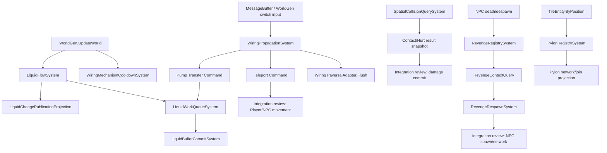

# System Decomposition Report: authoritative P01

## Scope and Evidence

| Item | Value |
| --- | --- |
| `designStatus` | `proposed` |
| `verificationStatus` | `not-run` |
| partition | `P01` |
| task | `AUTH-SYS-P01` |
| claim mode | `manual` |
| original `sessionId` | `17f3d4e11f504f5e98ff62ac4e380dd9` |
| claimed member count | `113` (`111` fields + `2` properties) |
| formal parents | `LiquidSimulation`, `WiringAndMechanisms`, `SpatialSimulation`, `DeathPenaltyAndRevenge`, `TeleportationAndTraversal` |
| input report | `D:\TRbackup\NLTX\docs\migration\ledgers\authoritative-20-partitions\P01-Liquid-Wiring-Spatial-Death-Teleport.md` |
| authorized output | `D:\TRbackup\NLTX\docs\system-decomposition\reports\2026-09-18-system-decomposition-authoritative-P01-liquid-wiring-spatial-death-teleport.md` |
| source project | `D:\TRbackup\Version4` |
| reference project | `C:\Users\shan\Downloads\ECS\space-station-14-master` |
| complete reference source | `D:\TRbackup\无任何删减通过编译` |
| migration code inspected | `D:\TRbackup\NLTX\src\NSSLC` |

This is a read-only, static boundary proposal for one authoritative partition. It does not
modify Version4, NLTX production code, the input ledger, prompts, task state, or CPG artifacts.
The runner's `Complete` state, if settled after this report, means only that this document task
was settled. It does not mean that a System was migrated, that behavior is equivalent, or that an
old API is compatible with a proposed API.

### Evidence classes

| Evidence class | Material used | Interpretation |
| --- | --- | --- |
| Member inventory | P01 input ledger, including source paths, declaration lines, and 14 leaf groups | Confirms the 113-member scope only. It does not prove unique writers or runtime ownership. |
| Version4 source | `Terraria/Liquid.cs`, `Terraria/LiquidBuffer.cs`, `Terraria/Wiring.cs`, `Terraria/Collision.cs`, `Terraria.GameContent/CoinLossRevengeSystem.cs`, `Terraria.GameContent/TeleportPylonsSystem.cs`, `Terraria.GameContent.Tile_Entities/TETeleportationPylon.cs`, and selected `Main.cs`, `WorldGen.cs`, `MessageBuffer.cs`, `NetMessage.cs` call sites | Primary semantic evidence for this report. Current line numbers are cited directly below. |
| complete reference source | `D:\TRbackup\无任何删减通过编译\Terraria` and related subtrees | Reconstructs non-stub method-body shape and ordering for comparison only; it is not evidence that Version4 or NLTX has equivalent behavior. |
| NLTX current tree | Existing components, Systems, Query types, commit ports, adapters, and projections under `src/NSSLC` | Shows local design material that can inform a proposal. It is not evidence that Version4 ownership has been transferred. |
| SS14 reference | `EntitySystem` and `EntityQuery` patterns in the reference project | Used only for vocabulary and composition shape: systems own updates and queries expose reads. It is not Version4 behavior evidence. |
| CPG Query API | Read-only `CpgEvidence.ps1` was initialized and started after the runtime was restored; symbol, call-site, member-use, and callable-facts queries were run | The database is read-only and the query server completed the selected scopes. Where the tool reports `partial`, this report labels the unresolved gap `unknown`; it is not a closure claim. |

### CPG Query API supplement

The restored read-only server reported schema `1`, import status `complete`, 967 shards,
8,166,789 nodes, 71,038,907 edges, 1,317 diagnostics, artifact manifest
`6d6bdf09a70e7b9ec3e22e5c4f32aa8d5f447f1a9bde5cd444b9d427a715a364`, and no source snapshot ID.
These facts identify the queried artifact but do not bind it to a per-file source revision.

| Query scope | Result | Evidence returned |
| --- | --- | --- |
| Symbol resolution | `complete` for 15 selected symbols | `UpdateLiquid`, `NetSendLiquid`, `numLiquidBuffer`, `TripWire`, `Teleport`, `WetCollision`, `GetWaterLine`, `TileCollision`, `CanTileHurt`, `CacheEnemy`, `CheckRespawns`, `SpawnEnemy`, Pylon `Update`, `HasPylonOfType`, and `TryGetPylonType` resolved to their declared Version4 files. |
| `Find-CpgCallSites(UpdateLiquid)` | `complete` | 4 sites: `Terraria.IO/WorldFile.cs` 1; `Terraria/WorldGen.cs` 3. |
| `Find-CpgCallSites(NetSendLiquid)` | `complete` | 2 sites, both in `Terraria/Liquid.cs`. |
| `Find-CpgCallSites(TripWire)` | `complete` | 8 sites, all in `Terraria/Wiring.cs`. |
| `Find-CpgCallSites(Teleport)` | `complete` | 1 site in `Terraria/Wiring.cs`; this does not close entity movement callers hidden behind the method. |
| `Find-CpgCallSites(WetCollision)` | `complete` | 7 sites: `Terraria/NPC.cs` 4, `Terraria/Player.cs` 1, `Terraria/Projectile.cs` 2. |
| `Find-CpgCallSites(CacheEnemy)` | `complete` | 1 site in `Terraria/NPC.cs`. |
| `Find-CpgCallSites(CheckRespawns)` | tool status `partial`; `gapStatus: unknown` | 0 sites in the selected `NPC.cs`, `Main.cs`, and system scopes; this is not evidence of no callers. |
| `Find-CpgCallSites(Pylon.Update)` | `complete` | 1 site in `Terraria/Main.cs`. |
| `Find-CpgCallSites(HasPylonOfType)` | `complete` | 1 site in `Terraria.GameContent.Tile_Entities/TETeleportationPylon.cs`. |
| `Get-CpgMemberUses(_netChangeSet)` | `complete` | 4 uses in `Terraria/Liquid.cs`; all access modes were `Unknown`. |
| `Get-CpgMemberUses(numLiquidBuffer)` | `complete` | 11 uses: `Terraria.IO/WorldFile.cs` 4, `Terraria/LiquidBuffer.cs` 7; all access modes were `Unknown`. |
| `Get-CpgMemberUses(Collision.contacts)` | `complete` | 23 uses, all in `Terraria/Collision.cs`; all access modes were `Unknown`. |
| `Get-CpgCallableFacts` for `UpdateLiquid`, `TripWire`, `WetCollision`, `CheckRespawns`, and Pylon `Update` | tool status `partial`; `gapStatus: unknown` | Operation node counts were 55, 262, 149, 54, and 13 respectively; every result reports `CalleeEffectsNotExpanded`. Empty direct-target lists are not negative call evidence. |

The CPG results strengthen positive call-site and symbol evidence, but they do not change the
proposed status. Member-use access modes, callee effects, open dispatch, aliases, and runtime
ordering still require source and focused verifier review.

### Complete reference comparison for teleport

The complete reference tree was read directly to recover the behavior shape that is absent or
partially stubbed in the target. Its `Terraria/Wiring.cs:3223-3288` constructs two 48x48
teleporter rectangles, scans both directions, gates Player traversal with
`blockPlayerTeleportationForOneIteration`, marks matching entities as teleporting, calls
`Player.Teleport`/`NPC.Teleport`, performs the server section/network effects, and clears the
temporary teleporting flags. The target has the corresponding method at
`D:\TRbackup\Version4\Terraria\Wiring.cs:2704-2764`; the line-level correspondence does not
close target runtime ownership or scheduler behavior.

The complete reference entity methods are `Terraria/Player.cs:37902-37987` and
`Terraria/NPC.cs:82322-82348`. They mix position mutation with pressure-plate updates,
TeleportEffect, portal metadata, timers and network sends. The target methods are at
`D:\TRbackup\Version4\Terraria\Player.cs:21731-21797` and
`D:\TRbackup\Version4\Terraria\NPC.cs:67306-67332`. Because those effects cross Player/NPC,
presentation, section and network owners, P01 keeps the final commit port as
`integration-review`/`unknown`; the complete reference only supplies an ordering and side-effect
checklist.

For reproducibility, the inspected file hashes were:

| file | Version4 SHA-256 | complete reference SHA-256 |
| --- | --- | --- |
| `Terraria/Wiring.cs` | `3D4D4C75B7A002207029294D63554B0BF376A29588AC7A06F62A08CC6A998225` | `704BFD8029E29FCF64BFDF4150A14D599D7489D3F58462F485B47A557BDF3FDE` |
| `Terraria/Player.cs` | `E5B301E3401F61E37BF3291754670BCC123D6593EDD94597C4E9109C4030FE86` | `367E6C3249F064DD9CCF8E421EBEBF6EE3AA745B6521F07A8BEBA4A3C2FF612C` |
| `Terraria/NPC.cs` | `29869B0390D85CB0E627552ECBED929D90508C8EF0DA55D9660133F91DA42D17` | `ED8AA2302730A9E046EF310E543204FBA391BD35B1C9C0B213C8065DFBBE39F0` |

Different hashes are recorded as an evidence boundary, not as a claim that the target is broken or
that the complete reference is a drop-in replacement.

### Version4 source facts

- `Liquid` declares process/world liquid budgets, counters, panic flags, work-item fields, and
  two network change sets at `Liquid.cs:14-54`. `ReInit` resets this state at `Liquid.cs:88-109`.
  `UpdateLiquid` changes the budget from active players, runs work items, drains the buffer,
  deletes work items, and swaps the network sets at `Liquid.cs:1015-1188`. `AddWater` writes
  `Main.tile`, `Main.liquid`, and `LiquidBuffer`, and may kill a tile and send a network message
  at `Liquid.cs:1190-1233`. `UndergroundDesertCheck` is a stub at `Liquid.cs:1235-1237`.
- `LiquidBuffer.AddBuffer` and `DelBuffer` mutate `Main.tile`, `Main.liquidBuffer`, and the
  shared count at `LiquidBuffer.cs:11-32`. This is a queue write/commit path, not a Query.
- `Wiring.Initialize` allocates propagation, gate, pump, teleport, and mechanism scratch state
  at `Wiring.cs:88-113`; `ClearAll` resets pump and mechanism arrays at `Wiring.cs:129-150`.
  `UpdateMech` is entered from `WorldGen.UpdateWorld` at `WorldGen.cs:59416`. `HitSwitch` and
  `TripWire` mutate tiles, queues, pump/teleport scratch, and network state at `Wiring.cs:267-386`
  and `Wiring.cs:468-607`. `CheckMech`, `XferWater`, `CheckLogicGate`, `GeyserTrap`,
  `DeActive`, `ReActive`, and `MassWireOperationInner` are empty/stubbed in the current source
  (`Wiring.cs:464-467`, `:665`, `:2703`, `:2777-2780`).
- `Wiring.Teleport` mutates Player/NPC teleport flags and positions and emits network messages
  at `Wiring.cs:2704-2764`. `ExplodeMine` crosses WorldGen, Projectile, and network boundaries at
  `Wiring.cs:2694-2702`.
- `Collision` stores result flags and shared lists at `Collision.cs:55-73`. `CanHitWithCheck`
  accepts a callback and catches exceptions (`Collision.cs:307-413`); `GetWaterLine` can lazily
  construct tiles (`:944-1000`); `WetCollision`, `SlopeCollision`, and `TileCollision` write
  shared result flags (`:1001-1227`, `:1228-1471`, `:1633-1797`). `BuildTileContacts` and
  `GetEntityEdgeTiles` fill caller-owned lists (`:1472-1530`, `:3049-3102`). Conveyor helpers
  use shared caches (`:3103-3385`, `:3386-3445`).
- `RevengeMarker` separates unique marker identity, NPC network/type context, location/hitbox,
  values, expiry, and respawn lock (`CoinLossRevengeSystem.cs:18-64`). It has mutating spawn and
  serialization behavior (`:186-220`, `:263-277`). The system caches markers and sends them over
  the network in `CacheEnemy`, `CheckRespawns`, `RemoveExpiredOrInvalidMarkers`, and
  `SendAllMarkersToPlayer` (`:315-462`).
- `TeleportPylonsSystem.Update` rebuilds and diffs a list from `TileEntity.ByPosition` and emits
  `NetTeleportPylonModule` messages (`TeleportPylonsSystem.cs:25-72`). `HasPylonOfType` reads the
  mutable list (`:38-44`). Placement uses this method at
  `TETeleportationPylon.cs:126-136`; type detection reads tile state at `:138-151`.
- Lifecycle callers are explicit: `Wiring.Initialize` is called by `Main.cs:3341`,
  `RevengeManager.Update` by `Main.cs:11451`, and `PylonSystem.Update` by `Main.cs:13119`;
  `Wiring.ClearAll` and `RevengeManager.Reset` are called during world reset at
  `WorldGen.cs:6416-6437`; `Liquid.ReInit` is called at `WorldGen.cs:10268`; liquid ticks occur
  at `WorldGen.cs:15306`, `:20118`, and `:59433`; Pylon joining projection is called at
  `MessageBuffer.cs:594`; Wiring input enters through `MessageBuffer.cs:1482`, `:2082`, and
  `:2879`.

### Query API policy used in this report

`Query` is a responsibility label, not a promise that every method with a read-like name is pure.
The proposed Query contract is:

1. return a value or immutable snapshot;
2. do not change observable authoritative state;
3. state whether weak purity (no observable write) and strong repeatability (same inputs and
   snapshot produce the same result) are guaranteed;
4. expose callback, clock, random, cache, lazy initialization, and error behavior explicitly;
5. prevent a Query/Command TOCTOU gap by rechecking invariants at commit time.

The following Version4 methods therefore remain mixed, `unknown`, or integration-bound rather
than being renamed into pure Queries by assumption:

| Legacy method | Proposed classification | Reason |
| --- | --- | --- |
| `Collision.CanHitWithCheck` | `QueryCandidate/mixed` | Callback execution and exception-to-false behavior are part of the result contract. |
| `Collision.GetWaterLine` | `QueryCandidate/mixed` | It may lazily write `Main.tile`. |
| `Collision.WetCollision`, `SlopeCollision`, `TileCollision` | `QueryCandidate/mixed` | They write shared static result flags read by callers. |
| `Collision.FindCollisionTile`, `IsClearSpotTest` | `DerivedQuery/mixed` | They call helpers with shared result side effects. |
| `Collision.ApplyConveyorBeltMovementToVelocity`, `StepConveyorBelt` | `Command/mixed` | They alter velocity or shared conveyor caches. |
| `TeleportPylonsSystem.HasPylonOfType` | `SnapshotQuery` | A proposed API must read an immutable pylon snapshot rather than expose the mutable list. |
| `TETeleportationPylon.TryGetPylonType` | `QueryCandidate` | It reads tile state; tile validity and placement ownership remain outside this System. |
| `RevengeMarker.IsInvalid`, `IsExpired`, `Intersects`, `WouldNPCBeDiscouraged` | `SnapshotQueryCandidate` | Pure-looking only after all Player/NPC/world inputs are snapshotted; equivalence is unverified. |
| `LiquidFlowBudgetQuery`, `LiquidWorkItemReadyQuery`, `WiringPropagationQuery` | `Proposed Query API` | Existing NLTX types demonstrate the intended vocabulary, but do not prove legacy takeover. |

## Prior Component Decomposition Reconciliation

The input ledger is treated as a member inventory and prior candidate design, not as proof of a
runtime migration. The following table reconciles every leaf group without moving a member across
the P01 boundary.

| Leaf group | Prior candidate boundary | Proposed System boundary | Current NLTX material | Reconciliation |
| --- | --- | --- | --- | --- |
| `LiquidFlowBudgetAndPanicState` | `LiquidFlowBudgetAndPanicStateComponent` | `LiquidFlowSystem` owns budget/panic transitions | `LiquidFlowSystem`, `LiquidFlowBudgetQuery`, budget components and commit ports exist | Keep state owner in one flow System; Query only derives decisions from a snapshot. |
| `LiquidCellWorkItemState` | `LiquidCellWorkItemStateCommand` | `LiquidWorkQueueSystem` consumes work-item commands | `LiquidWorkQueueSystem` and work queue commit ports exist | Keep coordinates/kill/delay as short-lived work payload unless source proves persistent ownership. |
| `LiquidBufferQueueState` | `LiquidBufferQueueStateComponent` | `LiquidBufferCommitSystem` owns enqueue/drain commits | `LiquidBufferCommitSystem`, queue state and drain results exist | Drain remains a write/commit operation, never a Query. |
| `LiquidChangePublication` | `LiquidChangePublicationProjection/Adapter` | `LiquidChangePublicationSystem` or projection emits snapshots | `LiquidChangePublicationProjection`, `LiquidNetworkAdapter` exist | One-way network projection; no reverse ownership claim. |
| `WiringPropagationAndGateState` | propagation/gate component | `WiringPropagationSystem` owns traversal and gate scheduling | `WiringPropagationSystem`, `WiringPropagationQuery`, scratch and commit ports exist | Preserve ordered traversal and gate phases; do not fold teleport or pump ownership into it. |
| `WiringTeleportAndPumpState` | teleport/pump component | `WiringTraversalAdapter` plus explicit teleport/pump Commands | traversal adapter, `WiringTeleportCommand`, pump scratch exist | Adapter may order handoff; Player/NPC movement and liquid transfer owners remain integration-review. |
| `WiringMechanismCooldowns` | mechanism cooldown component | `WiringMechanismCooldownSystem` | cooldown and schedule components exist | `UpdateMech` is a candidate tick System; exact owner of cannon/device effects is not closed. |
| `CollisionQueryCache` | collision cache component | `SpatialCollisionQuerySystem` with cache policy | Physics and Spatial `CollisionResultComponent` duplicates exist | Keep one owner undecided; `crossSubsystemOwner: integration-review`. |
| `CollisionContactAndHurtResults` | contact/hurt result component | `SpatialContactQuerySystem` and explicit damage handoff | both Physics and Spatial result components exist | Do not add a third component or select a winner in P01. |
| `RevengeMarkerExpirationAndIdentityState` | identity/lifecycle component | `RevengeMarkerLifecycleSystem` | identity, lifecycle, allocator and projection types exist | Keep marker unique ID separate from NPC IDs and network snapshots. |
| `RevengeMarkerEnemyContextState` | enemy context component | `RevengeContextSystem`/snapshot Query | `RevengeContextQuery`, context policy and target snapshots exist | Context reads must be snapshot based; no entity reference ownership inferred. |
| `RevengeMarkerValueAndRespawnState` | value/attempt component | `RevengeRespawnSystem` with commit port | respawn system, decision and attempt components exist | Evaluate is Query-like; apply attempt/spawn is a Command/commit. |
| `RevengeRegistryAndCache` | registry/projection | `RevengeRegistrySystem` plus network projection | registry, cache policy, clock and identity projection exist | Registry writes and network projection remain separate responsibilities. |
| `TeleportPylonRegistry` | registry/projection | `PylonRegistrySystem` plus immutable snapshot projection | pylon registry state, adapter, projection and snapshot types exist | No proof yet of ownership transfer from `TileEntity.ByPosition` or scene metrics. |

The existing NLTX tree contains useful proposed boundaries, but no build or runtime evidence was
used and no type is described here as an already completed migration.

## Conceptual Behaviors

The P01 behavior map is intentionally split by formal parent. Shared tile/entity data is an
integration fact and does not merge these Systems.

### Complete 113-member coverage

The following inventory is copied by member name from the claimed P01 input. It is the coverage
index for this report; declaration lines and types remain in the input ledger.

| Leaf group | Count | Members covered |
| --- | ---: | --- |
| `LiquidFlowBudgetAndPanicState` | 15 | `maxLiquidBuffer`, `maxLiquid`, `skipCount`, `stuckCount`, `stuckAmount`, `cycles`, `curMaxLiquid`, `numLiquid`, `stuck`, `quickFall`, `quickSettle`, `wetCounter`, `panicCounter`, `panicMode`, `panicY` |
| `LiquidCellWorkItemState` | 4 | `x`, `y`, `kill`, `delay` (`Terraria.Liquid`) |
| `LiquidBufferQueueState` | 3 | `numLiquidBuffer`, `x`, `y` (`Terraria.LiquidBuffer`) |
| `LiquidChangePublication` | 2 | `_netChangeSet`, `_swapNetChangeSet` |
| `WiringPropagationAndGateState` | 12 | `running`, `_wireSkip`, `_wireList`, `_wireDirectionList`, `_toProcess`, `_GatesCurrent`, `_LampsToCheck`, `_GatesNext`, `_GatesDone`, `_PixelBoxTriggers`, `_currentWireColor`, `CurrentUser` |
| `WiringTeleportAndPumpState` | 9 | `blockPlayerTeleportationForOneIteration`, `_teleport`, `MaxPump`, `_inPumpX`, `_inPumpY`, `_numInPump`, `_outPumpX`, `_outPumpY`, `_numOutPump` |
| `WiringMechanismCooldowns` | 9 | `MaxMech`, `_mechX`, `_mechY`, `_numMechs`, `_mechTime`, `cannonCoolDown`, `bunnyCannonCoolDown`, `snowballCannonCoolDown`, `HopperGrabHitboxSize` |
| `CollisionQueryCache` | 10 | `stair`, `stairFall`, `honey`, `shimmer`, `sloping`, `up`, `down`, `bottomFluff`, `contacts`, `_cacheForConveyorBelts` |
| `CollisionContactAndHurtResults` | 9 | `TileContact.Side`, `TileContact.Overlap`, `TileContact.X`, `TileContact.Y`, `TileContact.Slope`, `TileContact.Type`, `HurtTile.type`, `HurtTile.x`, `HurtTile.y` |
| `RevengeMarkerExpirationAndIdentityState` | 9 | `_uniqueIDCounter`, `_expirationCompCopper`, `_expirationCompSilver`, `_expirationCompGold`, `_expirationCompPlat`, `ONE_MINUTE`, `_expirationTime`, `_uniqueID`, `UniqueID` |
| `RevengeMarkerEnemyContextState` | 10 | `ENEMY_BOX_WIDTH`, `ENEMY_BOX_HEIGHT`, `EnemyBoxSize`, `_location`, `_hitbox`, `_npcNetID`, `_npcHPPercent`, `_npcTypeAgainstDiscouragement`, `_npcAIStyleAgainstDiscouragement`, `_spawnedFromStatue` |
| `RevengeMarkerValueAndRespawnState` | 5 | `_baseValue`, `_coinsValue`, `_forceExpire`, `_attemptedRespawn`, `RespawnAttemptLocked` |
| `RevengeRegistryAndCache` | 11 | `DisplayCaching`, `MinimumCoinsForCaching`, `PLAYER_BOX_WIDTH_INNER`, `PLAYER_BOX_HEIGHT_INNER`, `PLAYER_BOX_WIDTH_OUTER`, `PLAYER_BOX_HEIGHT_OUTER`, `_playerBoxSizeInner`, `_playerBoxSizeOuter`, `_markers`, `_markersLock`, `_gameTime` |
| `TeleportPylonRegistry` | 5 | `_pylons`, `_pylonsOld`, `_cooldownForUpdatingPylonsList`, `CooldownTimePerPylonsListUpdate`, `_sceneMetrics` |
| **Total** | **113** | **All claimed P01 members** |

### Liquid behaviors

`LiquidFlowSystem` should own the state transition from a liquid work queue to tile liquid
facts. It reads world-loading state, active player count, world settings, and buffer pressure;
it writes liquid counters, work-item state, tile liquid and checking flags, buffer membership,
and the dirty network projection. `LiquidBufferCommitSystem` must own queue compaction and the
`checkingLiquid` flag commit. `LiquidChangePublication` is an output projection and must not
become a second liquid writer.

`LiquidCheck`, merge-type selection, and lava/honey/shimmer rules are domain decisions that may
be exposed as Query functions only when the tile/world inputs are immutable snapshots. In the
current code they are coupled to tile writes and WorldGen helpers; their exact split is therefore
`proposed` and partly `unknown`. `UndergroundDesertCheck` is explicitly `unknown` because the
source body is a stub.

### Wiring behaviors

`WiringPropagationSystem` owns ordered wire traversal, skip tracking, gate queues, and pixel-box
trigger scheduling. The queue order is observable because `TripWire` runs four wire-color passes,
then pump transfer, teleport, pixel-box, and logic-gate passes (`Wiring.cs:468-607`).
`WiringMechanismCooldownSystem` may decrement cooldowns and scheduled mechanisms, but the actual
device effects and ownership of `CheckMech` are not proven. Pump transfer and player/NPC
teleportation are explicit handoffs, not private fields of a general propagation System.

`WiringPropagationQuery` may validate wire color, command shape, bounds, and normalized user
identity. It must not flush queues or mutate scratch state. `WiringTraversalAdapter.Flush` is an
ordered commit/cleanup operation and remains a Command boundary.

### Spatial behaviors

`SpatialCollisionQuerySystem` can calculate collision/contact/hurt results from a stable tile and
entity snapshot. Public result flags and reusable lists in the legacy class are not safe as an
unqualified ECS Query contract. The proposed API returns immutable result records, or writes into
an explicitly owned result buffer supplied by the caller, and documents cache invalidation.

The two current `CollisionResultComponent` declarations in
`src/NSSLC/Component/Physics/CollisionResultComponent.cs` and
`src/NSSLC/Component/SpatialSimulation/CollisionResultComponent.cs` make ownership unresolved.
This is a required `crossSubsystemOwner: integration-review` handoff.

### Death penalty and revenge behaviors

The marker lifecycle consists of capture, identity allocation, expiry/invalid filtering, player
proximity evaluation, respawn attempt locking, spawn, removal, persistence/network projection,
and clock advancement. A marker's unique ID, NPC type ID, NPC network ID, Player/NPC entity slot,
position, and network snapshot are different concepts. Proposed components must not collapse them
into one integer or entity reference.

`RevengeContextQuery` and `RevengeExpirationPolicy` can evaluate immutable snapshots. A respawn
decision must be committed through `RevengeRespawnSystem`; `ApplyAttemptState` and spawning are
writes and cannot be Query methods.

### Teleport pylon behaviors

`PylonRegistrySystem` rebuilds a current snapshot from TileEntity registry facts, diffs it against
the previous snapshot, and sends add/remove projections. `PylonRegistrySnapshot` is the only
proposed input to `HasPylonOfType`; callers must not receive `_pylons` directly. Tile validity,
placement, scene metrics, network deserialize, and visual dust remain external or projection
concerns until their owners are confirmed.

## State Ownership and Write Closure

| Leaf group | Proposed semantic owner | Main writes observed in Version4 | Lifecycle | Closure status |
| --- | --- | --- | --- | --- |
| Liquid budget/panic | `LiquidFlowSystem` | counters, panic flags, `GenVars.waterLine`, liquid queue count | world load/reset and world tick | `unknown`; helper and all caller closure not proven |
| Liquid work item | `LiquidWorkQueueSystem` | `Liquid.x/y/kill/delay`, tile liquid flags | active queue entry | `unknown`; command payload versus stored item needs verifier |
| Liquid buffer | `LiquidBufferCommitSystem` | `numLiquidBuffer`, `Main.liquidBuffer`, tile checking flag | world tick and drain | `unknown`; `WorldFile` reads count, but does not thereby own it |
| Liquid publication | projection/adapter | `_netChangeSet`, `_swapNetChangeSet`, network batch | per publication batch | `unknown`; NetMessage and NetLiquidModule paths both need closure |
| Wiring propagation/gates | `WiringPropagationSystem` | queues, dictionaries, running flag, tile frames | process input through ordered pass | `unknown`; several gate helpers are stubs |
| Wiring teleport/pump | integration adapter plus explicit command owners | pump arrays, `_teleport`, player/NPC position/flags | one traversal / one teleport pass | `unknown`; `XferWater` and cross-owner movement are unresolved |
| Wiring mechanism cooldowns | proposed cooldown System | mechanism arrays/timers and cannon cooldowns | world tick / clear on reset | `unknown`; effect ownership is not closed |
| Collision cache | spatial query/cache policy | shared flags, `contacts`, conveyor cache | per query/frame, invalidation unknown | `unknown`; cache observability and thread safety not proven |
| Collision contact/hurt results | spatial result projection | caller lists and returned `HurtTile` values | per query result | `unknown`; damage commit is outside this group |
| Revenge identity/expiry | marker lifecycle System | unique counter, expiry fields, unique ID | marker lifetime / reset | `unknown`; persistence identity binding unknown |
| Revenge enemy context | context snapshot System | marker location/hitbox and NPC context | capture through respawn | `unknown`; entity and ID mapping needs integration review |
| Revenge value/respawn | respawn System | force-expire and attempt lock; NPC spawn side effects | per respawn attempt | `unknown`; spawn/network commit closure unknown |
| Revenge registry/cache | registry System + projection | marker list/lock, clock, cache thresholds | world session / tick / reset | `unknown`; serialization and display flags cross boundaries |
| Pylon registry | pylon registry System | current/old lists, cooldown, scene metrics | world tick / reset / join | `unknown`; TileEntity and network ownership unresolved |

The only safe write closure proposed for P01 is “one owner per row above, with explicit commit
ports.” Shared Version4 stores (`Main.tile`, `Main.liquid`, `Main.player`, `Main.npc`,
`TileEntity.ByPosition`, and network services) are integration resources; their ownership is not
implicitly assigned to every System that reads them.

## Boundary Role and Decision

| Boundary | Role | Decision | Explicit exclusion |
| --- | --- | --- | --- |
| Liquid flow | authoritative System | Keep budget, panic, work scheduling, tile liquid transitions, and buffer drain as ordered Systems with separate commit ports | network transport, world-generation orchestration, and spatial contact resolution |
| Liquid publication | projection/adapter | Publish immutable dirty-section snapshots after liquid commit | no write-back into liquid state |
| Wiring propagation | authoritative System | Own traversal and gate queue ordering | pump transfer, entity movement, and device side effects |
| Wiring teleport/pump | command/adapter | Emit explicit pump and teleport intents; let integration owners commit them | no direct ownership of Player/NPC movement or liquid solver state |
| Wiring cooldowns | authoritative System | Advance timers at world tick and reset at world reset | unknown device-specific effects |
| Collision cache | cache policy | Treat legacy static flags/lists as implementation details that require an owned snapshot/cache policy | no decision between duplicate NLTX result components |
| Collision contact/hurt | Query/result | Return contact/hurt snapshots and hand damage to a separate commit owner | no direct Player damage commit |
| Revenge marker lifecycle | authoritative System | Separate identity, context, value, expiry, and attempt state | no conflation of NPC type/network IDs or marker IDs |
| Revenge registry | authoritative registry plus projection | Own marker collection and clock; project to network/presentation | no direct client snapshot mutation |
| Pylon registry | registry/projection | Own immutable current/previous pylon snapshots and diff publication | tile placement, scene metrics, and dust presentation |

Decision status for all rows is `proposed`. A row cannot be promoted to `confirmed` until focused
source and runtime verifiers prove the writer closure and lifecycle described here.

## System API and Legacy Behavior Mapping

The following signatures are conceptual contracts, not code additions. They show where Query API,
Command, and commit boundaries should sit if implementation proceeds.

### Liquid API

| Proposed API | Kind | Legacy mapping | Contract |
| --- | --- | --- | --- |
| `LiquidFlowBudgetQuery.Evaluate(in LiquidWorldSnapshot, in LiquidQueueSnapshot)` | Query | budget calculation in `UpdateLiquid` | Returns a decision record; no writes, no clock access, no player enumeration hidden inside. |
| `LiquidWorkItemReadyQuery.IsReady(in LiquidWorkItemSnapshot, in LiquidTileSnapshot)` | Query | skip/delay checks in `UpdateLiquid` | Strongly repeatable for supplied snapshots. |
| `LiquidFlowSystem.Reinitialize(...)` | Command/commit | `Liquid.ReInit` | Resets all flow counters in one owner; world-loading configuration is an explicit input. |
| `LiquidFlowSystem.Advance(...)` | System | `Liquid.UpdateLiquid` | Executes budget, work, buffer drain, stuck recovery, and publication in documented order. |
| `LiquidWorkQueueSystem.Enqueue/Remove` | Command/commit | `Liquid.AddWater`, `Liquid.DelWater` | Rechecks bounds and tile invariants at commit. |
| `LiquidBufferCommitSystem.Enqueue/DrainNext` | Command/commit | `LiquidBuffer.AddBuffer/DelBuffer` | Owns compaction and checking flag transitions; never exposed as Query. |
| `LiquidChangePublicationProjection.Project` | Projection | `NetSendLiquid` and `_netChangeSet` swap | Emits a one-way immutable dirty set; network module remains an adapter. |
| merge/lava/honey/shimmer evaluator | Query candidate | `LiquidCheck`, `GetLiquidMergeTypes`, `LavaCheck`, `HoneyCheck`, `ShimmerCheck` | `unknown` until tile-write and WorldGen helper closure is proved. |

### Wiring API

| Proposed API | Kind | Legacy mapping | Contract |
| --- | --- | --- | --- |
| `WiringPropagationQuery.IsKnownCommand`, `IsWithinBounds`, `NormalizeCurrentUser`, `IsValidWireColor` | Query | input validation around `HitSwitch`/`TripWire` | Pure over explicit input; no queue flush or tile write. |
| `WiringPropagationSystem.Initialize/Clear` | Command/commit | `Initialize`, `ClearAll` | Allocates/resets scratch state under one owner. |
| `WiringPropagationSystem.Propagate` | System | `TripWire`, `HitWire`, `LogicGatePass` | Preserves color pass and gate ordering; returns explicit intents. |
| `WiringTraversalAdapter.Flush` | Command/commit | missing old adapter seam | Applies ordered tile/device mutations and clears scratch; not a Query. |
| `WiringTeleportCommand` | Command | `Teleport` | Carries endpoints and eligibility snapshot; commit rechecks player/NPC state. |
| `PumpTransferCommand` | Command | `XferWater` | Must remain `unknown` until source semantics are restored. |
| `WiringMechanismCooldownSystem.Advance` | System | `UpdateMech` | Decrements timers and emits ready effects; exact effect owner remains open. |
| `WiringDeviceCommand.ExplodeMine` | Command | `ExplodeMine` | Handoff to WorldGen/Projectile/network owners. |
| `CheckMech`, `CheckLogicGate`, `GeyserTrap`, `DeActive`, `ReActive`, `MassWireOperationInner` | `unknown` | current stubs | No proposed behavior may be invented from method names. |

### Spatial API

| Proposed API | Kind | Legacy mapping | Contract |
| --- | --- | --- | --- |
| `SpatialCollisionQuery.CanHit(...)` | Query candidate | `CanHitWithCheck` | Callback and exception policy are explicit inputs/outputs; no hidden callback writes. |
| `SpatialCollisionQuery.WaterLine(...)` | mixed Query/command candidate | `GetWaterLine` | Must either require a complete tile snapshot or preserve lazy tile materialization as a commit. |
| `SpatialCollisionQuery.ComputeWet/Slope/TileCollision(...)` | Query candidate | `WetCollision`, `SlopeCollision`, `TileCollision` | Returns all flags in a value object rather than writing global static fields. |
| `SpatialContactQuery.BuildContacts` | Query/result | `BuildTileContacts` | Caller owns result buffer; aliasing and clear/append semantics explicit. |
| `SpatialContactQuery.HurtTiles/CanTileHurt` | Query candidate | `HurtTiles`, `AnyHurtingTiles`, `CanTileHurt` | Returns immutable hurt facts; Player damage application is a separate Command. |
| `SpatialCollisionCommand.ApplyConveyorMovement` | Command | conveyor helpers | Velocity/cache mutation is explicit and scheduled. |
| `CollisionResultProjection` | Projection | legacy shared static flags | Owner unresolved because NLTX has duplicate result components; `integration-review` required. |

### Revenge API

| Proposed API | Kind | Legacy mapping | Contract |
| --- | --- | --- | --- |
| `RevengeContextQuery.Evaluate` | Query | `WouldNPCBeDiscouraged`, marker context checks | Reads immutable Player/NPC/world snapshots only. |
| `RevengeExpirationPolicy.IsExpired/IsInvalid` | Query | marker methods | No clock mutation; caller supplies `gameTime`. |
| `RevengeRegistrySystem.CacheEnemy` | Command | `CacheEnemy` | Allocates a distinct marker ID, stores context/value snapshots, and emits a projection intent. |
| `RevengeRespawnSystem.Evaluate` | Query | `CheckRespawns` inner decision | Returns a decision without locking or spawning. |
| `RevengeRespawnSystem.ApplyAttemptState` | Command/commit | `SetRespawnAttemptLock`, `SetToExpire` | Rechecks marker revision and proximity before write. |
| `RevengeSpawnCommand` | Command | `SpawnEnemy` | NPC creation, value assignment, and network messages belong to integration owners. |
| `RevengeMarkerIdentityProjection` | Projection | `WriteSelfTo`, `SendAllMarkersToPlayer` | Serializes marker identity/context snapshot; no registry mutation. |

### Pylon API

| Proposed API | Kind | Legacy mapping | Contract |
| --- | --- | --- | --- |
| `PylonRegistrySystem.Refresh` | System/commit | `UpdatePylonsListAndBroadcastChanges` | Reads TileEntity facts, rebuilds current snapshot, diffs by stable value identity. |
| `PylonRegistryQuery.HasType(in PylonRegistrySnapshot, type)` | Query | `HasPylonOfType` | Reads immutable snapshot; no access to mutable `_pylons`. |
| `TETeleportationPylonQuery.TryGetType(in TileSnapshot, out type)` | Query candidate | `TryGetPylonType` | Tile validity is explicit input; no placement side effect. |
| `PylonNetworkProjection` | Projection | `NetTeleportPylonModule` add/remove and join sync | One-way output; deserialize and `TeleportPylonInfo.Equals` stubs remain `unknown`. |
| `PylonPlacementCommand` | Command | placement hooks | Placement and TileEntity ownership remain integration-review until all callers are traced. |
| `SpawnInWorldDust` | presentation side effect | `SpawnInWorldDust` | Excluded from registry owner. |

## Call and Dependency DAG

The static dependency direction proposed for P01 is:

Static caller evidence for the roots includes:

- `WorldGen.UpdateWorld` invokes `Wiring.UpdateMech` before other world updates
  (`WorldGen.cs:59416`) and invokes `Liquid.UpdateLiquid` when the liquid skip budget allows
  (`WorldGen.cs:59431-59434`).
- World-generation phases invoke `Liquid.UpdateLiquid` at `WorldGen.cs:15306` and `:20118`;
  these are distinct from the normal tick and must not be collapsed without a phase contract.
- Network input invokes `Wiring.HitSwitch` with `SetCurrentUser` around it
  (`MessageBuffer.cs:1480-1484`, `:2080-2084`) and invokes `MassWireOperation`
  (`MessageBuffer.cs:2877-2880`).
- `Main` invokes revenge clock advancement and pylon refresh (`Main.cs:11451`, `:13119`);
  world reset invokes their reset methods (`WorldGen.cs:6416-6437`).
- Collision callers include Player, NPC, Projectile, Mount, WorldItem, Utils, and PortalHelper;
  representative call sites in Version4 include `Player.cs:14175`, `:14321`, `:14332`,
  `:17110`, `:17132`, `:26829+`, `NPC.cs:22430`, `:43353`, `:50744`, `:65841`, `:67081`,
  `:76842`, `:78796+`, `Projectile.cs:10282`, `:14826+`, `:15642+`, `:15704+`, and
  `WorldItem.cs:722+`, `:908+`, `:924+`.

The DAG is a proposed ownership direction, not a resolved call graph. Dynamic dispatch, callbacks,
large-shard CPG gaps, and stubbed methods remain unresolved.

## Lifecycle and Side Effects

| Phase | Version4 evidence | Proposed P01 action | Side effects and boundary |
| --- | --- | --- | --- |
| process/world initialization | `Main.cs:3341` calls `Wiring.Initialize`; `Main.cs:3364` constructs Pylon system; `Main.cs:3418-3425` allocates liquid arrays | initialize each owner System and its commit ports | allocation only; no claim that old static state is replaced |
| world generation/load | `WorldGen.cs:10268` calls `Liquid.ReInit`; `Liquid.QuickWater` may alter tile solidity and cleanup | feed explicit world-load inputs to flow System | WorldGen and tile mutation are external side effects |
| normal world tick | `WorldGen.cs:59416`, `:59433`; `Main.cs:11451`, `:13119` | preserve phase ordering in scheduler contract | timers, liquid, revenge clock, pylon refresh are ordered writes |
| network input | `MessageBuffer.cs:594`, `:1482`, `:2082`, `:2879` | decode into Commands and snapshot inputs | caller identity, inventory, tile and network writes remain explicit |
| liquid publication | `Liquid.cs:1181-1186`; NetLiquidModule and NetMessage paths | project after flow commit | one-way network output; no reentrant Query |
| revenge capture/respawn | `CoinLossRevengeSystem.cs:315-338`, `:358-427` | evaluate from snapshots, then commit lock/spawn/removal | NPC spawn and network messages are integration side effects |
| pylon refresh/join | `TeleportPylonsSystem.cs:45-90`; `MessageBuffer.cs:594` | rebuild immutable current/previous snapshots and project diffs | TileEntity reads and network sends are separate boundaries |
| world reset | `WorldGen.cs:6416-6437`, `:6565` | clear each owner once, in documented order | no stale queue, marker, pylon, or cooldown state may survive reset |

Side-effect classification for P01 is:

- `Query`: returns values from explicit snapshots and has no observable writes.
- `Command`: carries an intent or performs a commit against one owner.
- `System`: schedules and orders Commands/Queries and advances owned state.
- `Projection/Adapter`: translates committed facts to network, persistence, presentation, or an
  external legacy boundary without taking semantic ownership.
- `unknown`: the current source is stubbed, callback-driven, or missing enough evidence to decide.

## Integration Handoff

The following decisions are deliberately handed to `integration-review` and are not resolved by
P01:

| Handoff | Why P01 cannot decide | Required receiving decision |
| --- | --- | --- |
| `CollisionResultComponent` owner | NLTX has both Physics and SpatialSimulation declarations | Choose one existing owner and define result snapshot lifetime; do not add a third component. |
| Tile ownership between Liquid, Collision, Wiring, and WorldGen | All read/write `Main.tile` with different schedules | Define tile commit ordering, invalidation, and whether lazy materialization is allowed. |
| Wiring teleport versus Player/NPC movement | `Wiring.Teleport` directly mutates entities and network sections | Assign movement Command owner and stale-snapshot recheck. |
| Wiring pump versus Liquid | `XferWater` is a stub while `TripWire` schedules it | Recover source semantics before assigning a pump writer. |
| Revenge IDs and entity/network IDs | marker unique ID, NPC type/net ID, entity slot, and network snapshot differ | Define serialization identity and restore/reconnect semantics. |
| Revenge spawn versus NPC/Projectile/network systems | `SpawnEnemy` creates NPCs and sends packets | Assign spawn commit and network projection owners. |
| Pylon registry versus TileEntity/WorldStorage | `_pylons` is rebuilt from `TileEntity.ByPosition` | Decide registry source of truth, snapshot revision, placement invalidation, and persistence. |
| Pylon network module | `Deserialize` and `TeleportPylonInfo.Equals` are incomplete in the inspected source | Recover protocol and equality semantics before compatibility claims. |
| Liquid network paths | batch `NetLiquidModule` and other `NetMessage` paths coexist | Define one projection contract covering both paths or document their intentional split. |

Each handoff is a blocking decision for implementation, not a reason to infer ownership from the
nearest class name.

## Migration Behavior Contract

This section states proposed invariants for a future implementation review. It is not a statement
that any invariant currently holds in NLTX or that Version4 behavior has been migrated.

1. **Single writer:** each authoritative row in the State Ownership table has one System/commit
   owner. Projections and Queries never write back to it.
2. **Ordered liquid tick:** budget calculation, work-item processing, buffer drain, stuck recovery,
   and publication preserve the relative order observed in `Liquid.UpdateLiquid`.
3. **Queue commit:** liquid and wiring queue mutation is performed through explicit Commands or
   commit ports. `DrainNext` and `Flush` are never exposed as Queries.
4. **Snapshot Query:** a Query receives all world/entity/time inputs required for its result. It
   does not hide clock reads, lazy tile construction, static result writes, callback invocation,
   random numbers, or event emission.
5. **TOCTOU recheck:** any Command derived from a Query rechecks bounds, revision, identity, and
   eligibility at commit time.
6. **Identity separation:** revenge marker ID, NPC type ID, NPC network ID, entity slot, and
   serialized network identity remain distinct values.
7. **Projection direction:** liquid, revenge, and pylon network adapters consume committed
   snapshots and cannot become alternate authoritative stores.
8. **Teleport handoff:** teleport Commands carry endpoint and eligibility facts; Player/NPC
   movement and section/network updates are committed by their integration owner.
9. **Unknown preservation:** stubbed Version4 methods and unresolved CPG/call-graph facts remain
   `unknown`; no proposed implementation fills them by naming convention.
10. **Compatibility posture:** legacy entry points may be wrapped by adapters during a future
    migration, but no API compatibility or behavior equivalence is claimed by this report.

## Evidence Gaps and Blocking Decisions

### Evidence gaps

- A prior CPG attempt was blocked by the host runtime. After the runtime was restored, the
  read-only server completed the selected symbol, call-site, member-use, and callable-facts
  queries documented above. The database was not modified.
- `WorldGen.cs` was queried for selected `UpdateLiquid` call sites, but full callee effects and
  unrelated dynamic callers remain unclosed. Positive call-site results are not a complete runtime
  call graph.
- `Liquid.UndergroundDesertCheck` is a stub. Liquid merge and lava/honey/shimmer helper closure,
  `DelWater` aliases, and all persistence readers/writers are not fully traced.
- `Wiring.CheckMech`, `XferWater`, `CheckLogicGate`, `GeyserTrap`, `DeActive`, `ReActive`, and
  `MassWireOperationInner` are stubs. Their intended state transitions and side effects are
  `unknown`.
- Collision callback behavior, lazy tile construction, shared flag lifetime, conveyor cache
  invalidation, and the full damage-application closure are not proven.
- Revenge persistence loading, marker protocol deserialization, and the complete mapping between
  NPC type/net IDs and marker identity are not closed.
- Pylon placement invalidation, TileEntity lifecycle, scene-metric ownership, network module
  deserialization, and `TeleportPylonInfo.Equals` semantics are not closed.
- Existing NLTX types are preliminary design material. No current type was verified as the unique
  Version4 writer, and duplicate collision result components remain unresolved.

### Blocking decisions

1. Resolve `crossSubsystemOwner: integration-review` for collision results before adding or
   moving a collision component.
2. Recover pump transfer and gate/mechanism stub semantics before implementing wiring commits.
3. Define the tile commit/invalidation protocol shared by Liquid, Wiring, Collision, and WorldGen.
4. Define network and persistence identity for revenge markers and pylons.
5. Restore a supported CPG runtime or provide equivalent read-only Query API evidence before
   treating call-graph closure as complete.

## Verification Plan

`verificationStatus: not-run` is intentional. No build, test, runtime execution, migration
verifier, or generated output check was run for this report, per the task constraint.

The focused verifiers to run in a later, separately authorized implementation/verification task
are:

| Verifier | Scope | Acceptance signal |
| --- | --- | --- |
| member coverage verifier | all 14 groups and 113 member IDs | no missing, duplicate, or cross-partition member |
| liquid writer/phase verifier | budget, work queue, buffer, tile, and publication | one writer per state and preserved tick ordering |
| wiring traversal verifier | four wire passes, gate queue, pump and teleport intents | ordered intents, no Query writes, explicit stub outcomes |
| spatial Query purity verifier | collision/contact/hurt Query inputs and results | repeated snapshot Query is stable and has no observable write |
| revenge identity/lifecycle verifier | capture, expiry, proximity, attempt lock, spawn, network | distinct IDs, reset closure, stale revision rejection |
| pylon snapshot/projection verifier | current/previous diff, placement, join sync, network | immutable snapshot and one-way projection |
| integration ownership verifier | Tile, entities, network, duplicate result components | all handoffs assigned or explicitly blocked |

Those verifiers must be run only after the blocking decisions above are resolved and after the
appropriate build/test constraints are read. Their future results must not be backfilled into this
static report without a new evidence update.
