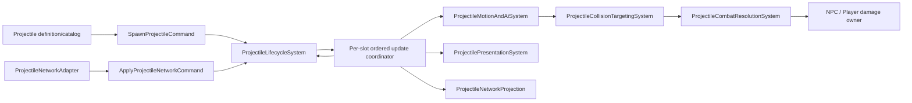

# Version4 P15 Projectile ECS 拆分设计

## Scope and Evidence

| 字段 | 值 |
| --- | --- |
| `designStatus` | `proposed` |
| `migrationVerificationStatus` | `not-run`（P15 行为/集成验收未执行） |
| `focusedVerifierStatus` | `partial`（lifecycle、hydration、ordered tick coordinator 的局部 verifier 已通过；packet API 只有声明，网络 wire 未验证） |
| `hydrationVerifierStatus` | `partial`（hydration focused verifier 已通过；完整 SetDefaults/content 接线仍未验证） |
| 最近更新 | `2026-10-01` |
| partition / task | `P15` / `AUTH-SYS-P15` |
| 原 session | `4426a5ad1b824c2490a832c3bb6726b8` |
| 输入报告 | [P15 权威静态拆分报告](2026-09-18-system-decomposition-authoritative-P15-projectile.md) |
| `outputReport` | 本设计文档；执行文档见 [P15 执行文档](2026-09-30-system-decomposition-authoritative-P15-projectile-execution.md) |
| `sourceModified` | `true`（`src/NSSLC` 的 packet 27/29 声明、lifecycle 与 ordered tick coordinator 局部切片；不代表 P15 已迁移） |
| 范围 | 17 个叶子组、126 个成员（118 fields + 8 properties） |
| 本轮交付 | 保留 packet 27/29 函数声明、validated lifecycle apply/termination 的 proposed 边界、有序 tick coordinator 的 immunity/lifetime 推进说明；不实现 packet wire 逻辑，完整 P15 仍不验收 |

本文是已结算 P15 报告的派生设计文档，不创建新的分区 claim，也不改变原 session 的结算状态。本文提出 ECS 边界和契约，并记录 packet 27/29 的声明级接口、生命周期和有序调度壳的局部实现证据；它不表示代码已完整迁移、API 已兼容或行为等价。局部实现不能替代真实 Version4 Main 调度接线、完整内容数据和跨系统集成证据。

### Source and Evidence

目标是为 `D:\TRbackup\Version4` 的 `Terraria.Projectile` 定义可逐步实现的 System、Component、Command、Query、Adapter 和 Projection 边界，同时保持旧实现可观察的槽位、身份、更新顺序、伤害、终止和网络行为。完整 P15 成员清单、原始调用观察和现有 NLTX 候选结构见输入报告；本文聚焦设计决策及其证据限制。

证据按以下顺序使用：

| 来源 | 用途 | 限制 |
| --- | --- | --- |
| `D:\TRbackup\Version4` 当前源码 | 目标版本语义主证据；重点为 `Terraria/Projectile.cs`、`Main.cs`、`MessageBuffer.cs`、`NetMessage.cs`、`Player.cs`、`NPC.cs` | 当前源码含空方法体；空体相关行为标 `unknown`，不推定为无行为 |
| CPG Query API | 补充静态符号、成员和调用点关系 | 数据库 `ReadOnly=true`、导入状态 `complete`、967 shards；manifest `6d6bdf09a70e7b9ec3e22e5c4f32aa8d5f447f1a9bde5cd444b9d427a715a364`，但 `SourceSnapshotId=null`，不能证明绑定到当前源码 hash |
| `D:\TRbackup\无任何删减通过编译` | 用户提供的完整参考源码，用于寻找可能缺失的实现和行为线索 | `Projectile.cs`、`Main.cs` 均与 Version4 SHA256 不同；不能把其实现直接认定为 Version4 语义。本轮未在该目录运行构建 |
| `C:\Users\shan\Downloads\ECS\space-station-14-master` | System 组织方式参考；`Content.Shared/Damage/Systems/DamageableSystem.cs:16-26` | 展示 `EntitySystem`、`EntityQuery<T>`、权威状态更新、Dirty 和事件通知的组织；不作为 Terraria 运行时行为证据 |
| NLTX `src/NSSLC` | 现有候选组件、catalog、query 和 system 的实现位置参考 | 现有类型不证明已存在完整 Projectile scheduler 或唯一写入者 |

完整参考源码的哈希观察如下：

| 文件 | Version4 | 完整参考 |
| --- | --- | --- |
| `Terraria/Projectile.cs` | `97C3D68586AEF862411699E428F5C4B18CEE1F8051B684BE9F86FA7B60FAE83B` | `8D6428FA1D098B26ADFDC1D6CC028251814B40CD3ACE576F0BFF462FB19D6038` |
| `Terraria/Main.cs` | `66DBE1D1E6FB89A24A512309BB039DFEC7C06D4678D2A22D7ADECBAD3AFD6520` | `E24E61C9903BB7995F47E36C51EDBE43481B643226861B717020877E7E22B63F` |
| `Terraria/MessageBuffer.cs` | `0F474225FA9D98C539F61249619273A44E73F69A4CF388B44258433A2D15D5EE` | `48AABBBF4E0967964D97598E0168E9252ADD3DD868C66C6DA46AA87670EACAAB` |

### 完整参考项目静态关系复核（2026-10-01）

复核入口为完整参考树的 `TerrariaServer.sln` / `TerrariaServer.csproj`，源码只读。Version4 与完整参考树中的 `FindOldestProjectile` 都从 0 扫描到 999，跳过 `netImportant`，以严格更小的 `timeLeft` 更新候选，因此并列时保留先遇到的低序号槽；没有候选时都返回 1000。两树的 `Main.projectile` 数组长度均为 1001，常规 Main projectile update 循环仍只处理 0..999，且本次读取到的 `PreUpdateAllProjectiles -> 升序 slot pass -> PostUpdateAllProjectiles` 片段一致。

这个哨兵不可直接等同普通槽位：Version4 `Projectile.NewProjectile` 在满池路径使用该返回值并访问 `Main.projectile[num]`；packet 27 的接收路径也会在没有空槽时调用同一选择逻辑并访问结果。若 0..999 全部 `netImportant`，返回值会是 1000。该数组元素可访问，但不在常规 1000 槽 update pass 中；它的预期生命周期、网络可见性和清理语义仍为 `unknown`，ECS 设计不得把它折叠成有效范围内任一槽或静默拒绝。

Version4 当前文本树没有 `Main.maxProjectiles` 声明；可见容量事实是 `Main.projectile = new Projectile[1001]` 与 `< 1000` 的硬编码扫描/update 循环。完整参考树另有 `Main.maxProjectiles = 1000` 常量。不能将完整参考的常量回填成 Version4 源码事实。

完整参考树中 `Projectile.NewProjectile` 的限定名直接调用文本出现在 12 个源码文件、427 个匹配行，涉及 `Main`、`Mount`、`NPC`、`Player`、`Wiring`、`WorldGen`、Cinematics 与 GameContent 等调用者。该文本扫描只确认静态拼写命中，不闭合反射、委托、别名或其它入口；跨域调用者仍须 integration review。

核心路径对照只支持局部复用线索：两树的 `NewProjectile` 都先选槽，再 `SetDefaults`，再覆盖 spawn 字段、执行 wet/source/banner/minion 处理、AI/UUID/subtype 初始化、modifier 和 channel 更新；完整参考树在本地发送 packet 27 外加 `Main.netMode != 0` 条件（完整参考 `Projectile.cs:10518-10520`），Version4 当前源码在 `:10510` 直接发送。packet 27 接收的 owner 规范化、按 owner+identity 查活动槽、回退空槽/oldest、仅 inactive 或 type 不同才 `SetDefaults` 及随后字段覆盖顺序可在两树看到；完整参考树还将 hostile 校验、spam 计数与 packet relay 放入 `Main.netMode == 2` 分支（`MessageBuffer.cs:1746-1815`），Version4 对应路径 `:1342-1403` 未见这些同样的外围 guard。该差异必须以 Version4 为目标语义，不能从完整参考回填网络行为。除表中列出的源码片段外，其余调用、Kill 副作用与版本行为未做全项目等价检查，保持 `unknown`。

#### `SetDefaults` 与 spawn hydration

Version4 `Terraria/Projectile.cs:444` 的 `SetDefaults(int)` 到紧随其后的 `DefaultToSpray()` 声明前，共 172,296 个字符；完整参考项目同一方法位于 `Terraria/Projectile.cs:454`，提取边界同样止于 `DefaultToSpray()`。两段源码文本 SHA256 均为 `DC4505F2E87C02030681E8247472A15A7FC4CF1EEC2FD601A13078D58B0402D1`。这只确认该方法文本一致，不证明两个源码树的字段依赖、静态 set、辅助方法、调用者或整个 Projectile 行为相同。

方法先重置实例上的分类标志、计时/网络字段、`ai`/`localAI`、trail 缓冲和命中免疫数组，再按 `Type` 执行类型默认分支；分支读取 `Main` 状态、difficulty 数据及 `ProjectileID.Sets`，并包含辅助默认方法调用。末尾以 `scale` 缩放宽高并令 `maxPenetrate = penetrate`。因此 `SetDefaults` 是“复用实例重置 + 类型默认值 + 上下文派生”的组合，不等同于只读 immutable definition 查询。完整参考与目标文本一致可用于发现字段映射，但默认仍以 Version4 作为目标语义来源。

Version4 `Projectile.NewProjectile` 在选定槽后先调用 `SetDefaults(Type)`（`Projectile.cs:10270`），随后覆盖 slot/owner、位置/速度、damage/knockback、identity 与 spawn AI 参数，再执行 wet collision、source stats、banner/minion source、UUID、免疫复制和类型专属逻辑。Main 初始化还会逐 type 调用 `SetDefaults` 并从结果建立 `projHostile`、`projHook`（`Main.cs:3388-3400`）；这条全局派生表路径与实例 spawn 不同，不能把其写入者默认归给 Projectile lifecycle。

packet 27 的目标源码在 `MessageBuffer.cs:1381` 先按 owner/identity 查找活动实例，否则找空槽或调用 oldest 选择；只有目标不活动或 type 不同才调用 `SetDefaults`。随后它写入 identity、position、velocity、type、damage、banner、originalDamage、knockback、owner、AI 与可选 UUID/index，再执行 desperation fix 并转发 packet。相同活动 type 的实例不会无条件重置。迁移需要分别描述 type defaults、spawn inputs/modifiers 与 network apply；不能把后两者折叠到 catalog hydration，也不能忽略池化时对旧数组/缓存状态的清理。

#### 普通生成的槽位身份与 UUID

普通 `NewProjectile` 的身份赋值有路径特定语义：Version4 在 `Projectile.cs:10244-10289` 先选槽 `num`，再写 `whoAmI = num`、`identity = num` 和 `Main.projectileIdentity[Owner, num] = num`；`Projectile.cs:10330-10335` 仅当 `ProjectileID.Sets.NeedsUUID[Type]` 为真时才写 `projUUID = identity`。之后 `StardustDragon[Type]` 分支（`:10336-10341`）读取 `ai[0]` 所指投射物的 UUID，找到有效 UUID 时再改写 `ai[0]`；这一步依赖前面的身份/UUID 初始化顺序。`NetMessage.cs:794-797` 也用 `NeedsUUID[type]` 决定 packet 27 是否带 UUID 字段。完整参考项目对应代码在 `Projectile.cs:10254-10299`、`:10340-10351` 和 `NetMessage.cs:798-801`，确认相同的普通生成与条件序列化线索。这里的 `identity` 仍是 owner 范围的逻辑/网络键，`SlotIndex` 是当前世界的本地存储位置；普通本地生成令两者数值相同，不代表所有路径都能把二者合并。packet 27 接收的远端 identity 必须保留，不能按接收端新分配的本地槽重算。

普通 spawn 的 proposed 契约让 `ProjectileSpawnCommand` 只接收 owner/type 与 spawn 参数，不让调用方预填 identity、UUID 或 slot。`ProjectileIdentityDefinition.NeedsUuid` 用 nullable 表达：`true`/`false` 表示内容定义已知策略，`null` 表示未知；未知策略由 hydration/lifecycle 在占槽前拒绝。`TrySpawn` 应在 free-slot 分配或 oldest-slot 替换选定槽后，于同一 lifecycle 提交设置 `SlotIndex = slot`、普通本地 `Identity = slot`，并按已知 `NeedsUuid` 设置 `ProjectileUuid = slot` 或保留 `-1`。旧 `TryCreate` 的显式 identity 语义仍需单独保留并验证。

网络 apply 切片由同一 `ProjectileLifecycleSystem.TryApplyNetwork` 提交：按 owner+packet identity 查找活动实例；同 type 只覆盖 position/velocity/AI/damage 等 packet 字段并保留已存在的 UUID；type 变化在原本地 slot 上换代并保留 packet identity，generation 递增；没有现有映射时按 packet identity 创建新状态。类型 UUID 策略未知或不需要 UUID 却携带 UUID 时，应在任何槽/index 修改前拒绝。Packet 27/29 目前只保留 `IProjectilePacket27Codec`、`IProjectilePacket29Codec` 的函数声明，未提供 wire decode/encode、长度校验、授权、relay 或结果构造逻辑；`TryApplyNetwork` 与 `TryTerminateNetwork` 只作为 lifecycle owner 的 proposed 状态边界记录，不由声明接口调用。未来 adapter 实现不得替换服务器 `whoAmI`，服务器会话授权和 relay 仍属于外部 adapter/integration。以上不能把本切片称为网络迁移完成。

Version4 与完整参考源码都将 `ProjectileID.Sets.NeedsUUID` 初始化为 `Factory.CreateBoolSet(625, 626, 627, 628)`；`Projectile.SetDefaults` 将实例 UUID 重置为 `-1`，普通 spawn 再按该表设置。当前 NLTX 候选 schema 尚没有完整类型 catalog/builder 将该表绑定到生产定义；未显式填充的 `NeedsUuid=null` 仍是缺口，不能默认成 `false`。Stardust Dragon 的 parent UUID 到 `ai[0]` 转换仍属于待实现边界；packet 27/29 的 UUID、长度、可选字段和终止语义仅保留声明，wire 实现、服务器授权、relay 与生产类型策略均未闭合。

设计拟使用只读 `IProjectileDefinitionQuery` 解析 type，由确定性的 `ProjectileDefinitionHydrationSystem` 构造候选状态，再由 lifecycle owner 统一提交 slot、generation 与 owner/identity index。hydrator 计划从 content schema 映射 definition identity/type、geometry 缩放尺寸、lifetime、AI/extra updates、friendly/hostile、spawn damage/knockback/center/velocity/AI、penetration、collision policy、immunity arrays/policy、network-important、presentation/trail 和已建模能力；缺失 definition、type mismatch、非法范围或无法表示值应在占槽前拒绝。schema 中的 owner hit-check distance 与 local/static NPC cooldown 目标值 `1000`、`-2`、`-1` 仍需按 Version4 证据和真实 catalog 装载复核。

此切片仍非完整 `SetDefaults`：当前 `ProjectileDefinition` 缺少大量逐类型分支字段、Main/difficulty/`ProjectileID.Sets` 派生输入、trail/AI 辅助规则、source modifiers、wet collision 共享标志、banner/minion spawn effects 及其精确覆盖顺序；content builder 仍未提供真实类型全集、`NeedsUuid` 数据装载或生产 spawn caller。packet 27/29 只有声明级接口，局部 lifecycle apply/termination 与 ordered tick coordinator 的旧 verifier 记录不覆盖这些声明；服务器校验、relay、recipient/section、Main 的 `projHostile`/`projHook` 初始化、pool 复用旧实例数组清除闭包、完整 `Kill` 副作用和 coordinator 到权威 Main 的真实接线仍未形成迁移证据。`Terraria.SpatialMotionPhysics.ProjectileDefinitionCatalog` 是另一命名空间下仅保存 frame/pet 数组的类型，不能当作 content defaults。以上缺口继续标 `unknown` / `partial`，本设计不以局部文件或 verifier 状态升级 P15。

| `SetDefaults` / spawn 概念 | 当前新状态写入 | 状态 |
| --- | --- | --- |
| type、friendly/hostile、AI style、extra updates | `Definition`、`Disposition`、`UpdateCadence` | 对已提供 schema `partial`；content 数据装配 `unknown` |
| 宽高/scale、tile/water/slope、owner hit-check distance | `Geometry`、`Collision`；宽高按旧式浮点乘法后截断 | schema 映射 `partial`；逐 type 数值未证 |
| timeLeft、penetrate/maxPenetrate、immunity policy | `Lifetime`、`Penetration`、`HitImmunityPolicy` 与新数组 | 结构映射 `partial`；完整复用与类型分支 `unknown` |
| spawn position/velocity/damage/originalDamage/knockback/AI | `Kinematics`、`Damage`、`Behavior` | proposed 显式 spawn 参数接入 lifecycle；source modifier 与 subtype 覆盖 `unknown` |
| network-important、presentation、trail、已建模能力 | `Network`、`Presentation`、`Animation`、`Trail`、能力状态 | schema 字段映射 `partial`；缺失成员仍 `unknown` |
| 普通 spawn slot identity 与条件 UUID | `TrySpawn` 在选槽后派生 `Identity=slot`，按显式 `NeedsUuid` 设置 UUID；`null` 在 commit 前拒绝 | 本地 schema/lifecycle 机制 `partial`；真实类型表装载、Stardust Dragon 与 packet UUID 仍 `unknown` |
| packet 27/29 network API | `IProjectilePacket27Codec` / `IProjectilePacket29Codec` 函数声明；command/result/status 类型和 lifecycle owner 边界 | wire 编解码、decode-before-commit、服务器 guard、relay、recipient/section、完整 Kill 副作用均 `not-run` / `unknown` |
| Main/difficulty/其余 `ProjectileID.Sets`、packet、湿碰撞及外部效果 | 未实现 | `unknown` / `integration-review` |

CPG Query API 对 `SetDefaults` 符号查询返回了 `Terraria.Projectile` 的 `void(int)`，同时带回一个位于 `Terraria/Item.cs` 的同名记录，故按声明路径和签名选择 Projectile 符号。对 `Projectile.cs`、`Main.cs`、`MessageBuffer.cs`、`NetMessage.cs` 的 call-site 查询只返回 `Main.cs` 与 `MessageBuffer.cs` 两处；目标源码 `Projectile.cs:10270` 可直接看到 `NewProjectile -> projectile.SetDefaults(Type)`，该边未出现在索引结果中。`Get-CpgCallableFacts` 为 `partial` 并带 `CalleeEffectsNotExpanded`，其空 `DirectCallTargets` 也不能覆盖源码可见的辅助调用。该项记为 CPG/source `evidence-gap`，按源码保留调用关系，不以查询 `complete` 推断 caller 闭包。

同日重跑的只读 CPG 查询确认 `ImportStatus=complete`、`ReadOnly=true`、967 shards、manifest `6d6bdf09a70e7b9ec3e22e5c4f32aa8d5f447f1a9bde5cd444b9d427a715a364`、`SourceSnapshotId=null`。在选定的 7 个 shard 路径与 `MaxItems=300` 下，`NewProjectile` 的 `Vector2` overload 返回 17 条、标量 overload 返回 227 条且各自查询状态为 `complete`；计数分别为 Projectile/NPC `13/4` 和 Projectile/NPC/Player `78/143/6`。此前默认 200 项的标量查询为 `partial` / 200 条 / `ItemBudgetExhausted`，不再作为当前较高预算结果。`SetDefaults:void(int)` 的符号按 `Terraria/Projectile.cs` 路径确认；选定源码 shard 返回 Main、MessageBuffer 两处调用，而源码 `Projectile.cs:10270` 的 `NewProjectile -> SetDefaults` 没有出现在 CPG 结果中。`FindOldestProjectile:int()` 的选定 7 路径查询只返回 MessageBuffer 一处，而源码 `Projectile.cs:10263` 可见 `NewProjectile` 自调用。两处未命中关系都登记为 CPG/source `evidence-gap`。两个 `NewProjectile` overload 的 callable facts 为 `partial`，带 `CalleeEffectsNotExpanded`；查询 `complete` 仅表示选定 shard 和结果预算内完成，不构成闭包。`maxProjectiles` 的零命中仍是 `NoMatchingFactInScannedScope`，不能证明字段不存在。

例如，Version4 `Projectile.cs` 的 `AI_149_GolfBall`、`Shimmer`、`AI_203_StormLightning` 在当前定位分别是 `:17993`、`:18676`、`:32969` 的空体；完整参考源码中存在相应实现（`AI_149_GolfBall` `:19100`、`Shimmer` `:21256`、`AI_203_StormLightning` `:37598`）。这证明两棵树的实现内容不同，不证明 Version4 应当采用参考树中的实现。每个差异需要先确认目标构建/版本，再决定恢复、保留 stub 或以其他行为替代。

## Conceptual Behaviors

1. 每个 Projectile 权威字段和索引不变量最终只有一个 commit owner。其他 System 通过明确 Command 表达写意图，不直接跨域写组件。
2. 每个槽位的生命周期、AI、移动、碰撞、伤害、轨迹、计时、终止和网络决策按目标源码中的可观察顺序执行。
3. `SlotIndex`、owner 范围的 `identity` 和可选 `projUUID` 是不同字段/职责。普通本地 `NewProjectile` 明确以选中的 slot 初始化 `identity`，packet 27 则保留远端 identity；不得把本地槽值无条件套到所有接收路径，也不得把 owner identity 索引当作实体的持久身份。
4. NPC 与 Player 的伤害状态由对应外部 owner 提交；Projectile 只提交带目标和预期版本的伤害意图。
5. Query 返回值或不可变快照，不写可观察权威状态。命令提交时重查容易变化的前置条件。
6. 空方法体、动态派发、外部副作用、缺失调用点和未闭合缓存均标 `unknown`、`partial` 或 `evidence-gap`，不可用“没搜到”推导“没有”。

## State Ownership and Write Closure

下表压缩列出报告中的全部 17 个叶子组。每项是 proposed owner，不构成最终字段写入证明；正式实现前仍需逐成员确认读写闭包并登记唯一 writer。

| P15 叶子组 | 成员数 | 候选 owner |
| --- | ---: | --- |
| `ProjectileIdentityAndClassificationState` | 16 | `ProjectileLifecycleSystem` + identity component |
| `ProjectileAiState` | 4 | `ProjectileMotionAndAiSystem` |
| `ProjectileLifetimeAndRuntimeState` | 6 | `ProjectileLifecycleSystem` |
| `ProjectileCombatAndImmunity` | 14 | `ProjectileCombatResolutionSystem` |
| `ProjectileMovementAndCollisionState` | 9 | `ProjectileMotionAndAiSystem` |
| `ProjectileNetworkReplicationState` | 4 | `ProjectileNetworkAdapter` / one-way projection |
| `ProjectileMinionAndPresentationState` | 13 | lifecycle/motion facts；render facts 属 `ProjectilePresentationProjection` |
| `ProjectileDamageAndElementState` | 13 | `ProjectileCombatResolutionSystem` |
| `ProjectileAnimationAndDirectionState` | 3 | `ProjectilePresentationSystem`，读取 motion snapshot |
| `ProjectileCollisionAndTargetingState` | 7 | `ProjectileCollisionTargetingSystem` |
| `ProjectileCombatScalingState` | 2 | `ProjectileCombatResolutionSystem` |
| `ProjectileCollisionGeometryCache` | 8 | `ProjectileGeometryQuery`；缓存策略 `unknown` |
| `ProjectileTargetSelectionCache` | 7 | `ProjectileTargetSelectionQuery`；缓存策略 `unknown` |
| `ProjectileFishingAndMiningQueryState` | 3 | `ProjectileToolQuery`；scratch owner `unknown` |
| `ProjectileKiteAndLightningRules` | 2 | `ProjectileSpecializedDefinitionQuery` |
| `ProjectileDerivedProperties` | 8 | `ProjectileDerivedPropertiesQuery` |
| `ProjectileStormDefinition` | 7 | `ProjectileStormDefinitionCatalog` |

候选 Component 按不变量聚合，不按 126 个字段拆分：

- `ProjectileIdentityAndClassificationStateComponent`：活动状态、内容类型、owner 关系、分类标志；分别保存本地 slot、owner identity 和可选 UUID。普通 spawn 的 identity 在 slot commit 后派生；网络 apply 保留包内 identity。
- `ProjectileAiStateComponent`：有界 `ai`/`localAI` 数组和 AI style。网络导入只有经验证的 apply Command 可写。
- `ProjectileLifetimeStateComponent`：活动、剩余寿命和终止原因。AI 对寿命的改变也必须经过生命周期 owner 的命令接口。
- `ProjectileCombatStateComponent`：伤害、穿透、免疫和缩放；不包含 NPC/Player 的权威生命状态。
- `ProjectileMotionStateComponent`：位置、速度、额外更新计数、tile/water 策略及轨迹历史。
- `ProjectilePresentationStateComponent`：动画帧、透明度、光照、绘制层、trail 与预览事实，只供表现系统读取/更新。
- `ProjectileNetworkStateComponent`：单实例发送预算与待发送事实；网络 projection 生成快照，不成为游戏字段的第二写入者。

这些组件的确切字段和序列化形式仍为 `proposed`；需以目标 API、持久化规则和所有访问点复核后再冻结。

## Prior Component Decomposition Reconciliation

当前 NLTX 树可见 `ProjectileIdentityIndex`、`EntitySlotStore<TState,TSlot>`、definition hydration 和 lifecycle 相关候选类型；本设计只把它们作为待审边界材料，不把文件存在或接口形状当作 Version4 运行时接入证据。Version4 当前文本可见的常规 Projectile 槽范围是 0..999，因此 `WorldStorageRoot.Projectiles` 的 1000 容量只表示拟议的常规槽；`Main.projectile[1000]` 作为满池哨兵路径的额外元素仍未建模，其行为待补证。玩家、NPC、物品 store 的容量仍由后续 owner 配置。typed slot 的读写约束仍需在实现阶段按源码和调度入口复核。

拟议的 `ProjectileLifecycleSystem` 作为 slot/identity 的串行提交 owner：free-slot create 在一个调用内分配槽、写入本地 slot identity（普通 `TrySpawn` 路径）并注册 owner/identity；普通 spawn 的 UUID 由 definition 中显式、已知的 `NeedsUuid` 规则决定，未知策略在 slot/index 修改前拒绝。`TryApplyNetwork` 复用同一 owner，按 packet identity 查找或在原槽换代，避免 network adapter 成为第二个 gameplay writer。旧 `TryCreate` 仍使用调用方显式身份，不套用本地 spawn 派生规则。重复身份注册失败应释放临时槽。池满时同一 lifecycle 调用扫描已占用常规槽，跳过 `NetworkImportant`，以严格更小的 `TimeLeft` 选择受害槽；同寿命时保留升序扫描中的较低 slot，并按 Generation 条件替换 identity mapping 与 slot state。若没有可替换项或新 identity 已映射到别的 handle，则拒绝且保留现有映射。terminate 校验 handle generation 和索引双向关系，再提交寿命终止、注销 identity 并释放槽。上述规则均需在实现阶段通过真实调用入口和行为验证确认，不构成已迁移或已验证结果。

这仍是局部 lifecycle 设计切片。满池替换只覆盖拟议 `WorldStorageRoot.Projectiles` 的常规 0..999 槽，不实现 Version4/完整参考在无普通候选时返回并访问 `Main.projectile[1000]` 的哨兵路径；该额外元素的生命周期、更新、网络和清理语义仍 `unknown`。拟议 owner 已接入 definition hydration、packet command 27/29 的局部状态边界和 ordered tick coordinator seam，但 packet command 尚未由 wire codec 产生，`NewProjectile` 的湿碰撞/source/minion 副作用、coordinator 到 Main 的权威接线，以及旧 `Kill` 的 channel、声音、伤害、子弹、网络等效果仍未形成证据。因此 `TryTerminateNetwork` 只表达按 owner+identity 释放槽位的局部边界，不等同旧 `Kill`；P15 行为/集成验收仍为 `not-run`，不能据此认定迁移成功。

## Boundary Role and Decision

| System / adapter | 负责 | 不负责 |
| --- | --- | --- |
| `ProjectileLifecycleSystem` | 槽位分配/复用，definition hydration，owner 与 identity 建立/解除，寿命终止和 recycle 提交 | 跨域直接修改 Player、NPC、Collision 或网络接收缓冲 |
| `ProjectileTickCoordinator` | 保留 `PreUpdateAllProjectiles`/`PostUpdateAllProjectiles` 边界；通过只读 slot query 按 `0..999` 升序读取当前 generation，按 `UpdateCadence.MaxUpdates` 委派每个子步 | 不拥有 AI、运动、碰撞、战斗、表现或网络规则；不自行分配/回收槽位；当前仍未接入 Version4 权威 Main 入口 |
| `IProjectileTickAdapter` | 作为单槽位行为委派边界，接收 coordinator 提供的 `ProjectileTickContext` 和状态，并把 AI、运动、碰撞、战斗、表现或网络工作交给各自 owner | 不预选 slot、不建立 identity、不绕过 lifecycle 提交终止；不把多个 projectiles 改成全局分阶段循环 |
| `ProjectileMotionAndAiSystem` | 在 coordinator 提供的单个槽位更新子步内调用 AI/运动行为；显式接收随机数与时间上下文 | 写 NPC/Player 生命状态，绕过 lifecycle 提交终止 |
| `ProjectileCollisionTargetingSystem` | 生成碰撞候选、目标快照和命中资格结果 | 在 Query 中改全局 Collision 标志或提交伤害 |
| `ProjectileCombatResolutionSystem` | 在 commit 时重查活动 identity、目标有效性、免疫和 penetration，并向 damage owner 发命令 | 复制/拥有 NPC、Player damage component |
| `ProjectilePresentationSystem` | trail、frame、opacity 和 render facts | 决定伤害、寿命、identity 或 slot 回收 |
| `ProjectileNetworkAdapter` / `ProjectileNetworkProjection` | 声明 packet 27/29 解码、校验、投影、recipient/section 的接口；将 packet 29 交给 lifecycle termination command | 在声明接口中实现 wire 逻辑或替换服务器 `whoAmI`；作为第二个 gameplay writer |
| `ProjectileSpecializedRuleSystem` | 按能力承载 minion、counterweight、bobber、fishing/mining、kite、storm 等规则 | 将所有专用规则塞入通用 System，或私自拥有其他域的生命周期/伤害状态 |

以上 System 是协作边界，不是 17 个叶子组的一对一拆分。调度协调器只负责保留原有每槽位的内序和接入委派，不应把所有 projectiles 改为“先统一 AI，再统一 collision，再统一 combat”的全局多轮调度。

## Lifecycle and Side Effects

Version4 `Main.cs:11530-11551` 的观察为：`PreUpdateAllProjectiles`，按 `n=0..999` 设置 `ProjectileUpdateLoopIndex` 并调用 `projectile[n].Update(n)`，随后清除 loop index 并调用 `PostUpdateAllProjectiles`。每个 `Projectile.Update`（`Projectile.cs:14693-15242`）内部交错处理免疫计数、extra updates、bounds/minion、water/collision、AI、伤害、trail、`timeLeft` 和终止条件。

### Ordered tick coordinator 局部切片

`ProjectileTickCoordinator.Tick(IProjectileTickAdapter)` 是对上述边界的局部 ECS seam：先调用 `PreUpdateAllProjectiles`，再以固定 `RegularSlotCount = 1000` 遍历本地槽位 `0..999`。每次迭代通过 `ProjectileLifecycleSystem.TryGetAtSlot` 读取当前 `ProjectileHandle`、generation 和状态；该方法只读 occupied slot，不分配、注册、释放或修改 lifecycle。活动实例在子步前按 regular Update 只推进一次 `ProjectileHitImmunitySystem.AdvanceTick`，随后按 `UpdateCadence.MaxUpdates` 执行子步，而 `MaxUpdates = ExtraUpdates + 1`；每个子步开始前重新按 handle 读取 lifecycle 状态，若 adapter 在前一子步提交了终止或实体已不再 active，则停止该 projectile 的剩余子步。每个仍有效的子步创建带 slot、generation、substep index 的 `ProjectileTickContext`，交给 `IProjectileTickAdapter.UpdateProjectile`。所有仍有效的子步完成后只推进一次 `ProjectileLifetimeSystem.Advance`；到期通过 lifecycle owner 提交 `LifetimeExpired` 并释放槽位，最后调用 `PostUpdateAllProjectiles`。

这条 seam 保留了目标源码的升序槽位、Pre/Post 相对位置、一次性免疫推进、一次性寿命递减和额外更新次数，并在 adapter 中途终止时避免继续调用失效实体。定向 build 后重新运行的 tick coordinator verifier 已覆盖到期释放和中途终止保护并通过。当前仍只是局部 coordinator。它尚未替代 `Version4/Main.cs` 的真实调度入口，也没有证明 `ProjectileUpdateLoopIndex`、当前帧 spawn 可见性、AI/collision/combat 交错顺序或完整终止副作用已经接通；这些项目继续标为 `unknown` / `partial`。

迁移时遵守以下执行规则：

1. 保留 `PreUpdateAllProjectiles` 和 `PostUpdateAllProjectiles` 的相对位置及调用次数。
2. 保留单个 update pass 的升序 slot 遍历和 `ProjectileUpdateLoopIndex` 可见范围。
3. 在一个槽位内以可观测的旧顺序调用新职责，不把处理项提升成全局阶段。额外更新的精确事件次序仍须用当前 Version4 源码/轨迹核实。
4. Spawn 或网络接收在 pass 中复用槽位时，保留当前帧可见性：更晚的 slot 可在本 pass 被访问，已越过的 slot 不应被新全局调度意外补跑。
5. `Kill`/recycle 在调用方观察到的时点提交；不延迟为帧末 cleanup。
6. 网络投影、表现投影读取已提交快照；需要影响本帧 gameplay 的接收数据必须经有序的 apply Command。

## System API and Legacy Behavior Mapping

| 契约 | 输入与责任 | 一致性要求 |
| --- | --- | --- |
| `SpawnProjectileCommand` | spawn source、owner/type、位置/速度、伤害意图 | 不接收预填 identity/UUID 或预选 slot；在一个提交内选 free/oldest slot、验证 generation，再按普通 `NewProjectile` 规则以 slot 派生 identity，并按经验证的 `NeedsUUID[type]` 规则初始化 UUID |
| `ApplyProjectileNetworkCommand` / `ProjectileNetworkTerminateCommand` | packet 27 的状态值 / packet 29 的 owner+identity | 作为声明级输入契约；实际 wire 校验、状态提交、终止副作用仍由后续 owner/adapter 设计负责；codec 不承担服务器会话 owner 替换 |
| `ResolveProjectileHitCommand` | 几何候选、目标快照、expected generation | 提交时重新验证 projectile、target、immunity、penetration；外部 damage owner 提交 NPC/Player 状态 |
| `TerminateProjectileCommand` | 终止原因和预期 handle | 由 lifecycle owner 统一解除索引、寿命、channel 关系并通过 adapter 发出副作用 |
| `ProjectileCollisionAdapter` | tile/world 查询上下文 -> collision snapshot | 隔离共享标志和懒加载；保持旧调用顺序 |
| `ProjectileDamageAdapter` | damage intent -> NPC/Player damage owner | 单向交接；不得双写生命或 Projectile penetration |
| `ProjectileNetworkProjection` | 已提交状态快照 -> packet/recipient decision | 只读；section 可见性和 net spam policy 需要独立证据 |
| `ProjectileDefinitionCatalogAdapter` | content type -> immutable definition | 查询目录不等同于覆盖完整 `SetDefaults` 初始化副作用 |

纯度与缓存要求：

| 旧入口/数据 | 提议分类 | 状态与约束 |
| --- | --- | --- |
| `GetNextSlot`、`FindOldestProjectile` | lifecycle Command 内部 helper | 不公开为独立 Query；分开查询和分配会产生 TOCTOU |
| `Collision.WetCollision` | spawn/update 流程中的混合 adapter | 写共享 `Collision.honey`/`shimmer`，不是纯 Query |
| `Colliding` | 几何候选 Query | 目标源码的全部 Collision helper/type dispatch 未闭合，纯度 `unknown` |
| `CanHitWithMeleeWeapon` | 候选 Query | 依赖 Player 与 Collision，分类 `partial`；回调、懒加载等未闭合 |
| `ProjectileLifecycleSystem.TryGetAtSlot` | 当前槽位的只读 `ProjectileHandle`/状态 Query | 不分配、不修改 generation、identity 或生命周期；只能作为 coordinator 的快照读取，不能被用作独立 slot 预选 Command |
| `IsNPCIndexImmuneToProjectileType` | frame snapshot qualification Query | 依赖 `Main.GameUpdateCount`；只在同一 captured frame 范围内承诺重复性 |
| storm geometry / derived property | snapshot Query 或 definition view | 缓存寿命、随机/时间输入、懒初始化 `unknown` |
| fishing/mining/target scratch | 显式 scratch snapshot Query | 现有静态可变列表的 owner 与失效规则 `unknown` |

Query API 的 `complete` 只表示该选定查询的索引范围已处理，不表示整个运行时调用图完整。2026-10-01 只读复查得到：数据库 `ImportStatus=complete`、`ReadOnly=true`、manifest `6d6bdf09a70e7b9ec3e22e5c4f32aa8d5f447f1a9bde5cd444b9d427a715a364`、`SourceSnapshotId=null`；`Find-CpgCallSites(FindOldestProjectile)` 在 `Projectile.cs`、`MessageBuffer.cs`、`Main.cs`、`Player.cs`、`NPC.cs`、`Item.cs`、`WorldItem.cs` 七个选定路径仍只返回 `MessageBuffer.cs` 调用点，但当前目标 `Projectile.cs:10263` 中 `NewProjectile` 直接调用 `FindOldestProjectile`。两个 `NewProjectile` overload 的 callable facts 均为 `partial` 且有 `CalleeEffectsNotExpanded` gap。该未返回的调用继续登记为 `evidence-gap`，不能视为不存在。

同一只读 Query API 会话中，`Find-CpgSymbols(Kill:void())` 按 `Terraria/Projectile.cs` 声明路径返回 `complete`；对 `Terraria/MessageBuffer.cs` 的 `Find-CpgCallSites` 返回 2 个 `CallTargets`，与目标源码 Packet 29 分支和另一处 MessageBuffer Kill 路径一致。该结果只确认选定 shard 内的静态 Kill 边，不能闭合 `Kill` 的 channel、声音、伤害、子弹、网络或其它副作用；因此 `TryTerminateNetwork` 的局部释放结果仍不能替代完整 Kill 行为。

同一只读 Query API 会话补查 `Update:void(int)` 与 `PreUpdateAllProjectiles:void()`：两个符号按目标声明路径返回 `complete`；`Update` 在选定的 `Terraria/Main.cs` shard 中返回 2 个静态调用点，`PreUpdateAllProjectiles` 返回 1 个静态调用点。对 `Kill:void()` 的选定路径查询返回 `partial`，并因 `MaxItems=100` 命中 `ItemBudgetExhausted`；返回结果包含 MessageBuffer 和 Projectile 内部调用，但不构成完整 caller 集。`Update` callable facts 为 `partial` / `CalleeEffectsNotExpanded`，其局部操作节点可见先调用 `DecrementLocalImmuneTimeCounters`、设置 `numUpdates = extraUpdates` 并进入循环，但 callee effects 未展开。该结果与目标 `Main.cs` 的 Pre/升序 slot pass/Post 源码片段支持 coordinator 的局部顺序设计；仍不闭合 `Projectile.Update` 内部行为、`ProjectileUpdateLoopIndex` 可见性或真实 Main 接入，故保留 `partial`。

## Call and Dependency DAG

定义/catalog -> spawn Command -> lifecycle -> 单槽位有序调度 -> motion/AI -> collision/targeting -> combat Command -> NPC/Player damage owner。表现与网络 projection 消费已提交快照；网络 adapter 只生成已校验 Command。`Player`、`NPC`、`Collision`、`WorldGen`、随机/时间、声音/粒子/尘埃、持久化、网络 recipient/section 以及实体关系均为 adapter 或 `crossSubsystemOwner: integration-review`。

## Integration Handoff

`Player`、`NPC`、`Collision`、`WorldGen`、随机/时间、声音/粒子/尘埃、持久化、网络 recipient/section、共享 ID、minion capacity、fishing/mining、counterweight 和实体关系均标记为 `crossSubsystemOwner: integration-review`。本分区只提出单向 Command、事件或快照边界，不替其他分区决定最终 owner；未形成读写闭包前不得删除旧 writer。

## Migration Behavior Contract

迁移必须保持 slot allocation、owner 范围 identity、可选 UUID、active/timeLeft、逐槽升序调度、单 Projectile 内更新顺序、同 type 网络原地更新、type 变化换代、packet 29 owner+identity 终止时点、错误拒绝和外部效果顺序等可观察结果。普通本地 spawn 可以在同一 lifecycle commit 中由选定 slot 派生 identity；packet 27 必须保留包内 identity，不得用接收端 slot 重算。当前只锁定这些 API 声明和拟议 owner 契约；`SetDefaults` 完整字段、packet framing 的服务器授权/relay、持久化、完整 Kill 副作用和跨系统效果仍是 `unknown`/`partial`。

## Verification Plan

验证计划包含源码/CPG 关系闭包、126 成员单写者矩阵、真实调用入口、1000 槽及 sentinel、spawn hydration、packet 27/29 声明、ordered tick coordinator、调度顺序、AI/collision/combat、持久化、网络重复/损坏输入和跨系统副作用。当前可保留的 focused 入口有 `--lifecycle`、`--hydration`、`--network` 和 `--tick-coordinator`；packet codec verifier 已移除，因为 packet API 只保留函数声明。已有定向 build 后，`--lifecycle`、`--hydration`、`--tick-coordinator` 三个入口返回 `PASS`；这些只提供生命周期、hydration 子集和调度壳的切片证据。`--network`、packet wire、真实 Main 接线及 P15 整体 `verificationStatus` 仍为 `not-run`，不能升级为迁移成功。任何未执行项目保持 `not-run`，证据缺口保持 `unknown`、`partial` 或 `evidence-gap`。

## Evidence Gaps and Blocking Decisions

| 问题 | 当前状态 | 放行条件 |
| --- | --- | --- |
| 126 个成员的完整读写闭包、反射/event/dynamic dispatch | `partial` / `unknown` | 按目标 revision 枚举读写点并确定单一 commit owner |
| CPG 与当前 Version4 源码绑定及调用关系差异 | `evidence-gap` | 明确 CPG source revision；补查 `NewProjectile -> FindOldestProjectile` 并记录 API 限制 |
| Version4 空方法体与完整参考树实现的版本关系 | `unknown` | 确认目标语义的来源；逐个 stub 做保留/恢复/替代决策 |
| `Projectile.Update` 所有被调行为、随机消耗和异常分支 | `partial` | 固定目标源码基线，必要时用 trace 建立顺序基准 |
| Collision 共享静态标志及 tile 懒加载 | `unknown` | 定义隔离 adapter/snapshot 并证明顺序不变 |
| 网络重复包、服务器 owner guard、relay、recipient 和持久化闭包 | `not-run`（packet 27/29 只有声明级 API） | 完成 packet/state matrix、服务器会话授权、relay/section、Kill 副作用及异常输入策略 |
| 当前 NLTX 候选 System 与权威 scheduler 的关系 | `unknown` | 找到或指定唯一 authoritative coordinator |
| Player/NPC、minion、fishing/mining、counterweight 和效果 spawn owner | `crossSubsystemOwner: integration-review` | 确认 Commands、事件方向和共享 ID 所有权 |

未解除以上阻塞项前，不批准声称 P15 迁移完整或行为等价。后续验证方案和分阶段退出条件见 [P15 执行文档](2026-09-30-system-decomposition-authoritative-P15-projectile-execution.md)。
