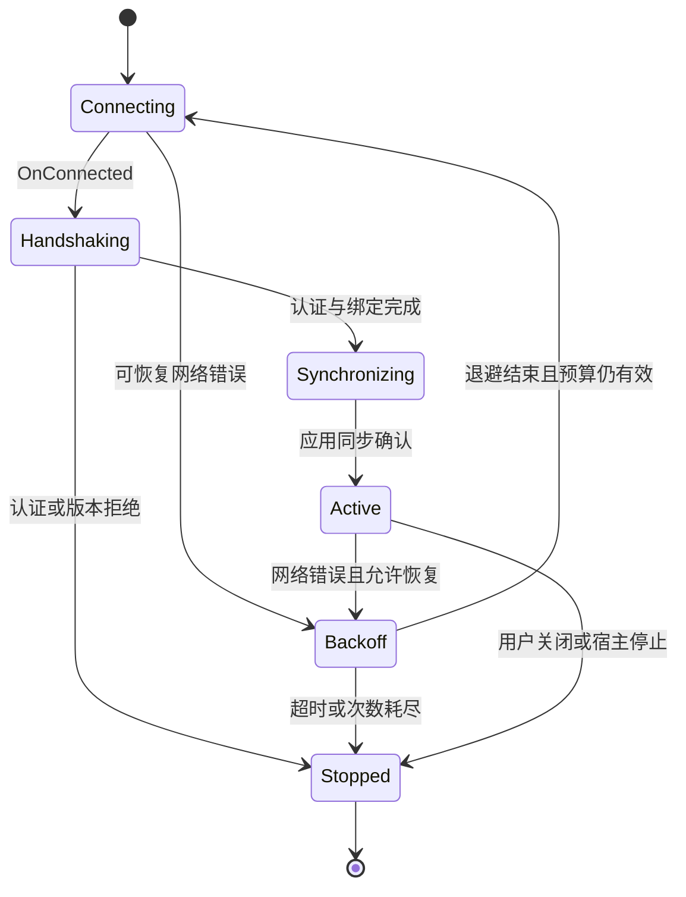

# 网关缓冲、发送、连接与重试设计

日期：2026-10-03。状态：提案，参数为起始配置，未经过性能验证。依据：[NetCoreServer 8.0.7 研究](D:/ProjectItem/SourceCode/Net/NetWork/docs/research/2026-10-03-netcoreserver-gateway-evidence.md)、[读写契约](2026-10-03-packet-io-api.md)。

## 1. 固定版本与适配原则

当前原型固定 NuGet NetCoreServer 8.0.7。研究从本机 nuspec 核实 repository commit=`cb58a43ba0bbce6182d9a5259388c75763d63db7`，使用该提交的 [TcpSession](https://github.com/chronoxor/NetCoreServer/blob/cb58a43ba0bbce6182d9a5259388c75763d63db7/source/NetCoreServer/TcpSession.cs)、[TcpClient](https://github.com/chronoxor/NetCoreServer/blob/cb58a43ba0bbce6182d9a5259388c75763d63db7/source/NetCoreServer/TcpClient.cs) 与 [Buffer](https://github.com/chronoxor/NetCoreServer/blob/cb58a43ba0bbce6182d9a5259388c75763d63db7/source/NetCoreServer/Buffer.cs)，不以 master 替代版本依据。

库选项的真实名称为 `OptionSendBufferLimit`、`OptionReceiveBufferLimit`，不是移交文字中的泛化 BufferSendLimit。发送限额只检查库主缓冲，不含 flush；接收限额检查下一次数组扩容，不等于单帧、半包或应用队列额度。网关必须另行记账。

库接受 SendAsync 时复制调用方字节；调用方只用于提交的帧可以在调用返回后归还。`OnSent(sent,pending)` 的 sent 是本次字节增量，pending 是库待发送与正在发送的合计，不是消息确认。库的数组和回调线程也不由网关拥有。

## 2. 资源拥有期

| 资源 | 拥有者 | 释放时点 |
| --- | --- | --- |
| OnReceived 的 byte[] | NetCoreServer | 仅回调内借用；不能跨回调保存 Slice |
| 接收复制块、半帧累积 | 当前 Session/Epoch 的 framer | 消费到完整帧并转移拥有期，或断线/拒绝/超时 |
| 待解码完整帧 | 接收邮箱中的帧租约 | 解码结束且保留片段已独立复制；任何异常也释放 |
| 已返回 packet | PacketMessage/调用方 | 普通 GC 生命周期；不会引用已归还的帧 pool |
| 编码中 MemoryStream | 单个 binding 编码操作 | 已复制进完整帧后 Dispose；null/错误路径也释放 |
| 待发送完整帧 | 发送项 | 尚未提交时由队列拥有；SendAsync 调用返回后释放提交副本 |
| 库发送主/flush 缓冲 | NetCoreServer | 库发送完成/断开清理；应用在台账中保留对应未完成字节额度 |
| 发送 completion 元数据 | Session 的字节台账 | 当前帧本地完成、明确未提交或结果未知后恰好终结一次 |
| 可共享区段编码缓存 | 有界 PacketSnapshotCache | TTL、LRU、世界修订变化、Profile 变更或最终租约释放 |

池化优化不是“零拷贝”的承诺。首版允许必要复制，先证明拥有期正确；缓存帧经库复制后与缓存拥有期无关。共享缓存内容不可改写，每个目标独立承担发送额度和完成结果；引用计数必须包含所有借用者，或采用简单不可变 byte[] 缓存。

## 3. 建议额度及溢出动作

| 项目 | 起始建议 | 满额/超时规则 |
| --- | --- | --- |
| 单帧总长 | 65535 bytes；profile 可收紧 | 长度头低于 3 或超过 profile 上限立即拒绝 |
| 单会话接收原始/完整帧待处理总字节 | 128 KiB，包含半帧与邮箱内容 | callback 不能等待时 TryWrite 失败关闭该连接并记录 ReceiveCapacityExceeded |
| 接收 frame 邮箱 | 64 项，同时执行字节额度 | 不使用 DropOldest/DropNewest 静默丢握手或命令 |
| 单会话待编码/待发送额度 | 512 KiB＋128 项；最大帧预留计入额度 | 普通应用生产者异步等待容量并受期限约束；回调不得阻塞等待 |
| 尚未获得发送额度的调用等待者 | 每会话最多64项，计入128项总额 | 超额立即报 NotSubmitted/SendCapacityExceeded，不保留无界任务或packet引用 |
| 控制帧容量预留 | 上述额度内保留 16 KiB | 保证受控 Kick/close 能排队，但不跨越同步屏障或已提交帧 |
| 单会话正在库内发送 | 首版至多一帧 | 余下帧保留在网关队列，减少库不可见缓冲与完成歧义 |
| 进程 owned network 字节预算 | 64 MiB，覆盖接收/编码/发送/快照缓存 | 全局原子预算；单连接容量不与连接数相乘后无限分配 |
| 编码快照缓存 | 进程预算内 16 MiB、TTL 2 s | LRU/版本失效；缓存不可用则重新从 owner 当前快照编码 |
| 无进展半帧期限 | 5 s，无进展以累计字节变化衡量 | 超时关闭，禁止持续少量滴入无限保活 |
| Hello/密码/资料阶段截止时间 | 各 10 s，另设握手总限 30 s | 仅真实阶段进展能更新阶段期限，Ping 不延长总期限 |
| 初始同步总期限 | 60 s，可按部署容量配置 | 超时终止同步；不发送虚假“已同步”通知 |
| 发送进展期限 | 10 s | 已交给库但无进展：关闭，未完成项报 OutcomeUnknown |
| Active 空闲期限 | 60 s，需与对端合法 Ping 流程配置 | 空闲超时关闭；不能要求裁剪客户端没有实现的自创心跳 |

以上内存预算统计的是逻辑有效字节，物理驻留还包括租用数组的容量、库主/flush数组保留容量、packet 对象、展开的压缩 body 和固定 callback 缓冲。池申请要按实际容量核算并设额外工作集上限；不能用“64 MiB 字节预算”宣称总进程内存最多 64 MiB。关闭后 Dispose 旧 adapter，避免库数组一直随可重用客户端保留。

读取循环按需解码，首版每会话至多一个正在处理的 decoded message，不在 raw邮箱后再建无界对象邮箱。应用到owner的命令投递也须有总项数/容量上限；等待owner期间接收仍受128 KiB额度保护。编解码工作区从独立并发预算获取资格，先对Packet10等大包限制为进程内一次操作；现有TryWrite内部流不能由网关frame预留硬性限制，严格上限需完成API文档所列生成器预算入口，不能声称已由Channel实现。

Packet10 当前 codec 有 64 MiB 展开体及 1,000,000 tiles 上限，见 [源码](D:/ProjectItem/SourceCode/Net/NetWork/src/Packets/Packet10Packet.Codec.cs:8)。这不代表网关可让多个连接同时达到这个上限。服务端 C2S 在昂贵解码前禁止 TileSection；客户端若需要解码，使用少量并发解压额度，并把最坏展开分配纳入独立总预算。后续收紧展开上限必须真实兼容性验证，不能在文档里声称已经实现。

库级 limit 独立配置为非零且与初始接收数组及扩容规则一致。接收 limit 不直接设成 65535；到上限时数组恰好填满会触发下一次扩容检查。首版用有限 limit 和溢出关闭；若要求长时间无损暂停接收，应设计能控制 ReceiveAsync 调用的 adapter，再验证满缓冲场景，不能靠一个 Pipe 参数解决。

用有界 [Channel](https://learn.microsoft.com/en-us/dotnet/core/extensions/channels) 处理事件，并在其外维护字节额度。发送的应用生产者可等待容量；接收 OnReceived 是 void 且库随后继续接收，所以其基线是短时 owned copy＋TryWrite，失败关闭。禁止 async void、每帧 Task.Run 和无界后台 WriteAsync 等待者。若采用 [Pipelines](https://learn.microsoft.com/en-us/dotnet/standard/io/pipelines)，上游必须真正 await FlushAsync 才产生背压，AdvanceTo 后禁止保留 ReadResult.Buffer。

控制/关闭通知另设固定容量或原子终止标记，不能因数据邮箱排满而丢失断开与释放事件。会话停止后的迟到 callback 只释放其 owned memory，不再次建立绑定。

## 4. 有序发送及完成台账

首版只有一个发送者允许调用底层 SendAsync，并一次提交一帧。状态为 `Reserved → Encoded → Queued → Submitting → Accepted → LocallySent`；故障分支为 `NotSubmitted` 或 `OutcomeUnknown`。成功与失败都由同一个终结逻辑以原子标记完成一次。

步骤如下：

1. 生产者获得字节及项数预留（编码前按最大帧预留），编码为完整帧并调整到实际大小；取得序号和当前 Epoch。
2. 发送者取项并重验代次、会话阶段、目标有效性及期限。Queued 取消可移除；开始 Submitting 后取消只影响调用者意图，不撤回当前帧。
3. **调用 SendAsync 前**，登记本帧累计 EndOffset、completion 和 Submitting 状态。任何同步 OnSent 都先归入这一代次的台账。
4. 调用 SendAsync。返回 true 后标记 Accepted；库已经复制原始帧，可释放应用帧。同步回调已累计完的项，此时才最终确认成功。库可能返回 true 但随后已经断开，因此 true 不能覆盖终止事件。
5. OnSent 只转交 `(Epoch,sent)`，按当前代次累计 totalSent。只有 `totalSent ≥ EndOffset` 且提交已确认，才完成该帧 receipt。pending 仅用于诊断，不作为单帧完成条件。
6. 返回 false 且没有该帧任何接受/发送证据，项报告 NotSubmitted；若回调或断开竞态不能证明未提交，报告 OutcomeUnknown 并关闭。禁止静默再提交整帧。
7. OnDisconnected/OnError/发送期限到达时，已 Accepted 未完整完成的项报 OutcomeUnknown；Queued 项报 NotSubmitted。清理当前代次的台账、等待者和额度。

库会在连接/断开过程中重置自身统计；网关维护自己的 Epoch 累计计数，不依赖随时读取库 BytesSent。不能让 diagnostics、握手响应或业务旁路直接调用 SendAsync；所有字节，包括 Kick/Ping，也进入同一个台账。

Session 控制循环不能因为 awaiting 本帧发送 completion 而停止处理 OnSent/OnDisconnected。发送者和会话事件处理通过短状态转换/完成通知协作，等待发生在事件循环外；否则会产生“等待自己消费的回调”的死锁。

广播先取得当前目标投影，再逐目标尝试准入。一个慢目标不能使全广播等待；正常目标可成功发送，慢目标按照其额度与期限关闭或延期。广播结果报告每个目标 LocallySent/NotSubmitted/Unknown/Expired，不伪造整组原子成功。取消尚未分发的目标不撤销已经完成的目标。

## 5. 缓存与合并资格

| 缓存类别 | 键与内容 | 失效与限制 |
| --- | --- | --- |
| 冻结 codec 目录/事实 | ProfileKey＋目录指纹＋facts版本 | profile 更新重建，新连接选择新 profile，活动连接不热换事实 |
| 发送排队缓存 | SessionKey＋Epoch＋OutboundSequence；已编码完整帧 | 取消、期限、发送接受、关闭；是等待发送，不能跨连接当重放日志 |
| 共享世界快照编码缓存 | Profile＋方向＋WorldKey/WorldGeneration＋Section＋SnapshotRevision＋格式变体 | 版本变化即 miss，TTL/LRU；只有输出完全相同才共享，不混入玩家私有内容 |
| 允许合并的待发送快照 | SessionKey/Epoch＋目标实体Generation＋快照类型/全字段语义 | 仅显式声明可覆盖的完整绝对状态；同一屏障段内替换未提交项并调整额度 |

首次实施**关闭跨连接 packet 重放，默认关闭快照合并**。需要时先证明某具体快照不含事件、增量或条件省略字段，再启用白名单。Packet13 的 flags 与可选字段并非完整绝对快照，不能因更新频率高就删掉早期项；Packet21 涉及所有权/物品生命周期，也不能仅按消息 ID 保留最后一帧。控制消息、出生/死亡、创建/销毁、增量伤害、Toggle、支付和物品转移不合并。

无 handler、未知 ID/模块、密码/HostToken 不进入共享缓存。原始帧只可在同 profile、同实际方向、无需身份改写且明确批准的独立代理路径透传；服务端权威转发从 owner 结果重新编码。

## 6. 连接恢复

服务端接受的入站连接由对端重新建立；网关不会主动“重连这个玩家”。只有本机发起的客户端/未来上游连接使用 ReconnectCoordinator，重连配置在工厂创建时固定。

`ConnectAsync()` 返回 true 只表示启动流程；等待 OnConnected 才确认 TCP 成功，还要完成协议 Hello、认证、绑定与同步后才能 Active。`ReconnectAsync()` 本身不带重试策略，且已断开时可能因 DisconnectAsync 返回 false 不继续 ConnectAsync，不能将它视为通用重连入口。

建议 full jitter：第 n 次失败后等待 `Uniform(0,min(10 s,200 ms × 2^n))`，n 从 0 开始；最多 8 次新连接尝试、整体 60 s、单次连接 5 s，任何单次上限都受整体剩余时间约束。指数计算饱和防溢出。时间与随机源可注入以便未来确定性验证；默认用简单协调器，不为了单一场景引入大型策略框架。

| 错误 | 恢复策略 |
| --- | --- |
| 超时、网络暂不可达、连接重置、允许恢复的临时拒绝连接 | 进入有限退避，重新建立连接 |
| 版本不匹配、密码/host认证拒绝、非法帧、无效配置 | 终止，向宿主报告；自动重试不会改变这些条件 |
| 用户主动断开、服务器明确踢出、宿主停止 | 终止，取消 timer；不得靠 OnDisconnected 又拉起 |
| 持续后端故障 | 首版由次数/时间预算终止；未来多后端再评估目标级熔断，勿层层重试放大 |

每次尝试使用新的 adapter 和新 Epoch，更容易隔离旧事件和库缓存；先完成旧 adapter 有界清理并确认销毁。只有 Active 持续 30 s 才重置失败历史，防止成功连接但马上断开的抖动形成无限循环。退避和连接都接受生命周期取消；不采用 Thread.Yield 轮询停止，也不在 OnDisconnected 内递归启动无限重连。

新连接必须重新创建 SenderBinding、握手进度、SectionInterest 与世界基线。原协议没有可靠恢复 token/sequence 的证据，本方案不宣称无感续接。HostToken 是授权输入，不是网络恢复令牌。

## 7. 消息重试的确定性

TCP 已负责同一连接内的传输重发。[RFC 9293](https://www.rfc-editor.org/rfc/rfc9293.html#section-2.2) 的有序可靠字节流并不等于跨连接业务去重；[Microsoft Retry](https://learn.microsoft.com/en-us/azure/architecture/patterns/retry)要求按瞬时失败和幂等性选择重试。

已提交的帧即使本地发送没有完成，也可能已被对端处理；完整帧是否被处理不能靠 Socket 断开判断。Write 的本地成功同样不证明应用接受。17/28/29/34/61/65/73/85/109/110/117/118/130/146 等含操作或事件的消息默认禁止重放。

只允许应用重新发起已明确证明幂等的读取意图，不搬迁旧 encoded frame、旧 completion 或旧序号。例如区段重同步由世界 owner 重新选取当前快照；56/69 即便是读取请求，也应重新验证槽位、对象有效性和响应关联。161/38 由新的认证流程重新提供，不从通用网络缓存重发。

若未来业务协议需要保证去重，需显式 requestId、服务器持久去重窗口和应用 ACK；这会改变 wire/业务契约，不作为当前 Terraria 协议的隐含能力。本轮没有设计伪造的 ACK 字段。

## 8. 停止、可观测性和验收

停止顺序：停止接受/重连 → 禁止新业务准入 → 标记 Closing → 按期限排队最后控制帧 → 关闭 TCP → 完成所有读写等待者 → 撤销绑定投影 → 释放帧、额度、timer 与 adapter → Closed。提交到世界 owner 的命令不因网络清理自动撤销；owner 结果返回后只对当前有效目标路由。

记录：当前连接数及阶段、接收/发送额度、半帧年龄、解码失败 ID/方向与 body 偏移、阶段拒绝、旧代次事件、队列峰值、慢目标关闭、发送 certainty、重连次数与终止原因。只记录必要的消息元数据与安全的拒绝码，不记录密码、HostToken 或完整玩家私有载荷；高频异常日志采样。

未来验收包括同步 OnReceived/OnSent 重入、库 flush/Main 同时占用、生命周期事件在满邮箱时仍可清理、半帧 EOF、编码复制后 packet 未变、取消提交竞态、慢广播目标、旧 Epoch 迟到回调、8 次/60 s 重试上限、主动停止不复活、世界 revision 缓存失效及默认不重放副作用命令。运行时、真实客户端及工作集/吞吐验证尚未执行。
