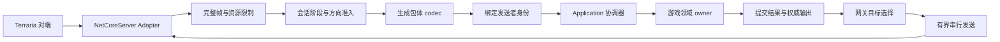
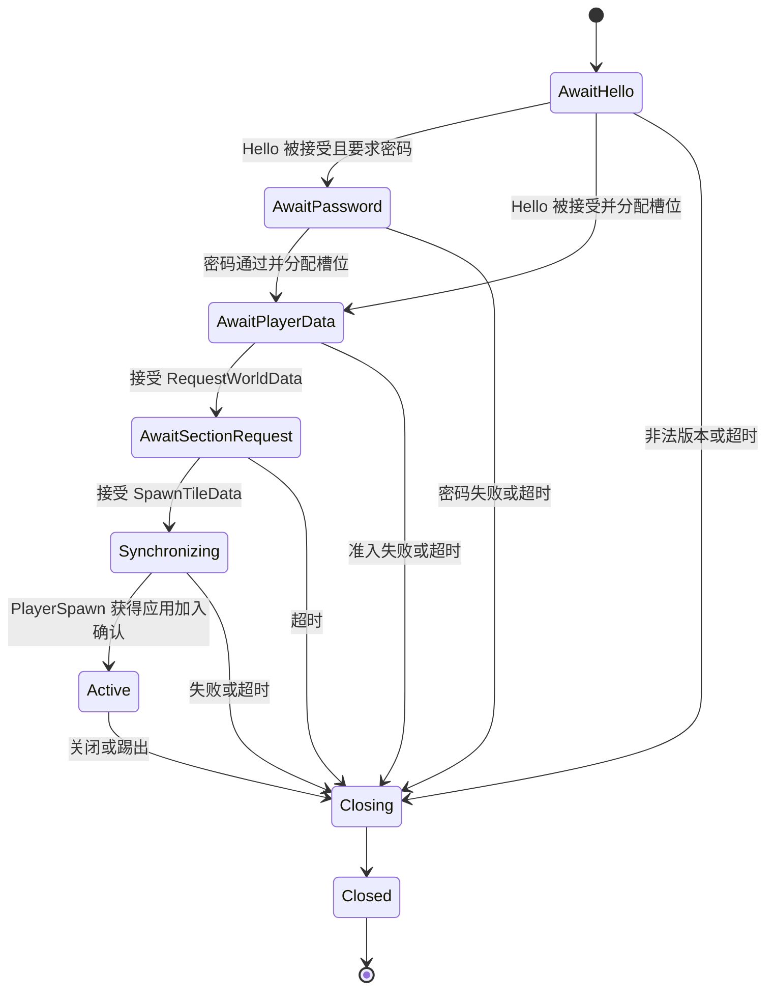

# 网络领域模型与网关职责设计

日期：2026-10-03。状态：提案；本轮仅文档。设计起点为[通信层移交报告](D:/ProjectItem/SourceCode/Net/NetWork/docs/reports/2026-10-03-packet-communication-handoff.md)及本目录[术语表](CONTEXT.md)。

## 1. 目标和部署形态

在 NLTX 服务端进程内建立一个网络入口，集中处理连接生命周期、完整帧、协议准入、身份绑定、串行消息处理、目标路由和发送资源。NetCoreServer 只负责 TCP 接受与字节收发；格式编译器只负责包体。网关通过应用协调器调用游戏 owner，使用提交后的结果发出响应或转发。

“转发”在本设计中主要指服务端向一个或多个玩家发出权威消息，默认不要求额外上游 TCP 连接。若以后需要独立代理，应另建 `RelaySession` 绑定 Downstream/Upstream 两个连接及槽位映射；源连接和目标连接的实际游戏方向相同，不能根据本机客户端/服务端类名反转方向。代理不能冒充世界 owner，也不能在后端断线后恢复客户端旧状态而不重新握手。

## 2. 现有事实与设计决定

| 源码事实 | 对网关的影响 |
| --- | --- |
| [MessageID.cs](D:/TRbackup/Version4/Terraria.ID/MessageID.cs:5) 是普通 class，消息 ID 为 const byte 字段，Count=162 | 复用固定编号；新的 enum 若需要，应由目录生成，不能手抄另一份编号 |
| [MessageBuffer.GetData](D:/TRbackup/Version4/Terraria/MessageBuffer.cs:141) 先检查编号、State 和握手例外 | 完整帧后先按 ID 做准入，再进行昂贵解码；状态机集中维护 |
| 当前 [PacketAllDefinitions](D:/ProjectItem/SourceCode/Net/NetWork/src/Packets/PacketBasicCodecs.cs:2696) 注册完整格式；56/69/85 分方向 | 格式目录与准入目录分开；布局双向不表示业务双向许可 |
| [opaque 定义](D:/ProjectItem/SourceCode/Net/NetWork/src/Packets/PacketOpaqueCodecs.cs:67) 只保存原始 body | 默认禁用业务派发；93 是握手白名单例外，但没有足够语义依据，需专门能力配置 |
| [NLTX 架构边界](D:/TRbackup/NLTX/Context/架构设计/ECS领域与基础设施架构边界.md) 规定基础设施用普通 .NET 类型、端口由内层拥有 | Socket/队列/重试不是 ECS Component；游戏权限和世界提交在内层 |

源码版本中许多接收 case 为 break 或存在不可达残留。本文以明确的源码行为为事实，游戏意图及未来替代行为标为建议；不会把死代码当作当前可用处理器。

## 3. 模型与归属

| 模型 | 身份、生命周期 | 拥有者及核心不变量 |
| --- | --- | --- |
| `ProtocolProfile` | ProfileKey、wire 握手标识、目录指纹、稳定事实；宿主选定后固定 | 基础设施 codec 配置；交付复核时编译器 schema=7、manifest Version="4"、Hello="Terraria319" 是三个不同值 |
| `NetworkSession` | 本进程 SessionKey；从接受连接到最终关闭 | 网关会话协调器；只通过有序事件更新阶段与资源 |
| `ConnectionGeneration` | SessionKey＋单调递增 Epoch；一次 TCP 建立 | 传输适配器；所有回调、排队消息和发送承诺携带 Epoch |
| `SenderBinding` | SessionKey/Epoch→PlayerSlot/GameSessionKey | 应用授权，网关保存有效投影；包体身份不能建立或替换绑定 |
| `GameSession` | 参与者、世界及加入资格 | 游戏领域；网关不拥有玩家生死、背包、位置或胸箱所有权 |
| `SessionAdmissionState` | Hello、密码阶段、玩家资料、世界同步、活动阶段及截止时间 | 网关；游戏 owner 返回加入确认后才进入 Active |
| `PacketPolicy` | ProfileKey＋实际方向＋ID；82 可附 ModuleId/Action | 网络应用协调器维护语义许可，Infrastructure 执行固定策略；缺失条目默认拒绝 |
| `PacketMessage` | 一帧的 ID、方向、序号、代次和普通 packet 值 | 连接读写适配器；解码失败的值不得进入应用 |
| `SectionInterestProjection` | 游戏会话、世界代次、区段集合/修订号 | 世界 owner 提供只读投影；网关只用来筛选目标和发送缓存 |
| `OutboundDispatch` | 提交结果、目标选择和待发 packet | 应用产生，网关执行；仅携带当前目标会话的有效代次 |

每个网络会话有一个有序控制循环。NetCoreServer 回调只能交付已拥有的输入或传输事件，不能直接调用 ECS。8.0.7 的 TryReceive 在 OnConnected 前启动，OnReceived 可能先到；Session、邮箱、profile 和初始准入阶段必须在构造/OnConnecting 前准备，不能等到 OnConnected 才注册。跨会话的世界提交在 owner 的调度边界进行；网关不是世界级事务锁。

## 4. 握手及会话状态机

本地服务端证据：State=0 等 Hello；-1 等密码；1 已接受；6 触发 1→2；8 触发 2→3；12 触发 3→10。见 [1 的处理](D:/TRbackup/Version4/Terraria/MessageBuffer.cs:180)、[6](D:/TRbackup/Version4/Terraria/MessageBuffer.cs:375)、[8](D:/TRbackup/Version4/Terraria/MessageBuffer.cs:526)、[12](D:/TRbackup/Version4/Terraria/MessageBuffer.cs:621)、[38](D:/TRbackup/Version4/Terraria/MessageBuffer.cs:1738)。客户端 case 49 的 `Connection.State==6 ->10` 是另一端的状态，不能混入服务端枚举。

建议阶段与原 State 的映射仅是兼容参考。迁移时保留合法报文序列，不能直接复制源码中缺少 return 的 BootPlayer 分支后继续执行。非法准入必须结束当前消息处理。

| 阶段 | 准入及动作建议 |
| --- | --- |
| AwaitHello（0） | 仅 C2S Hello(1)；检查长度、版本、连接配额和封禁结果；失败发送 Kick(2) 后限时关闭 |
| AwaitPassword（-1） | 仅 C2S SendPassword(38)；S2C RequestPassword(37)；密码不进入日志、缓存或广播 |
| AwaitPlayerData（1） | 允许资料/装备及经过确认的初始化消息；6 开始世界信息流程；会话只能获得宿主已分配槽位 |
| AwaitSectionRequest（2） | 允许初始化白名单；8 申请初始区段；应用决定合法坐标和区段集合 |
| Synchronizing（3） | 按区段同步序列发送 7/9/10/11 等；12 需应用确认加入后 Active；不能由“写完最后一帧”自行推断对端同步完成 |
| Active（10） | 按 ID/模块/动作、发送者权限和应用 owner 开放游戏消息 |
| Closing/Closed | 禁止新业务输入；限时发送最后控制帧；释放绑定、队列、缓存和待完成操作 |

原版 `<10` 例外 ID 是 93、16、42、50、38、68、147、161，加上低号 0–12；这只是旧代码的上界证据，**不是所有早期阶段通用白名单**。新方案按阶段列出精确集合，93 无 schema 默认禁用，68 只消费 string、161 是 HostToken。4/5/16/42/50/147 在初始化阶段的合法次序需记录真实客户端序列；不凭猜测要求全部收齐，也不在资料不全时自动跳到 Active。

World 同步与控制消息采用显式顺序屏障：初始快照和必要实体同步先入队，49 等完成指示后入队；TCP 有序性只保证已经提交的顺序。控制帧可保留容量，但不能跨越这个屏障抢发。

## 5. 拦截链与权威转发

处理顺序固定为：帧边界与额度 → 当前代次 → Profile/方向/ID 准入 → 完整包体解码 → 身份投影 → 速率/权限及 owner 校验 → owner 提交 → 构造权威输出 → 目标资格筛选 → 编码发送。网关级拒绝不执行领域行为。

身份投影保留“线上声明值”供有限审计，但传入应用的 Actor 来自 SenderBinding。已有 Player 13 规则见 [IPlayerPacket13RouteQuery](D:/TRbackup/NLTX/src/NSSLC/Component/Player/IPlayerPacket13RouteQuery.cs)及其 [结果](D:/TRbackup/NLTX/src/NSSLC/Component/Player/PlayerPacket13RouteResult.cs)：网关只提供可信上下文，保留 owner 的自回显和服务器角色判断，不再复制一套同义规则。27/29 的 Projectile owner/identity 校验也交给已有领域入口；伤害 117 中的受害者可以不同于发送者，不能把所有 Player 字段都改成发送者槽位。

| 消息族 | 网关动作 | owner 决定及输出 |
| --- | --- | --- |
| 4/5/13/16/30/36/41/50/147/150/157 等玩家消息 | 绑定 actor、阶段、每类型额度、当前代次；明确字段哪个是 actor、哪个是目标 | Player/Inventory 校验并提交；生成权威快照，按原有 self echo 规则选择目标 |
| 17/19/20/48/52/59/63/64/79/109 等地形消息 | 限流、区段许可投影和昂贵消息配额 | Tiles/Liquid/Wiring 验证坐标、权限及资源，提交后向有区域订阅的参与者发送 |
| 21/22/27/28/29/39/117/118/151/153 | actor、实体引用、频率；不自动重放 | Item/Projectile/Combat 校验所有权、伤害或销毁，输出权威结果 |
| 31/32/33/34/69/85、121/122/123/124/133/149/156 | 请求响应、交互资格、当前槽位及领域令牌 | Chest/TileEntity/Inventory 维护交互与物品转移；转发范围由结果确定 |
| 56/69/85 | 按方向选择独立类型；禁止原 body 换方向 | 请求交 owner；响应使用另一方向 codec；85 尚无互通证据，默认不开放 |
| 82 | 按 ModuleId 及 Action 二次准入；空 body 也要限流 | 模块 owner 决定权限和语义；液体分区、创意权限、传送、粒子各自配置 |
| 94 DevCommands、161 HostToken | 94 公网默认拒绝；161 仅允许指定阶段且禁止载荷日志 | 宿主授权检查；139 的 host 结果由服务端产生，客户端不能自授 host |
| 0/15/25/26/44/67/83/93/138 opaque | 默认拒绝语义派发；93 若真需 SocialHandshake 必须单独补配置 | 无 owner/无语义证据时保持禁用；透传代理另行建立精确许可 |

全部 ID 的提案见[处理矩阵](D:/ProjectItem/SourceCode/Net/NetWork/docs/plans/2026-10-03-network-special-packet-matrix.md)。矩阵不是自动启用清单，实际开放还必须满足 Application handler、方向、阶段及证据等级。

目标路由支持 `Single`、`AllActiveExceptSender`、`SectionSubscribers`、`ExplicitTargets`，但只接受应用产生的目标意图；网关再核查每个目标当前代次、Profile、绑定及阶段。不能通过客户端填入 remoteClient/ignoreClient 控制广播。个别源路径包含发送者回显，需逐包保留，不能为所有包统一排除发送者。

## 6. 失败场景与不变量

- A 伪造 B 的 PlayerControls：格式可解码，但只绑定 A；Player owner 决定可应用值，向目标发出的身份由权威结果产生。
- 同一胸箱两人同时 QuickStack：会话串行不足以保证胸箱一致性；Chest/Inventory owner 在世界提交边界协调，不由网关锁覆盖。
- 初始世界同步期间排满发送队列：不能提前发送 InitialSpawn；暂停同步生产，超时后关闭慢连接。
- 断线后同一槽位被新连接占用：旧 Epoch 的发送、缓存、关闭事件和领域结果全部失效，不得发给新玩家。
- 游戏 owner 已提交而发送失败：提交不会因为网络错误回滚；向失败目标报告或关闭，由后续权威快照修复，禁止自动再执行原命令。
- 关闭和 owner 响应竞态：已提交的状态由 owner 保留；响应路由检查当前 Epoch，只丢弃失效网络输出。

## 7. 实施 seam

基础设施公开连接工厂和 packet 读写能力；NetCoreServer 类型只出现在 Adapter 内。应用拥有消息处理及身份/目标契约，世界 owner 拥有 gameplay 判断。现有 `NSSLC.Application` 可以承载契约；只在独立依赖边界出现时再拆 Contracts 项目，不先铺开空工程。

未来建议建立一个正式 `NSSLC.Infrastructure.Network` 项目，位于 `NSSLC.Infrastructure/Network/`，显式引用 NetCoreServer 8.0.7、Application 稳定端口及 packet/生成 codec 程序集；禁止引用 `分类参考/Network` 或历史原型。API 和最小文件列表见[读写设计](2026-10-03-packet-io-api.md)，资源规则见[连接重试设计](2026-10-03-buffer-connection-retry.md)。
